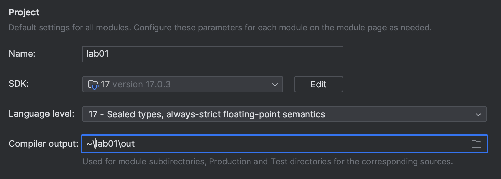

## Assignment Workflow

This guide describes how to set up an assignment in CS 61B.

## Getting the Skeleton

A video demo of this guide is available at [this link](https://www.youtube.com/watch?v=tABtNcN5y0A).

The `skeleton` remote repository contains the skeleton code for all assignments.
Whenever a new assignment is released, or if we need to update an assignment,
you will pull from the skeleton. First ensure that you are in your `sp23-s***`
repository directory, then:

```shell
git pull skeleton main
```

This fetches all remote files from the repo named `skeleton` (which
is located at `https://github.com/Berkeley-CS61B/skeleton-sp23.git`) and copies
them into your current folder.



(If you're working on Lab 1, go back to the lab spec at this point.)

## Opening in IntelliJ

The following instructions apply for **every** assignment. **Each time after
pulling from `skeleton` to get new lab or project files, you will need to run
through the following steps again.**

1.  Start up IntelliJ. **If you have no projects open**, click the "Open"
    button. If you have a project currently open, navigate to
    **"File --> Open"**.

1.  Find and choose the directory of your current assignment. For example, for
    Lab 1, you would select the `lab01` directory inside your `sp23-***` repo.

1.  Navigate to the **"File -> Project Structure"** menu, and make sure you are
    in the **Project** tab. Set your project SDK to your installed Java version.
    If 17 or higher isn't available in the dropdown, make sure you downloaded
    and installed Java completely.

    {: style="max-height: 300;"}

1.  Still in the **Project** tab, set the Project Language Level to
    "17 - Sealed types, always-strict floating-point semantics".

    At this point, the Project tab should look something like this:

    {: style="max-height: 300;" }

    -   The SDK is set to Java 17 or higher
    -   The Language level is at least 17, and at most the SDK.
    -   The Compiler output is filled in, and is set to the assignment
        directory, followed by `out`

1.  Still in Project Structure, go to the **Libraries** tab. Click the
    "**+ -> Java**" button, then navigate to `library-sp23`, select the
    folder, and click "Ok".

1.  Click "Ok" to apply your settings and leave Project Structure.

At this point, if things have been configured correctly:

-   Each Java file should have a blue circle next to its name.
-   When you open any file, none of the code should be highlighted in
    red.

## Submitting to Gradescope

1.  Add your assignment directory using `git add`. For example, for Lab 1,
    from your repo root (`sp23-***`) you would use `git add lab01`. From the
    assignment directory, you could use `git add .`.
1.  Commit the files using `git commit -m "<commit message here>"`. The commit
    message is required. For example, `git commit -m "Finished Lab 1"`.
1.  Push your code to your remote repository with `git push origin main`.
1.  Open the assignment on Gradescope. Select Github, then your `sp23-s***`
    repository and the `main` branch, then submit your assignment. You will
    receive a confirmation email, and the autograder will run automatically.

Gradescope will use the latest version of your code from Github. **If you think
that Gradescope isn't grading the right code, check that you have added,
committed, and pushed  with `git status`.**

If you've gotten yourself into a situation where you're unable to push for some reason,
see [https://sp23.datastructur.es/materials/guides/git/wtfs/](https://sp23.datastructur.es/materials/guides/git/wtfs/).

