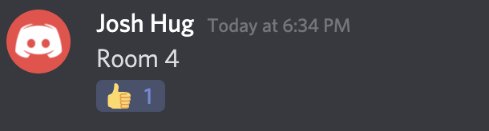
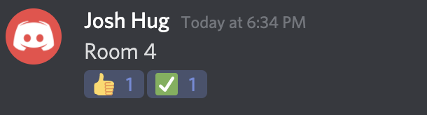
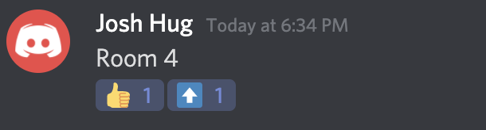
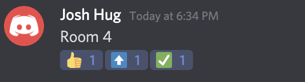

## How is Discord Used in CS 61B?

In Spring 2021, CS 61B will host Lab sections and Office Hours on Discord servers. Each TA will have their own Discord server for their Lab section. We will have a separate Discord server for Office Hours. All the invitation links to the CS 61B servers will be available on Ed starting from the first week of class.

## Joining a CS 61B Discord Server

To join one of our servers, you will have to complete the following steps.

1. Download the Discord app to your personal computer.
2. Go to the Beacon home page and note the “Discord Username” section. It should have your full name camelCased with some random numbers. For example: JoshHug1543.
3. Create a Discord account here, using your Berkeley email. You must ensure that your Discord username matches the username on Beacon or else you will be removed from our servers.
4. Browse the index post on Ed to find the invitation link for the server you want to join. After you join the server for the first time, it will be saved in your Discord’s side bar for easy access in the future.
5. Upon joining a CS 61B server, set your nickname to your full name. For example, if your Discord username is JoshHug1543, you would set your nickname to Josh Hug. Note that this step must be done for every server you join.

All our servers will have a bot that would ban your access if you don’t follow these steps exactly.

## Lab Discord Policies

Lab sections will usually start with a presentation given by the lab TA, overviewing the lab assignment. Then, students will be given time to work on the assignment for the majority of the lab. The lab TA and academic interns will be available to provide help with the assignment, and process help requests off a queue. In some labs, the lab TA will go over a part of the solution for the assignment toward the end of the section. 

Students who sign up for a Lab section and attend are required to have their video turned-on for the duration of the section. You will automatically be removed from the server if your video is turned off for more than a few minutes. 

Every Lab Discord server will have the following important channels:

- lab-announcements: In this text channel, the lab TA will post important announcements about the lab section. Always check this channel first when joining a Lab Discord server.
- general: Every section begins in this video channel with a short presentation given by the lab TA. If the help queue is empty, the TA and academic interns will hang out in this channel for any casual questions. Note that Discord has a limit on the number of users that can be in a video channel, so the lab TA may choose to alternate between Discord and Zoom for some presentations. This will be announced in the #lab-announcements channel.
- room-x: Every Lab server will have multiple “room” video channels which are spaces for students to work with each other or get help from TAs and academic interns.
- lab-queue: This text channel serves as the place to queue up for help with the lab assignment. Simply drop a message with the room number you are in. When a TA or an academic intern will come to assist you, they will react to your message with a thumbs up. When they are done helping, they will react to your message with a checkmark. If you are assisted by an academic intern, and the problem needs to be escalated to the lab TA, the academic intern will react to your message with an up-arrow, indicating that a TA should come to you when they become available. These will help you and other students see how the queue is being processed.

| Case | Example |
| ---  | --- |
| Being helped |  |
| Resolved |  |
| Escalated to a TA |  |
| Escalated and then resolved |  |

In Lab sections, you can only get help with Lab assignments. If you need assistance with any other assignments, please go to Office Hours.

Finally, you should never send a direct message to a TA or academic intern on Discord. All direct messages will be ignored. Please refer to [our course policies](../../about) to see what are the appropriate channels to communicate with staff.

## Office Hours Policies

Office Hours will be one of the main resources you use for help. We have very particular policies for assisting students in Office Hours, so we can get to as many students as possible. It is very important that you follow all these guidelines exactly, otherwise you will always be skipped when trying to get help. These policies are repeated here, on our Office Hours Discord server, and on the [Office Hours Queue](https://oh.datastructur.es/).

The Office Hours Discord server will have the following layout:

1. **Text channels**: the #rules channel specifies all Office Hours policies, and we will use the #announcements channel to let you when Office Hours start, end, and when TAs will present concepts to any interested student.
2. **Small Group Rooms**: You and up to 5 other classmates can join these rooms and work together on assignments. You will be able to share your screen with your group members in these rooms.
3. **Presentation Rooms**: These are rooms that TAs will use to present concepts if we realize that many students have the same question. **Do not join these rooms unless a TA has explicitly announced to join.**

To get help in Office Hours this semester:

1. Create a ticket on the [Office Hours Queue](https://oh.datastructur.es/), and specify what room you are in. Your ticket must include a useful description of the problem you're facing (at least 2 full sentences). Additionally, include in your ticket a link to your sp21-s*** Github repository (see Lab 1 for details on how to get this repository). We will skip tickets without useful descriptions and/or Github links, and delete them after 10 minutes if they are unchanged. If you are unable to join Discord for some reason, note that on your ticket and provide a Zoom / Google Meet link. Copy and paste the template at the top of the OH Queue to fill in all these details.
2. Please don’t add tickets before Office Hours actually starts. When we begin a session of Office Hours, we will delete all tickets before accepting new ones. For example, on Mondays, we have Office Hours 1:00-3:00pm and then 4:00-6:00pm. At 1:10pm and 4:10pm we will delete all tickets from the queue before accepting new ones.
3. If you are working with another student or a group of students, tell us in your ticket! We will always prioritize groups for efficiency.
4. The Office Hours Queue will notify you once a TA or an academic intern grabs your ticket off the queue. They will move you into a private room, where you can explain what you need help with. If you are working alone in a small group room, they may choose to help you in that room directly. Note that they can only spend about 10 minutes with you. If this time is not enough, you can always get on the queue again.
5. If you’re helped by a TA, they may decide that the answer to your question can benefit other students. In this case, you and the TA will move to one of the presentation rooms. The TA will invite everyone on the server to listen in on the answer via the #announcements text channel.
6. We will rarely give help with extra credit in Office Hours. We may decide to help you if no other student is seeking help with regular assignments.
