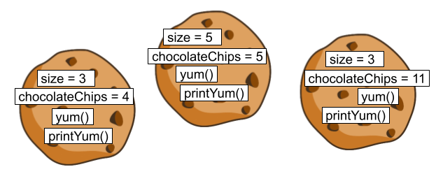
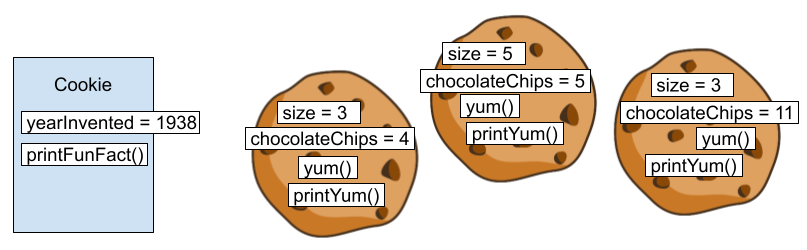

## Instance Variables and Methods

Let's bake cookies. The below class has two instance variables (`size` and `chocolateChips`) and two instance methods (`yum` and `printYum`):


<table>
    <thead>
        <th>Python</th>
        <th>Java</th>
    </thead>
<tr>
<td markdown="block">

```python
class Cookie:
    def __init__(self, size, chocolate_chips):
        self.size = size
        self.chocolate_chips = chocolate_chips
    
    def yum(self):
        return self.size + self.chocolate_chips

    def print_yum(self):
        print(self.yum())


```

</td>
<td markdown="block">

```java
class Cookie {
    int size;
    int chocolateChips;
    
    public Cookie(size, chocolateChips) {
        this.size = size;
        this.chocolateChips = chocolateChips;
    }

    public int yum() {
        return this.size + this.chocolateChips;
    }

    public void printYum() {
        System.out.println(this.yum());
    }
}
```

</td>
</tr>

<tr>
<td markdown="block">

```python
c1 = Cookie(3, 4)
c2 = Cookie(5, 5)
c3 = Cookie(3, 11)
c1.print_yum()
c2.print_yum()
c3.print_yum()
```

</td>
<td markdown="block">

```java
Cookie c1 = new Cookie(3, 4);
Cookie c2 = new Cookie(5, 5);
Cookie c3 = new Cookie(3, 11);
c1.printYum();
c2.printYum();
c3.printYum();
```

</td>
</tr>


</table>

Because these are instance variables/methods, each cookie has gets its own `size`, `chocolateChips`, `yum`, and `printYum`. Here's an artist's rendition of the above code:




The `this` keyword is like `self` in Python, and refers to the current `Cookie` instance. Unlike Python, the `this` keyword can be omitted, and Java will still know what you mean. Here is equivalent code for the `yum` and `printYum` methods:

```java
public int yum() {
    return size + chocolateChips;
}

public void printYum() {
    System.out.println(yum());
}
```

The `this` keyword is only needed if you have a local variable with the same name as an instance variable. For example, in the `Cookie` constructor, `size = size;` would do nothing, so `this.size = size;` is necessary.


## Static Variables and Methods

Let's add a static variable and a static method:

<table>
    <thead>
        <th>Python</th>
        <th>Java</th>
    </thead>
<tr>
<td markdown="block">

```python
class Cookie:
    year_invented = 1938
    
    ... # code from previous section

    def print_fun_fact():
        print("Chocolate chip cookies were invented in " 
            + str(Cookie.year_invented))


```

</td>
<td markdown="block">

```java
class Cookie {
    public static int yearInvented = 1938;

    ... // code from previous section

    public static void printFunFact() {
        System.out.println(
            "Chocolate chip cookies were invented in "
            + yearInvented);
    }
}
```

</td>
</tr>
<tr>
<td markdown="block">

```python
print(Cookie.year_invented)
Cookie.print_fun_fact()
```

</td>
<td markdown="block">

```java
System.out.println(Cookie.yearInvented);
Cookie.printFunFact();
```

</td>
</tr>

</table>

Unlike instance variables/methods, which are part of individual objects, static variables/methods are part of the class itself. 



Static methods can not use the `this` keyword, since there is no "this" object for the method to reference. The below code would not compile:
```java
public static void printFunFact() {
    System.out.println("I have size " + this.size); // error!
    System.out.println("I have " + chocolateChips + " chips"); // error!
    System.out.println("yum ".repeat(yum())); // error!
    printYum(); // error!
}
```

Note that the 2nd, 3rd, and 4th lines all implicitly use `this` (i.e. `chocolateChips` is the same as `this.chocolateChips`), so they error. However, the below code is fine:

```java
public static void printFunFact() {
    Cookie c = new Cookie(12, 0);
    System.out.println("I made a sugar cookie! It has size " + c.size);
    System.out.println("yum ".repeat(c.yum()));
}
```

