A video walkthrough for this guide is available at <https://sp21.datastructur.es/materials/lab/lab1setup/windows_setup_video.html>.
Do note that this was recorded in Spring 2021, so some of the content may look updated now, but it should still be helpful.

## A. Install Java

1.  The first step is install the latest version of the Java OpenJDK.
    The easiest way to do this is to get a pre-built binary from Adoptium, which you can download from
    <https://adoptium.net/temurin/releases>.
    You'll want to select the latest version for Windows x64, and use the `.msi` installer.
    At the time of this writing the latest version is marked with "jdk-17.0.3+7",
    but if some later version of Java has been released at the time you're reading this, you're welcome to download that instead.

    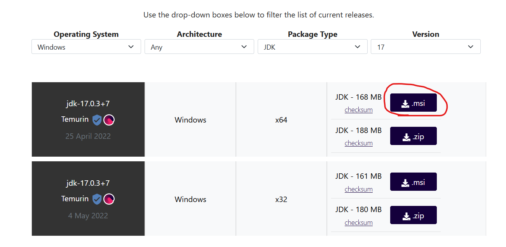

1.  **Important**: The installer will give you the following four options:

    

    You should click the small red Xs and change it from "Entire feature will be unavailable" to "Will be installed on local hard drive" as shown below:

    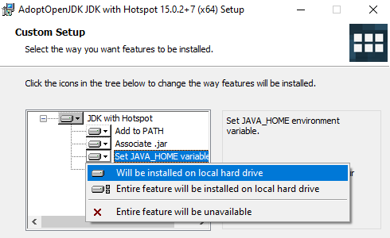

    When you've done this, it should look like the following:

    

1.  Click next until everything is installed.

## B. Install Git

1.  Install git. Head to
    [http://git-scm.com/download/](http://git-scm.com/download/)
    and download the Git for Windows installer.

    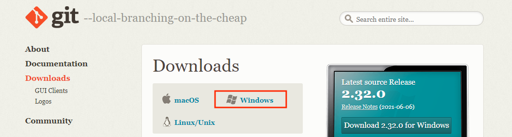

    1.  Run the installer. Let git be installed in the default location (`C:\Program Files\git`).
        You'll be faced with many options.
        We have recommendations for the first two, show below:

    1.  The first choice is selecting which components to install.
        The one option to pay attention to is `Windows Explorer integration`.
        Checking `Windows Explorer integration` will add new options to the context menu that appears when you right click a file.
        These two new options (Git Bash and Git GUI) might maybe one day be helpful to you.
        Personally, though, I'd turn it off.

        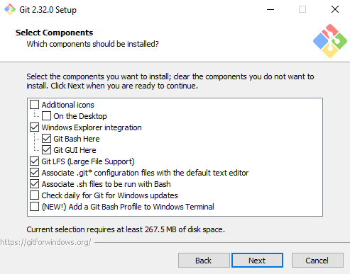

    1.  After, you should see the following. Just click Next.

        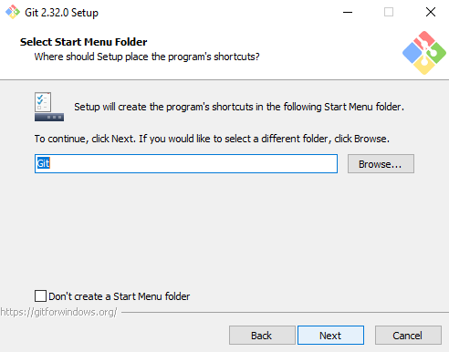

    1.  Next we'll select a default Git Bash text editor.
        If you have a favorite text editor that's on the list, select it.
        Otherwise you can leave it as vim for now.

        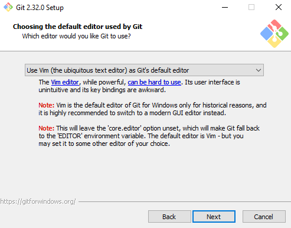

    1.  For all of the remaining choices, the defaults are fine.
        For the option that looks like this below, make sure you select the default "Git from the command line also from 3rd-party software".

        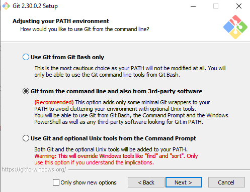

2.  Open a Git Bash window (using the start menu, if you didn't add a start menu link, you can go to `C:\Program Files\Git\bin` and run `bash.exe`).
    The window that opens is a terminal window that allows you to interact with a bash shell.
    We'll learn more about the bash shell in the Lab 1 setup directions.
    To test that everything is working, try typing `javac --version` and press enter.
    If you see a message that says "`javac version 17.0.3+7`" (or other version number that is at least 15), then everything is working fine.
    You may have to restart your computer first before running this command.

3.  Now type (or copy and paste) `git config --get core.editor`.

    Steps 2 and 3 should look like the below (with a different Java version):

    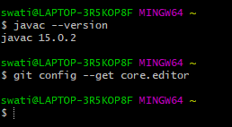

    However, if you picked a text editor other than vim, the second step should
    look something like the image below.

    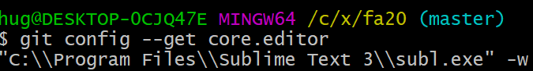

    If instead nothing is printed, as is the case in the first image, this
    means your default text editor is vim.
    If you've never used vim before, type `git config --global core.editor
"nano"` and press enter.
    This will change the default text editor from `vim` to `nano`.
    `nano` is much easier to use.
    Note: If you're an experienced vim user, you can skip this step.

## C. Install Windows Terminal (optional but recommended)

As an alternative to the Git bash terminal, you can use the new Windows terminal app.
I personally think it's smoother, aesthetically nicer, and has some useful additional features like tabs.
(Caveat: ANSI codes don't work properly for certain programs.
This won't be a problem within this course, but if you start seeing `←[?`, this
is a known problem.)

It's a bit annoying to set up, though, so if you don't want to go to all the trouble below, the Git bash terminal will work fine.

1.  To install the Windows Terminal, I recommend using the Microsoft Store,
    which does not require a login or payment.
    Alternate installation instructions are at <https://github.com/microsoft/terminal>.

1.  When you start up windows terminal, you'll see something like the picture below:  
    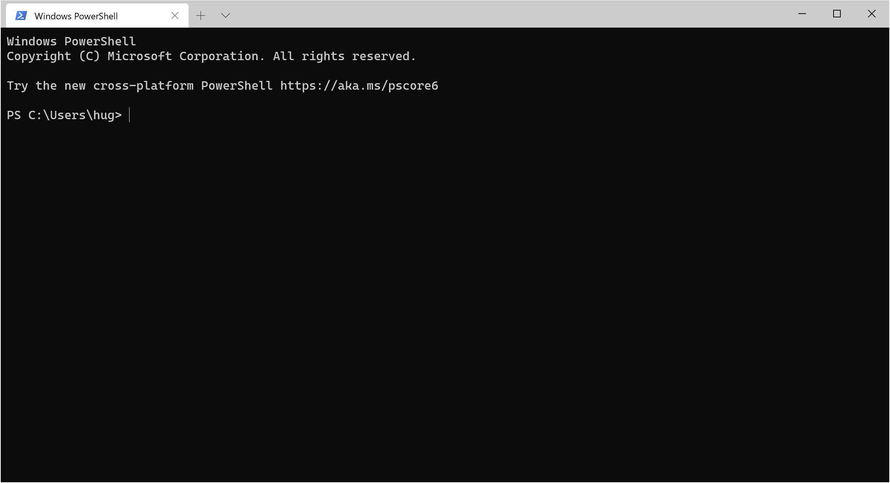

1.  We don't want to use "PowerShell", which is based on Windows.
    Instead, we want to use a "bash shell" (specifically, Git bash), which is based on Linux.
    To set this up, press `ctrl-,` (control and comma) inside the Windows Terminal, and you should see "Settings" open up.

1.  Click on "Add a new profile" or "+" at the bottom, then click "+ New empty profile".

    

1.  Set the fields as follows:

    - Name: Git Bash
    - Command line: `%PROGRAMFILES%\Git\usr\bin\bash.exe -l -i`
    - Starting directory: uncheck "Use parent process directory", then type `%USERPROFILE%`
    - Icon: `%PROGRAMFILES%\git\mingw64\share\git\git-for-windows.ico`

    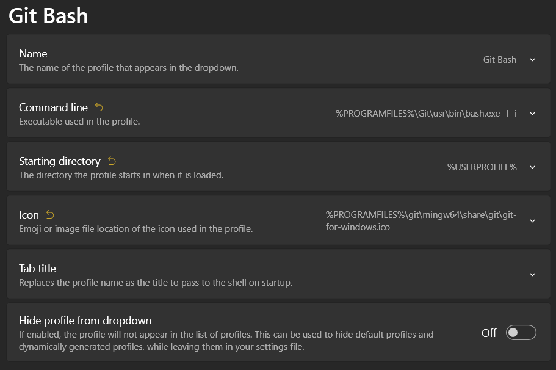

1.  Click "Save".
    If you completed the previous step correctly,
    when you click on the little downward pointing arrow in the Windows Terminal (which creates a new tab),
    there should be an option called "Git Bash".
    If you click on "Git Bash", you should find yourself in a window that looks a lot like the Git Bash window.
    As before, use `javac --version` to verify that everything is working correctly.

    If you want to change the default font size, you can go to the Appearance settings for the Git Bash profile.

    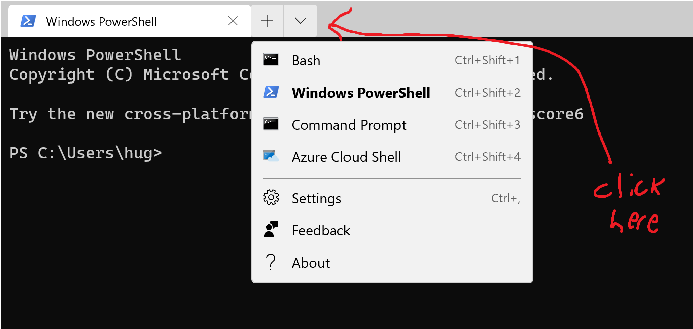

1.  If you press the + sign, you'll see that it opens a PowerShell window by default.
    To change the behavior of the "+" sign so that it opens a Git Bash window instead,
    you can edit the "Default profile" under "Startup".

    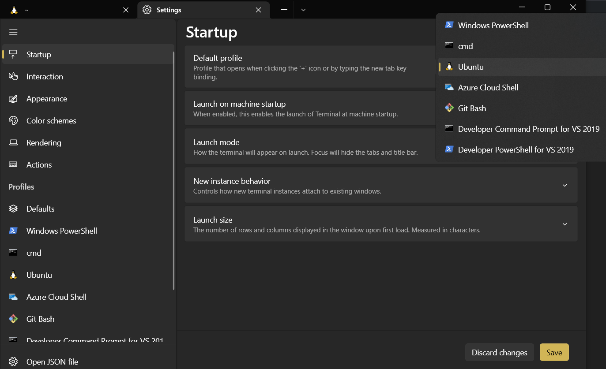

    Try clicking the plus sign, and you should see a Git Bash shell window open.
    At this point, you're all done!
    You can now move on with the rest of Lab 1.

## D. Note on WSL2 (experimental)

The Summer 2020 update of Windows contains a Linux kernel called WSL2.
We will not be officially supporting WSL2 for this term.
If you're pretty computer savvy, you're welcome to try it out though!
One word of warning: You will need to install javac, java, and git inside WSL2 again,
following the [Linux](linux) instructions for your chosen distribution.
