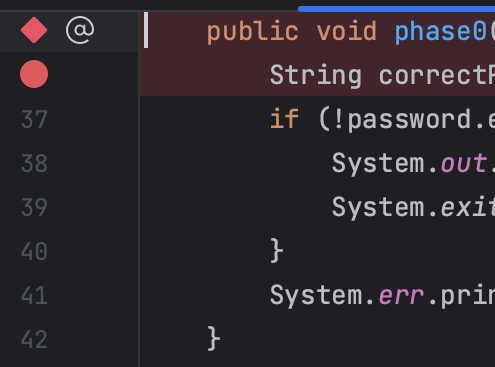

## [FAQ](faq.md)

Each assignment will have an FAQ linked at the top. You can also access it by
adding "/faq" to the end of the URL. The FAQ for Lab 02 is located
[here](faq.md).

## Introduction

To debug a program, you must first know what's wrong. In this lab, you'll get
some experience with using the debugger to see program state. When you run into
a bug, the error is accompanied with a "stack trace" that details the method
calls that caused the error in the first place. One of the focuses of this lab
will be to get you used to reading these stack traces, because they can be
**super** helpful in debugging your own code.

### Setup

Follow the
[assignment workflow instructions](../../guides/assignment-workflow/index.md#getting-the-skeleton)
to get the assignment and open it in IntelliJ.

### Goals and Outcomes

In this lab, you will enhance your code debugging abilities by defusing a
(programmatic) bomb and debugging a text adventure we have written. We’ll guide
you through this process, but the intention is to make this a realistic
debugging experience.

By the end of this lab, you will…

- Be able to use the debugger and visualizer to inspect program state.
- Be able to interpret test failure messages.
- Be able to interpret stack traces.
- Be better able to approach debugging code.
- Have learned about some common Java bugs and errors.

### `IntList` Aside

Added to our implementation in Wednesday's lecture are two methods in the
`IntList` class, `print` and `of`. The `of` method is a convenience method for
creating `IntList`s. Here's a quick demonstration of how it works. Consider the
following code that you've seen in lecture for creating an `IntList` containing
the elements 1, 2, and 3.

```java
IntList lst = new IntList(1, new IntList(2, new IntList(3, null)));
```

That's a lot of typing, and is quite confusing! The `IntList.of` method
addresses this problem. To create an IntList containing the elements 1, 2, and
3, you can simply type:

```java
IntList lst = IntList.of(1, 2, 3);
```

The other method `print` returns a `String` representation of an IntList.

```java
IntList lst = IntList.of(1, 2, 3);
System.out.println(lst.print())

// Output: 1 -> 2 -> 3
```

These methods mostly provide convenient ways of creating and displaying
`IntList`s, respectively. We use these convenience methods to make testing
easier.

## `Bomb`

The `BombMain` class calls the various `phase` methods of the `Bomb` class.
Your job is to figure out what the passwords to each of these phrases is by
_using the IntelliJ debugger_.



### Interactive Debugging

So far, you might have practiced debugging by using using print statements to
see the values of certain variables as a program runs. When placed
strategically, the output from printing might help make the bugs obvious or
narrow down their cause. This method is called **print debugging**. While print
debugging can be very useful, it has a few disadvantages:

- It requires you to modify your code, and clean it up after.
- It's tedious to decide and write out exactly what you want to print.
- Printing isn't always formatted nicely.

In this lab, we'll show you a new technique, **interactive debugging** --
debugging by using an interactive tool, or a debugger. We'll focus on IntelliJ's
built-in debugger.

### Debugger Overview

#### Breakpoints

Before starting the IntelliJ debugger, you should set a few **breakpoints**.
Breakpoints mark places in your code where you can _suspend_ the program while
debugging and examine its state. This:

- Doesn't require you to modify your code or clean it up after, since
  breakpoints are ignored in normal execution.
- Lets you see _all_ the variables without needing to write print statements.
- Lets IntelliJ display everything in a structured manner

To set a breakpoint, click the area just to the right of the line number.

{: style="max-height: 325px;" }

A red circle or diamond should appear where you clicked. If nothing appears,
make sure that you click next to a line with code. When the debugger reaches
this point in the program, it will pause **before** the execution of the line or
method. Click the breakpoint again to remove it.

#### Running the Debugger

Once you've set some breakpoints, you're ready to start a debugging session!
Click on the green triangle next to the class or test you want to debug (in test
files there may be two green triangles). Instead of clicking the green triangle
to run, click the
{: .inline } debug option:

{: style="max-height: 325px;" }

The selected program should run until it hits its first breakpoint. A debugger
window should also appear on the bottom of the interface, where the console was.

{: style="max-height: 325px;" }

On the left, you will be able to see all current method calls and on the right,
you will be able to see the values of instantiated variables at this point in
the program (they will also be shown in gray text in the editor). For instances
of classes, you can click the dropdown to expand them and look at their fields.

In the debugger, you have a few options:

- Learn something from the displayed values, identify what's wrong, and fix
  your bug! Click {: .inline } to stop the debug session.
- Click {: .inline } to resume the program (until it
  hits another breakpoint or terminates).
- Click {: .inline } to advance the program by
  one line of code.
  - {: .inline } does something similar, but
    it will step into any method called in the current line, while
    {: .inline } will step over it.
  - {: .inline } will advance the program until
    after it returns from the current method.
- If you accidentally step too far and want to start the session over, click
  {: .inline }.

To see the console output (and type into the console) while debugging, click
the "Console" tab next to "Debugger" in the top left of the debug window,
just above the frames. If you want to see everything simultaneously (while
being more compressed), you can drag the console tab to the far right of the
bottom panel. [Here's a GIF][console drag] from a previous semester that shows
this (IntelliJ looks different, but the action is the same.)

[console drag]: https://gfycat.com/SmugAbleAustraliankelpie

### `Bomb` Introduction (Phase 0)





Once you've found the correct password, running the code (not in debug mode)
should output "You passed phase 0 with the password \<password\>!" instead of
"Phase 0 went BOOM!"

<details markdown="block">
<summary markdown="block">

**`phase0` Method Breakdown**

</summary>

The `phase0` method first generates a secret String `correctPassword` (you don't
need to understand how `shufflePassword` works). The `password` passed in from
`BombMain` is then compared against `correctPassword`. The goal of this phase is
to use the debugger to find the value of `correctPassword` and pass in a
`password` that matches that value!

</details>

### Visualizer (Phase 1)

While being able to see variable values is great, sometimes we have data that's
not the easiest to inspect. For example, to look at long `IntList`s, we need to
click a lot of dropdowns. The Java Visualizer shows a box-and-pointer diagram of
the variables in your program, which is much better suited for `IntList`s. To
use the visualizer, run the debugger until you stop at a breakpoint, then click
the "Java Visualizer" tab.

The password for phase 1 is an `IntList`, not a `String`. You may find the
`IntList.of` method helpful.



<details markdown="block">
<summary markdown="block">

**`phase1` Method Breakdown**

</summary>

The `phase1` method generates a secret `IntList` called `correctIntListPassword`
(similar to the previous phase, you don't need to understand how
`shufflePasswordIntList` works). The `password` (in the form of an `IntList`)
passed in from `BombMain` is then compared against the `correctIntListPassword`
for equality. The goal of this phase is to use the debugger's Java Visualizer to
find the structure and value of the `correctIntListPassword`'s IntList and pass
in a `password` that matches it!

</details>

### Conditional Breakpoints (Phase 2)

Sometimes you may want to have your program pause only on certain conditions.
To do so, create a breakpoint at the line of interest and open the
"Edit breakpoint" menu by right-clicking the breakpoint icon itself. There,
you can enter a boolean condition such that the program will only pause at this
breakpoint if the condition is true.

Another thing you can do is to set breakpoints for exceptions in Java. If your
program is crashing, you can have the debugger pause where the exception is
thrown and display the state of your program. To do so, click
{: .inline }
in the debugger window and press the plus icon to create a "Java Exception
Breakpoint". In the window that should appear, enter the name of the exception
that your program is throwing.



<details markdown="block">
<summary markdown="block">

**Hint 1**

</summary>

You may want to look up Java's `split` method for `String`s if you're unsure
of what it does.

</details>

<details markdown="block">
<summary markdown="block">

**Hint 2**

</summary>

You don't necessarily need to construct the password in one line of code.

</details>

<details markdown="block">
<summary markdown="block">

**Hint 3**

</summary>

You'll need to build the password in pieces so that the `split` method will cause
the correct number be in the right spot.

</details>

<details markdown="block">
<summary markdown="block">

**Hint 4**

</summary>

After you've constructed a sufficiently long `String` so that `1337` is a valid
index, set a conditional breakpoint inside the for loop that pauses the program
when `i` is close to `1337`. Then step until you find the password.

</details>

<details markdown="block">
<summary markdown="block">

**`phase2` Method Breakdown**

</summary>

The `phase2` method takes in your `password` from `BombMain` and splits it by
spaces into the `passwordPieces` array. For example, if your password is `"1 2
3"`, then `passwordPieces` will be equivalent to `{"1", "2", "3"}`.

The method then adds 100,000 random integers to a `Set` called `numbers`. It
then loops through them using a for-each loop, incrementing a variable `i` as it
goes along. On the 1338th iteration (because Java is zero-indexed, `i == 1337`
on iteration 1338), we check whether the integer at the 1337th index of the
`passwordPieces` array is equal to the current `number`.

</details>

---

At this point, you should be able to run the tests in `tests/bomb/BombTest.java`
and have all of them pass with a green checkmark.

## `Adventure`

### Running the Game and Tests

The very first thing you should do is run the `main` method in `AdventureGame`
to run through the game. This will give you a sense of what the program you are
debugging is actually supposed to do. Then, after you’ve run the game, run the
tests in `tests/adventure/AdventureGameTests`. They should fail on
`BeeCountingStage` which will lead you into debugging the first error below.

### Reading Stack Traces

When a _runtime error_ occurs in Java, a stack trace is printed to the console
to provide information on where the error occurred and what steps the program
took to get there. When running `Adventure` for the first time, your stack
trace will look something like this:

{: style="max-height: 325;" }

The first thing to note is what kind of error occurred; this is shown at the
first line of the stack trace. In this case, our code threw a
`NullPointerException`.

For some exceptions, including `NullPointerException`s, Java will give you an
explanation. Here, `this.input` is `null`, so we can't invoke (call) a method on
it.

The lines beneath it represent the sequence of methods the program took to
arrive at the error: the first line in the list is where the error occurred
and the line beneath it represents the line of code that called the method
which threw the error, and so on.

You can click on **`blue text`**{: .blue} to navigate to that file and line.

---





### Debug `BeeCountingStage`



Expected lines modified: 1

---

It turns out that this isn’t the only error in `BeeCountingStage`!



**Note**: Ignore the grey links to `Objects.java` and `ArrayList.java` at the
top of the stack trace. The error may have _occurred_ in code that was not
yours, but the root cause was probably something _your code_ tried to do.

Expected lines modified: 1

---

<details markdown="block">
<summary markdown="block">

**Hint 1**

</summary>

Just because the error occurs on a certain line doesn't necessarily mean that
piece of code is incorrect - something not shown in the stack trace may
be the elusive culprit!

</details>

<details markdown="block">
<summary markdown="block">

**Hint 2**

</summary>

Take a close look at the constructor.

</details>

## Optional for This Week Only



### Debug `SpeciesListStage`



Expected lines modified: 3-4

---

<details markdown="block">
<summary markdown="block">

**Hint**

</summary>

Consider the possibilities for lists. Does the code account for all of
them? Are there any edge cases the code fails to handle?

</details>

### Debug `PalindromeStage`



**Note:** If the debugger feels unresponsive, it is usually due to an infinite
loop somewhere in your code. If you set a breakpoint and it is never reached,
then you know an infinite loop occurs before the breakpoint! Use this in
combination with stepping to isolate the problem.

Expected lines modified: 3

### Debug `MachineStage`

The `sumOfElementwiseMax` method in `MachineStage` is supposed to take two
arrays, compute the element-wise max of those two arrays, and then sum the
resulting maxes. For example, for two arrays `{2, 0, 10, 14}` and
`{-5, 5, 20, 30}`, the element-wise max is `{2, 5, 20, 30}`. In the second
position, the larger of `0` and `5` is `5`. The sum of this element-wise max is
$2 + 5 + 20 + 30 = 57$.

There are two different bugs that make the method return an incorrect result.
You can assume the input parsing code in `playStage` works correctly.

To find the bugs, you should not step into the `mysteryMax` or `mysteryAdd`
functions, or even try to understand what they are doing. That is, you should
use {: .inline } to _only see the result_. These
are **_mysterious_** functions that are deliberately obfuscated. If you find
yourself having accidentally stepped into one of these two functions, use the
{: .inline } button to escape.

Even without stepping INTO these functions, you should be able to tell whether
they have a bug or not. That’s the glory of abstraction! Even if I don’t know
how a fish works at a molecular level, there are some cases where I can clearly
tell that a fish is dead.



Expected lines modified: 2-5

---

<details markdown="block">
<summary markdown="block">

**Hints**

</summary>

- Understand what the `sumOfElementwiseMax` function is supposed to do. When
  you give inputs to the game, try computing the answer by hand or with a
  calculator. Verify your computation against the output, and you'll see that
  the output is incorrect.
- Set a breakpoint on the line that calls `sumOfElementwiseMax`. When you run
  the debugger, step into `sumOfElementwiseMax`, then use
  {: .inline } to see the result of the call
  to `arrayMax`. Is the output of `arrayMax` what you expect it to be?
- You should step into `arrayMax` if you think that there's a bug there. Don't
  step into `mysteryMax`, though -- if and only if you think it has a bug,
  rewrite it completely.
- Repeat for `arraySum` and `mysteryAdd`.

</details>

### Still Broken...?

At this point, the test for correct inputs should pass. That test is testing a
**correct** input to the adventure game. The second test checks an **incorrect**
input (meaning one that gets something wrong at some point during the game). You
should have gotten an error this time which tells you that the output the game
gave did not match the output we expected. Click on `<Click to see difference>`,
and IntelliJ will tell you where and how the long `String` outputs differed.
Specifically, in this case, `SpeciesListStage` has a bug.



Expected lines changed: 0-1

---

After completing this task, all of the tests should pass.

---

<details markdown="block">
<summary markdown="block">

**Hint**

</summary>

You can force Java to use decimal division by multiplying the numerator by
`1.0`.

</details>

## Deliverables and Scoring

The lab is out of 256 points. There are no hidden tests on Gradescope. If you
pass all the local tests, you will receive full credit on the lab.

- Find all the passwords in `BombMain.java`. (3 parts, 64 pts each)
- Fix the bugs in `BeeCountingStage` for correct inputs. (1 part, 64 pts)
- (Optional, but required for Lab 03) Fix all bugs in the remaining adventure
  game stages for correct inputs. (3 parts, 0 pts each)
- (Optional, but required for Lab 03) Fix the bug in the adventure game for
  incorrect inputs. (1 part, 0 pts)

## Submission

Just as you did in Lab 1, add, commit, then push your Lab 2 code to GitHub.
Then, submit to Gradescope to test your code. If you need a refresher, check
out the instructions in the
[Lab 1 spec](../lab01/index.md#saving-your-work-using-git-and-github) and the
[Assignment Workflow Guide][workflow].

[workflow]: ../../guides/assignment-workflow/index.md#submitting-to-gradescope

## Acknowledgements

This assignment is adapted from Adam Blank.
