## FAQ

The FAQ for Lab 05 is [here](faq.md).

## Setup

Follow the
[assignment workflow instructions](https://sp23.datastructur.es/materials/guides/assignment-workflow/#getting-the-skeleton)
to get the assignment and open it in IntelliJ. This assignment is `lab05`.

## Introduction

In this lab, you will take a deeper dive into git and also learn some advanced
debugging techniques with another exercise. By the end of this lab, you should
feel much stronger about the git workflow, and your debugging skills should be
more refined!

A playlist with some videos that may be helpful for this lab is available **[here](https://www.youtube.com/watch?v=6YhV4L7NNv8&list=PLnp31xXvnfRqw9s4bCo8BFq9U_sLedPVn&index=1)**.

## Git Background

In this part, you may watch a series of videos that explain the major concepts
of git, and then get some hands-on practice using git. We've already practiced
git before in lab01 (and we have an awesome **[git guide](../../guides/git)**), so **feel free to watch these as you are
doing the lab, or skip them if you feel comfortable**.

- [Git Review (updated for sp23)](https://www.youtube.com/watch?v=zl5aaPsv4qk&list=PLnp31xXvnfRqw9s4bCo8BFq9U_sLedPVn&index=2)



These videos talk more about how git works, and are optional for this lab.

- [Git Intro - Part 1](https://www.youtube.com/watch?v=yWBzCAY_5UI)
- [Git Intro - Part 2](https://www.youtube.com/watch?v=CnMpARAOhFg)
- [Git Intro - Part 3](https://www.youtube.com/watch?v=t0tzTcZESWk)
- [Git Intro - Part 4](https://www.youtube.com/watch?v=ca1oCEMQGRQ)
- [Git Intro - Part 5](https://www.youtube.com/watch?v=dZbj9gjjYv8)
- [Git Intro - Part 6](https://www.youtube.com/watch?v=r0oHi0vXhLE)

In particular, you should understand the following concepts:

- Local git workflow: `git add` and `git commit`
- Updating files with `git restore`
- Remote repositories, e.g. those hosted on [GitHub](https://github.com)
- Local git integration with remote repositories: `origin` and `skeleton`
- How to resolve merge conflicts

If you have any questions about the above concepts, you can reference our [git guide](../../guides/git) and the [Git WTFS](https://sp19.datastructur.es/materials/guides/git-wtfs) (Git Weird
Technical Failure Scenarios -- get your mind out of the gutter!), or you can
always feel free to ask your TA to clarify concepts.

We will warn you here: _be wary of git information that you find online_, since
not all of it comes from trusted sources. Also, be sure to **NEVER copy commands
you find online or get from friends with git when you are stuck, unless you
_really, really_ know what you're doing - always ask your TA when you are in
doubt**.

**And remember, we also have our [git guide](../../guides/git) and
[guide on merging](../../guides/git/skeleton-merge-guide.md) as resources!**

## Git Exercise





1. Pull the skeleton code as described in the [assignment workflow
   instructions](https://sp23.datastructur.es/materials/guides/assignment-workflow/#getting-the-skeleton),
   if you haven't already.

2. After pulling the skeleton code, run `git push origin main` (yes, even before
   doing any work on the lab). Make sure to commit your code before you push!

3. Navigate to your GitHub repo online
   (https://github.com/Berkeley-CS61B-Student/sp23-s\*\*\*\*) and go to the
   `lab05` folder (if you can't find it, be sure you've completed step 2). Then,
   click on the `src` and `conflict` folders, and then click on `hello.txt`. You
   should see the following:

   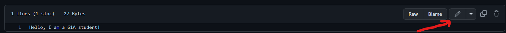

{:start="4"} 4. Click the pencil icon on the right-hand side to edit the file.
Change the contents of the file to be
`text
    Hello, I am NOT a 61A student!
    `
and then scroll to the bottom of the page. Change the commit message from
"Update hello.txt" to "Change hello.txt to NOT 61A" and click the green
"Commit changes" button.

    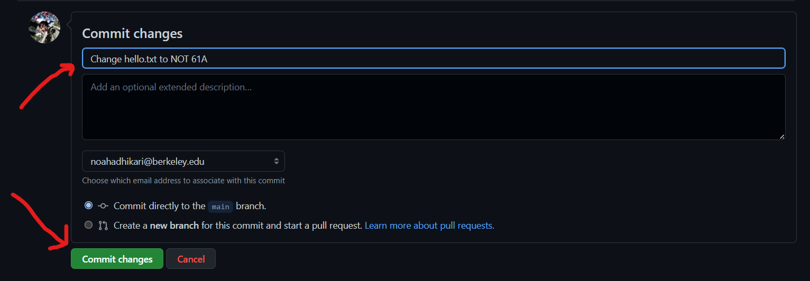

5. Now, open up `hello.txt` locally (in your terminal editor, IntelliJ, or
   something else). You should still see the original contents (`Hello, I am a
61A student!`). This time, change the file to read
   ```text
   Hello, I am a 61B student!
   ```
6. Add and commit this change **locally** (i.e., not on GitHub!) with the
   message "Change hello.txt to 61B".

7. Now, try to `git push` your code from the terminal, as you usually would to
   submit your work. You should see an error like the following (you may have
   seen something like this before):
   ```sh
    ! [rejected]        main -> main (fetch first)
   error: failed to push some refs to 'https://github.com/Berkeley-CS61B-Student/sp23-s****.git'
   hint: Updates were rejected because the remote contains work that you do
   hint: not have locally. This is usually caused by another repository pushing
   hint: to the same ref. You may want to first integrate the remote changes
   hint: (e.g., 'git pull ...') before pushing again.
   hint: See the 'Note about fast-forwards' in 'git push --help' for details.
   ```
   This occurs because git is extremely hesitant about overwriting changes. You
   don't yet have the latest version of the file that the remote has ("NOT
   61A"), so if you pushed your local commits, the "NOT 61A" version of the file
   would be lost!



{:start="8"} 8. To resolve this, run `git pull origin main` to integrate the remote's changes
with your local changes. Oh no, git is saying something about a conflict! You
should have gotten a message like the following:

    ```sh
    Auto-merging lab05/src/conflict/hello.txt
    CONFLICT (content): Merge conflict in lab05/src/conflict/hello.txt
    Automatic merge failed; fix conflicts and then commit the result.
    ```

    If you now inspect the contents of `hello.txt`, you should see something like

    ```text
    <<<<<<< HEAD
    Hello, I am a 61B student!
    =======
    Hello, I am NOT a 61A student!
    >>>>>>> 538409c19b3d2dafccd3e8b0c16449662e78de04
    ```

    Don't panic! This is a common occurrence, especially
    when working with others. Git does its best to integrate your changes
    ("61B") with the remote's changes ("NOT 61A"), but it isn't always smart
    enough to figure out how to do so automatically. In this case, git has
    identified a conflict in `hello.txt`, and doesn't know which version to keep.
    We'll learn how to resolve this in a bit, but **don't edit anything yet**!

    The text between `<<<<<<< HEAD` and `=======` is the version of the file in
    your "HEAD" commit, git's shorthand for your most recent local commit. The
    text between `=======` and `>>>>>>> 538409c...` is the version of the file
    in the remote's commit `538409c...`. These two versions are incompatible, so
    git edits our file with these strange conflict markers to let us know that
    we need to resolve the conflict manually.

    In this case, the conflict involves the entire file, but in practice,
    conflicts will only involve a small portion of the conflicted file. Git is
    smart enough to only mark the lines that are in conflict and leave the rest
    of the file alone.

    At this point, the output of `git status` should look similar to this:

    ```sh
    $ git status
    On branch main
    Your branch and 'origin/main' have diverged,
    and have 1 and 1 different commits each, respectively.
        (use "git pull" to merge the remote branch into yours)

    You have unmerged paths.
        (fix conflicts and run "git commit")
        (use "git merge --abort" to abort the merge)

    Unmerged paths:
        (use "git add <file>..." to mark resolution)
            both modified:   src/conflict/hello.txt
    ```

9. If you run `tests/conflict/ConflictTest`, you should now pass
   `testConflictExists`. You will still be failing `testConflictResolved`, but
   that's okay - we'll come back to it later.

   (If you are failing `testConflictExists` but are sure you've done everything
   correctly, refer to the [FAQ](faq.md).)

10. Usually, you would resolve the merge conflict first, and then commit the
    result. However, for this lab, we want to make sure you actually got a merge
    conflict! Run the following commands in the terminal, from the `lab05/` directory:

    ```sh
    $ git add src/conflict/hello.txt
    $ git commit -m "Merge conflict still present"
    ```

11. You should now `git push` as usual and submit your code to Gradescope. If
    everything goes smoothly, your submission should tell you some hidden
    directions on exactly how to resolve the merge conflict and proceed with the
    assignment.

12. Resolve the conflict using the directions stated by the autograder. You
    should now be passing all tests in `ConflictTest`.



Congratulations, you've successfully resolved a merge conflict! In real-world
code, the merge conflicts you encounter may be much more complex, but the
general idea is the same - your changes are incompatible with the remote's
changes, and you need to reconcile them manually.

## Another Debugging Puzzle?!

In Lab 02, we learned how to use the IntelliJ debugger. In this lab, we'll learn
some more handy features of the debugger, and use it to solve a puzzle!





### Exception Breakpoints

When debugging, you may sometimes run into an unexpected error, making it
difficult to figure out what is wrong with your code. To help with this,
IntelliJ allows you to set breakpoints on exceptions. These ensure that when
your code throws an exception, the debugger will pause execution and allow you
to inspect the state of your program.

Go ahead and run the `Puzzle` class. You should see the following output:

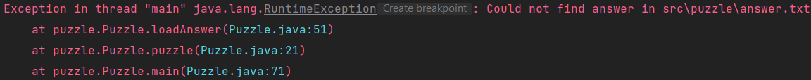

For many common exceptions, IntelliJ will indicate a "Create breakpoint" button
in the console output (just to the right of `java.lang.RuntimeException` in the
above screenshot), which will allow you to access the advanced breakpoint
window. To access it without this button, create a breakpoint on any line (in
the following screenshot, we've created a breakpoint on line 23), right-click
it, and select "More".

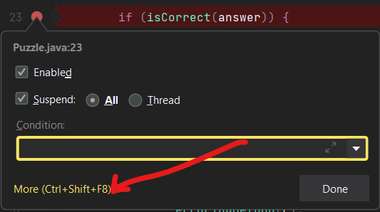

The advanced breakpoint window should look something like this:

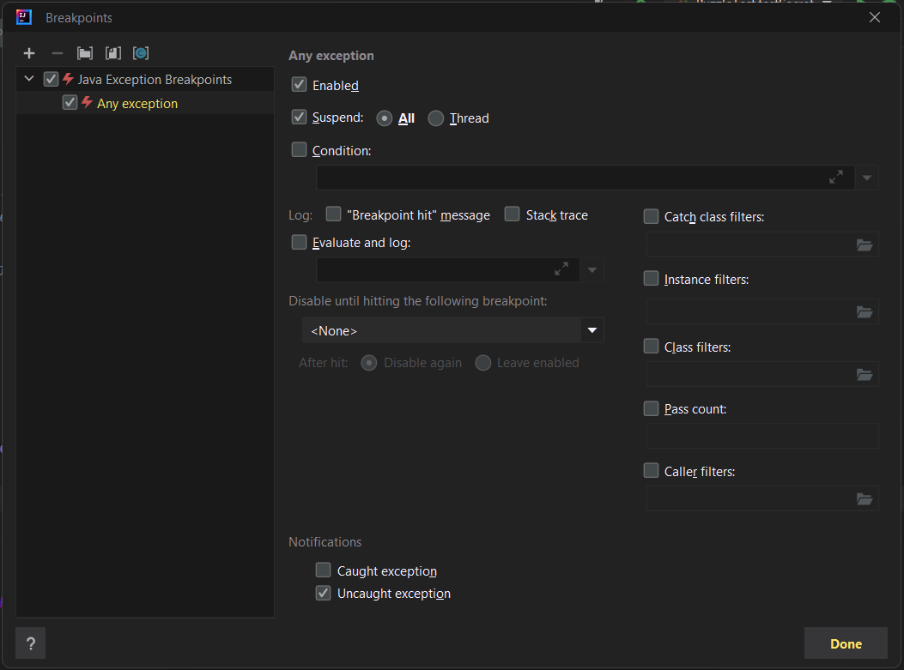

There's a lot going on here, but you don't need to understand most of it. Click
the plus symbol in the top-left corner, and you should see a popup like this:

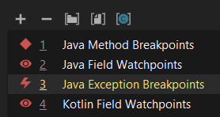

Select "Java Exception Breakpoints", and another window will appear where you
can specify the type of exception for which we want to pause execution. The
console told us that we were getting a `java.lang.RuntimeException`, so go ahead
and select that.

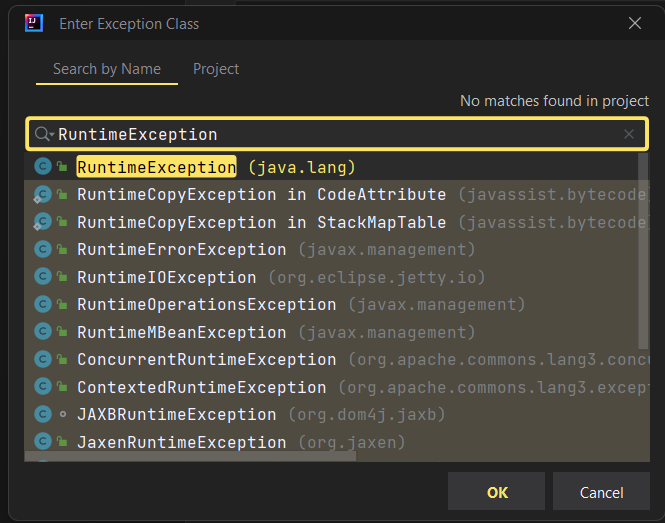

You should now see the original advanced breakpoint window, with a newly created
exception breakpoint aptly named 'java.lang.RuntimeException' (if you used the
console's "Create breakpoint" button to access the window, you may see two
copies of this, and that's okay).

You will have the option to break on caught or uncaught exceptions, or both.
This can be useful because a lot of library code intentionally throws and
catches a lot of exceptions, so this allows us to focus on the unhandled ones if
necessary. For now, go ahead and leave both options checked.

If you debug the program at this point, your code should pause on line 53, with
a little lightning bolt symbol in place of the usual red circle. This indicates
that the breakpoint was triggered by an exception, rather than a normal
breakpoint.

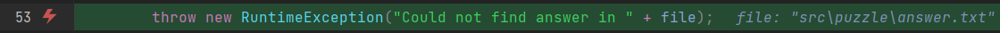

From this, we can see that IntelliJ is hinting that the problem may be in
`src/puzzle/answer.txt`. By inspecting that file, poking around `Puzzle.java`,
and using other debugging techniques you learned in Lab 02, can you figure out what's
going on?



<details markdown="block">
<summary markdown="block">

**Hint**

</summary>

The issue is that `Puzzle.java` parses `answer.txt` for an integer guess, and
doesn't find any, so it throws an exception. To fix this, replace the TODO line
of `answer.txt` with any integer.

</details>

After fixing the bug, run `Puzzle` again. You should now see the following
output:

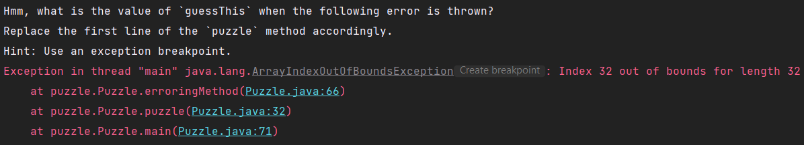

Read the error message and see if you can find the answer! If you've got it
correct, `Puzzle.java` will no longer error and you should pass `testPuzzle`
inside of `tests/puzzle/PuzzleTest`.



### Expressions and Watches

When debugging, you may not always have the value that you want to inspect
stored in a variable. Luckily, IntelliJ has a solution for us! Once paused on a
certain line, you can use the "Evaluate Expression" tool (shaped like a
calculator). You can click on the calculator icon to open up a whole new window,
but you can also just type the expression into the debugger directly:

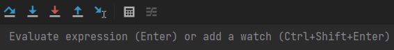

You can use variables and method calls with this tool too! Even though we've
only used `Math` library methods in the following example, you can call anything
you want. Here, we are using the tool in `Puzzle.java` with an initial `answer`
guess of `973`:

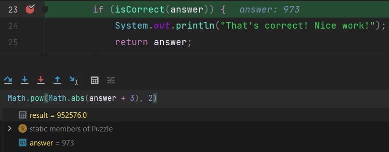

After you resume the program, `result` will be lost. If you don't want to lose
it, you can use Ctrl+Shift+Enter (Windows) or Cmd+Shift+Enter (Mac) to add it as
a _watch_. This will keep it around even after you continue execution. Moreover,
watches will change value accordingly with the program, just like normal
variables would!

Watches will persist even after you stop and rerun your program, so they can be
very useful for debugging over multiple executions. As an example, I've changed
my guess from before to be `1717` and reran the program entirely, but didn't
have to re-evaluate the expression for the debugger to tell me what it was!

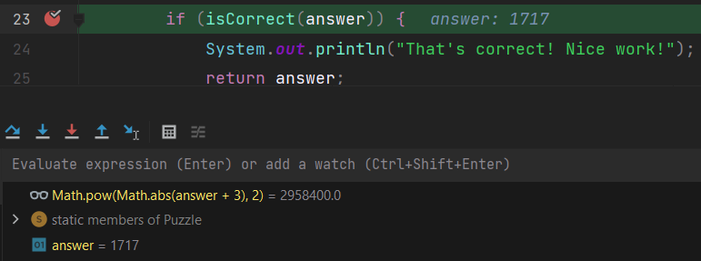

### A Secret Challenge

At this point, you should have one more failing test, `testSecret` (there is no
associated Java file for this test). We're being intentionally vague and not
telling you what `testSecret` does. In the real world, you often need to figure
out what poorly documented code is doing, and the debugging skills you've
learned over the past three labs will prove immensely helpful!

While you're debugging, you may find the exception breakpoint from the last
exercise to be quite annoying. Feel free to open up the advanced breakpoints
window again to disable or delete it.





---

Once you're done with that, congratulations, you have finished Lab 05!

## Deliverables and Scoring

The lab is out of 256 points. There are no hidden tests on Gradescope. If you
pass all the local tests, you will receive full credit on the lab (unless you
modified things you weren't supposed to modify).

- Create a merge conflict in `conflict/hello.txt` (64 pts)
- Resolve the merge conflict appropriately in `conflict/hello.txt` (64 pts)
- Find a correct value for `puzzle/answer.txt` (64 pts)
- Find a correct value for `puzzle/secret.txt` (64 pts)

## Submission

Just as you did for the previous assignments, add, commit, then push your Lab 05
code to GitHub. Then, submit to Gradescope to test your code. If you need a
refresher, check out the instructions in the
[Lab 1 spec](/materials/lab/lab01/index.md#saving-your-work-using-git-and-github)
and the
[Assignment Workflow Guide](/materials/guides/assignment-workflow/index.md#submitting-to-gradescope).
