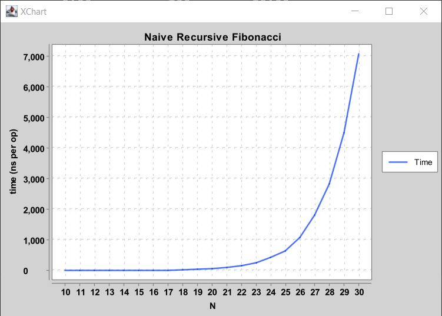

**This lab is optional, and you are not required to complete it. Because of this,
there is no set due date for this lab. There is a corresponding video that we
recommend you watch to help you get started with this lab.**

## FAQ Page

Please use our **[common issues and frequently asked questions page](./faq.md)**
as a resource. We'll be updating this FAQ page on the website throughout the
week! In future labs, we'll link the FAQ at the top.

## Introduction

Different data structures perform differently in different situations. In this
lab, we'll explore a couple of these situations for the `AList` and `SLList`
classes we discussed in lecture.

### Setup

Follow the
[assignment workflow instructions](../../guides/assignment-workflow/index.md#getting-the-skeleton)
to get the assignment and open it in IntelliJ. This assignment is `lab05`.

### Goals and Outcomes

In this lab, you will solidify your understanding of why we have different
kinds of data structures by analyzing the time they take to perform certain
operations.

By the end of this lab, you will...

- Understand that different data structures have different time guarantees.
- Be able to empirically measure the runtime of a program.
- Interpret timing experiments and reason about their implications.

## Timing Experiments

### Overview

You learned in 61A how to construct correct solutions to problems, but didn't
worry too much about how fast they run. One way of determining the speed of a
given program is to test it on a variety of inputs and measure the time it takes
for each one. This is called a _timing experiment_, and we refer to this process
as finding the efficiency of a program _empirically_. In this lab, we will be
doing
some timing experiments to see how the `AList` and `SLList` classes we discussed
in lecture perform.

We'll learn more about how to theoretically formalize this notion of "speed"
later in 61B, but for now, we'll stick to empirical methods.

In this part of the lab, we will be working with the code in the `timing`
package.

### `TimingData`

In a timing experiment, we are interested in seeing how the time of some
operations scales with the size of the computation. The output of a timing
experiment will be an instance of the following class:

```java
public class TimingData {
    private List<Integer> Ns;
    private List<Double> times;
    private List<Integer> opCounts;
    // Some utility methods for accessing data
}
```

In this class, we have three parallel lists, storing data from a bunch of
trials. The data for trial `i` is stored at index `i` in each list:

`Ns`
: The size of the data structure, or how many elements it contains.

`times`
: The total time required for all operations, in seconds.

`opCounts`
: The number of operations made during the experiment. For example, we might
do many operations to take an average over.

### Example: Fibonacci

As an example, let's look at timing a method that computes the N-th Fibonacci
number, very inefficiently. Open the `timing/Experiments.java` file, and look
at the `fib` and `exampleFibonacciExperiment`.

The most interesting part is the for loop in the experiment:

```java
for (int N = 10; N < 31; N++) {
    Ns.add(N);
    opCounts.add(ops);
    Stopwatch sw = new Stopwatch();
    for (int j = 0; j < ops; j++) {
        int fib = fib(N);
    }
    times.add(sw.elapsedTime());
}
```

1.  We compute the 10th through 30th Fibonacci numbers in the outer loop. This is
    our computation "size", so we add it to the `Ns` list. (For small `N`, `fib` is quite fast and will probably be subject to machine noise.)
2.  We also do this computation 100 times to collect a lot of samples and make
    sure we get a good average time, so we add `100` to the `opCounts` list.
3.  To time code, we use Princeton's [`Stopwatch` class][stopwatch]. We
    construct a `Stopwatch` just before the code we want to time, and call
    `stopwatch.elapsedTime()` at the end to see how much time has passed in
    seconds. This time is added to the `times` list.
4.  Inside the inner for loop, we simply call the `fib` function `ops` times
    on the argument `N`. This for loop is timed.

Note that all 3 lists have the same length.

[stopwatch]: https://algs4.cs.princeton.edu/14analysis/Stopwatch.java.html

### Timing Tables

One way that we could look at the collected data is by printing the lists in a
table:

```text
           N     time (s)        # ops  microsec/op
------------------------------------------------------------
          10         0.00          100         0.00
          11         0.00          100         0.00
          12         0.00          100        10.00
          13         0.00          100         0.00
          14         0.00          100         0.00
          15         0.00          100        10.00
          16         0.00          100        10.00
          17         0.00          100        10.00
          18         0.00          100        20.00
          19         0.00          100        40.00
          20         0.01          100        60.00
          21         0.01          100       100.00
          22         0.02          100       150.00
          23         0.03          100       250.00
          24         0.04          100       420.00
          25         0.06          100       630.00
          26         0.11          100      1070.00
          27         0.18          100      1810.00
          28         0.28          100      2830.00
          29         0.45          100      4510.00
          30         0.71          100      7080.00
```

The first 3 columns are the data we collected and described above. The last
column, as its header says, is the number of microseconds it took on average
to perform each operation. Here, an "operation" is a call to `fib(N)`. Note
that `ops` is always the same here, because we were timing the same number of
calls every time.

Here are some things to notice about the above table:

- `fib(N)` takes _longer_ to compute when `N` is larger. Many functions will
  take a longer time to complete when the input or underlying data is larger.
- For 15, 16, 17, and others, the time per `fib(N)` calll is the same,
  despite being different numbers. For small inputs, timing results are not
  precise for two reasons:

  - The variance in runtime is high, for reasons beyond the scope of the
    course (and covered in CS 61C).
  - The accuracy of our System clock (milliseconds) is insufficient to
    resolve the difference between runtimes for these calls.

  This can also lead to strange situations, such as the runtime for 12 being
  larger than the runtime for 13. Therefore, when we use empirical timing
  tests, we focus on the behavior for _large_ `N` -- note that the differences
  are much larger, and easier to distinguish!

Finally, the times that you get may be _very_ different from the table that's
written above. That’s okay, as long as the _general trend_ is the same. In 61C,
you will learn exactly why the same code may take vastly different amounts of
time on different hardware. In 61B (and in most theory-based classes) we are
only concerned with general trends, which hide parts of reality that are hard
to account for. While reasoning about “general trends” may seem tricky, we
will learn a formalism for this later in the course (asymptotics). For now, use
your intuition!

### Plots

While we can do some things with numbers, it's hard to really _feel_ the
"order of growth" in a text table. We can also use a graphing library to
generate plots!

{: style="max-height: 500px;" }

### `AList`, Bad Resizing

As discussed in [lecture][], a multiplicative resizing strategy will result in
fast add operations (good performance), while an additive resizing strategy
will result in slow add operations (bad performance). In this part of the lab,
we'll put visuals to these statements!

[lecture]: https://docs.google.com/presentation/d/1yGLKPo8qvoRe6AXeHluBPahttNawAfmv6beQPAW4J2o/edit#slide=id.g625dc7e36_0943

In the `timing` package, we've provided the `AList` class created in lecture
with the bad resizing strategy below:

```java
public void addLast(Item x) {
    if (size == items.length) {
        resize(size + 1);
    }

    items[size] = x;
    size = size + 1;
}
```

In this part of the lab, you'll write code that tabulates the amount
of time needed to create a `AList` of various sizes using the `addLast` method
above.

- `N` should take on the values of 1000, 2000, all the way to 128000, doubling
  each time.
- You should time the entire time it takes to construct an `AList` of size
  `N` from scratch. That is, you will need a new `AList` for each value of
  `N`, and you will have an inner for loop containing a call to `addLast`.
- We're interested in the average time per `addLast` call, so the number of
  operations is the number of `addLast` calls, or `N`.





**Note**: If your computer is a little slow, you might want to stop at 64000
instead of 128000.

### `AList`, Good Resizing



Your `AList` objects should now be constructed nearly instantly, even for `N =
128000`, and each add operation should only take a fraction of a microsecond.
You might observe some strange spikes for "small" `N` -- these are due to,
again, 61C material.

Optional: Try increasing the maximum `N` to larger values, e.g. 10 million. You
should see that the time per add operation remains constant.

Optional: Try experimenting with different resizing factors and see how the
runtimes change. For example, if you resize by a factor of 1.01, you should
still get constant time `addLast` operations! Note that to use a non-integer
factor you'll need to convert to an integer. For example, you can use
`Math.round()`.

```java
public void addLast(Item x) {
    if (size == items.length) {
        resize((int) (size * 1.01));
    }

    items[size] = x;
    size = size + 1;
}
```

### `SLList.getLast`

Above, we showed how we can time the construction of a data structure. However,
sometimes we're interested in the dependence of the runtime of a method on the
size of an existing data structure that has already been constructed.

For example, in your `LinkedListDeque`, you are supposed to have `addLast`
operations that are fast... a single `addLast` operation must take "constant
time", i.e. execution time should not depend on the size of the deque.

In this part of the lab, we'll show you how to empirically test whether a
method's runtime depends on the size of the data structure.

Suppose we want to compute the time per operation for `getLast` for an `SLList`
and want to know how this runtime depends on N. To do this, we need to follow
the procedure below:

1. Create an `SLList`.
2. Add `N` items to the `SLList`, for `N` from 1000 through 128000 and doubling.
3. Start the timer.
4. Perform `M` getLast operations on the `SLList`.
5. Check the timer. This gives the total time to complete all `M` operations.

**It's important that we do not start the timer until after step 2 has been
completed.** Otherwise the timing test includes the runtime to build the data
structure, whereas we're only interested how the runtime for `getLast` depends
on the size of the `SLList`.



Note that the `N` and `# ops` columns are not the same. This is because
we are always calling `getLast` the same number of times regardless of the size
of the list, i.e. `M = 10000` for step 4 of the procedure described above.

Secondly, the operations are again not constant time! (If your results imply
that the operations _are_ constant time, make sure you're running your tests on
the `SLList` instead of the `AList`!). This means that as the list gets bigger,
the `getLast` operation becomes slower. This would be a serious problem in a
real world application. For example, suppose the list is of ATM transactions,
and the `getLast` operation was being called in order to get the most recent
transaction to print a receipt. Every time the ATM is used, the next receipt
would take a little bit longer to print. Eventually over many months or years,
the list would become so large that the `getLast` operation would be unusably
slow. While this is a contrived example, similar problems have plagued real
world systems!

For this reason, the `LinkedListDeque` that you built in Project 1A was
required to have a runtime that is independent of the size of the data
structure. In other words, the last column will be some approximately constant
value.

Optional: Try running a timing test for getting the last element of a Java
`LinkedList`, with `list.get(list.size() - 1)`. What do you think it does to
achieve this?

Optional question to ponder: Why is `getLast` so slow? What is special about
your `LinkedListDeque` that makes the `getLast` function faster?

## Deliverables and Scoring

The lab is not worth any points. There are no hidden tests on Gradescope. 

- `timing/Experiments.java`
  - `timeAListConstruction`
  - `timeSLListGetLast` 

## Submission

Just as you did for the previous assignments, add, commit, then push your Lab 5
code to GitHub. Then, submit to Gradescope to test your code. If you need a
refresher, check out the instructions in the
[Lab 1 spec](../lab01/index.md)
and the
[Assignment Workflow Guide](../../guides/assignment-workflow/index.md#submitting-to-gradescope).
