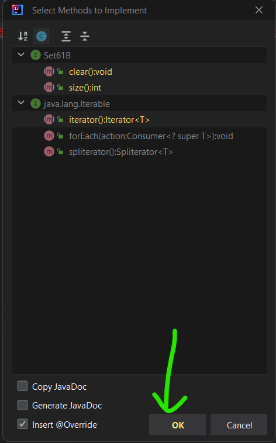

## FAQ

The FAQ for this lab can be found [here](faq.md).

## Introduction

In this lab, you'll create `BSTMap`, a BST-based implementation of the `Map61B`
interface, which represents a basic tree-based map. You will be creating this
completely from scratch, using the interface provided as your guide.

After you've completed your implementation, you'll compare the performance of
your implementation to a list-based `Map` implementation `ULLMap` as well as the
built-in Java `TreeMap` class (which uses a BST variant known as a _red-black tree_).

## Pulling from skeleton

Follow the
[assignment workflow instructions](https://fa23.datastructur.es/materials/guides/assignment-workflow/#getting-the-skeleton)
to get the assignment and open it in IntelliJ. This assignment is `lab07`.

## BSTMap

In this lab (and future labs), we may not provide as much skeleton code as in
the past. If you're having trouble getting started, please come in to lab and/or
use the resources linked below!

An algorithmic guide to `put` and `get` can be found
[here](https://www.youtube.com/watch?v=P3_Luw2M8X4).

Create a class `BSTMap` that implements the `Map61B` interface using a BST
(Binary Search Tree) as its core data structure. **You must do this in a file
named `BSTMap.java`!** Your implementation is required to implement all of the
methods specified in `Map61B` _except_ for `remove`, `iterator` and `keySet`. For
these methods you should throw an `UnsupportedOperationException`, unless completing
the optional portion of the lab.

Your code will not compile until you create the `BSTMap` class and implement all
the methods in `Map61B`. You can implement methods one at a time by writing the
method signatures of all the required methods, but throwing
`UnsupportedOperationException`s for the other implementations until you get
around to actually writing them.

For debugging purposes, your `BSTMap` should also include an additional method
`printInOrder()` (not given in the `Map61B` interface) that prints out your
`BSTMap` in order of increasing Key. We will not test the result of this method,
but you may find this helpful for testing your implementation!

In your implementation, you should ensure that generic keys `K` in `BSTMap<K,V>`
implement
[Comparable](https://docs.oracle.com/en/java/javase/11/docs/api/java.base/java/lang/Comparable.html).
This is called a _bounded type parameter_.

[The syntax](https://docs.oracle.com/javase/tutorial/java/generics/bounded.html)
is a little tricky, but we've given an example below. Here, we are creating
a `BSTSet` for `Comparable` objects. We've included the rather strange
`compareRoots` for pedagogical purposes (for a `compareTo` refresher, see this
[documentation](<https://docs.oracle.com/en/java/javase/11/docs/api/java.base/java/lang/Comparable.html#compareTo(T)>)):

```java
public class BSTSet<K extends Comparable<K>> implements Set61B<K> {
    private class BSTNode {
        K item;
        // ...
    }

    private BSTNode root;

    /* Returns whether this BSTSet's root is greater than, equal to, or less
     * than the other BSTSet's root, following the usual `compareTo`
     * convention. */
    public int compareRoots(BSTSet other) {
        /* We are able to safely invoke `compareTo` on `n1.item` because we
         * know that `K` extends `Comparable<K>`, so `K` is a `Comparable`, and
         *`Comparable`s must implement `compareTo`. */
        return this.root.item.compareTo(other.root.item);
    }

    // ...
}

```


**INFO**: You may have noticed that the syntax for a bounded type parameter uses `extends`
even though `Comparable` is an `interface`. In the context of bounded type
parameters, `extends` can mean `extends` or `implements`
([docs](https://docs.oracle.com/javase/tutorial/java/generics/bounded.html)). Don't ask us why - we don't know either.

(The syntax also implies you can "extend" `final` classes such as `Integer`,
which is impossible. Go Java!)






IntelliJ has a nice feature that will generate the method signatures for you. If
you're implementing an interface and haven't implemented all the methods,
IntelliJ will highlight the class signature in red. If you hover over this, you
should be able to select `Implement methods`. On the pop-up window, click "OK"
with the default selections, and IntelliJ should populate the class with the
required method signatures (they won't be functional though!).

It should look something like this (**you don't have `Set61B`, this is just an
example!**):




In this example, IntelliJ will generate the `clear`, `size`, and `iterator`
method signatures, because that's all our mythical `Set61B` interface
requires. If you follow this procedure with your code, you should have all the
method signatures required for `Map61B`. (You can also pick and choose which signatures to generate, if you'd like.)





## Resources

The following resources might prove useful:

- Lecture 16 [slides](https://docs.google.com/presentation/d/1FRqlq7C_854ZLp-VMHZ13CxA7U45P50iEA7IuxW8H7A/edit?usp=sharing).
- `ULLMap.java` (given in `src/`), an unordered, linked-list-based `Map61B`
  implementation.

## So... How Fast Is It?

There are two interactive speed tests provided in `InsertRandomSpeedTest.java`
and `InsertInOrderSpeedTest.java`. Do not attempt to run these tests before
you've completed `BSTMap`. Once you're ready, you can run the tests in
IntelliJ.

The `InsertRandomSpeedTest` class performs tests on element-insertion speed of
your `BSTMap`, `ULLMap` (provided), Java's built-in `TreeMap`, and Java's
built-in `HashMap` (which you'll explore more in the next lab). It works by
asking the user for a desired length of each String to insert, and also for an
input size (the number of insertions to perform). It then generates that many
Strings of length as specified and inserts them into the maps as
`<String, Integer>` pairs.

Try it out and see how your data structure scales with the number of insertions
compared to the naive and industrial-strength implementations. Remember that
asympototics aren't representative on small samples, so make sure your inputs
are sufficiently large if you are getting a confusing trend. Record your results
in a file named `speedTestResults.txt`.

Now try running `InsertInOrderSpeedTest`, which behaves similarly to
`InsertRandomSpeedTest`, except this time the Strings in `<String, Integer>`
key-value pairs are inserted in
[lexicographically-increasing order](http://en.wikipedia.org/wiki/Lexicographical_order).
If you observed anything interesting, discuss it with your fellow students or a
staff member!



## Deliverables and Scoring

The lab is out of 5 points. There is one hidden test on Gradescope (that
checks your `speedTestResults.txt`). The rest of the tests are local. 
**For this lab, if you pass all the local tests and fill out the`speedTestResults.txt` 
file sufficiently, you will get full credit on Gradescope.**

## Submission

Just as you did for the previous assignments, add, commit, then push your Lab 07
code to GitHub. Then, submit to Gradescope to test your code. If you need a
refresher, check out the instructions in the
[Lab 1 spec](../lab01/index.md)
and the
[Assignment Workflow Guide](../../guides/assignment-workflow/index.md#submitting-to-gradescope).

## More (Ungraded) Exercises

These will not be graded, but you can still receive feedback using the local
tests (and on the autograder).

Implement the methods `iterator()`, `keySet()`, `remove(K key)` in your `BSTMap`
class. When implementing the `iterator` method, you should return an iterator
over the _keys_, in _sorted order_. `remove()` is fairly
challenging - you'll need to implement Hibbard deletion.

For `remove`, you should return `null` if the argument key does not exist in the
`BSTMap`. Otherwise, delete the key-value pair (key, value) and return value.

## Optional: Asymptotics Problems

Check your answers against the [solutions](asymptotics-soln.md)!

Given `B`, a `BSTMap` with `N` key-value pairs, and `(K, V)`, a random key-value pair, answer the following questions.

Unless otherwise stated, "big-Oh" bounds (e.g. $\mathcal{O}(N)$) and "big-Theta" bounds (e.g. $\Theta(N)$) 
refer to the **number of comparisons** in the given method call(s).

For questions 1-7, state whether the statement is true or false. For question 8, give a runtime bound.

1. `B.put(K, V)` $\in \mathcal{O}(\log N)$
2. `B.put(K, V)` $\in \Theta(\log N)$
3. `B.put(K, V)` $\in \Theta(N)$
4. `B.put(K, V)` $\in \mathcal{O}(N)$
5. `B.put(K, V)` $\in \mathcal{O}(N^2)$

{:start="6"} 
1. For a fixed key `C` not equal to `K`, both `B.containsKey(C)` and `B.containsKey(K)` run in $\Omega(\log N).$
2. (This question is quite difficult.) Let `b` be a `Node` of a `BSTMap`, and two subtrees rooted at `root`, called `left` and `right`. Further, assume the method `numberOfNodes(Node p)` returns the number of nodes ($M$) of the subtree rooted at `p` and runs in $\Theta(M)$ time. What is the running time, in both the worst and best case, of `mystery(b.root, z)`, assuming `1 <= z < numberOfNodes(b.root)`?

Hint: See if you can work out what `mystery` does first, then see how it accomplishes it.

```java
public Key mystery(Node b, int z) {
    int numLeft = numberOfNodes(b.left);
    if (numLeft == z - 1) {
        return b.key;
    } else if (numLeft > z) {
        return mystery(b.left, z);
    } else {
        return mystery(b.right, z - numLeft - 1);
    }
}
```
