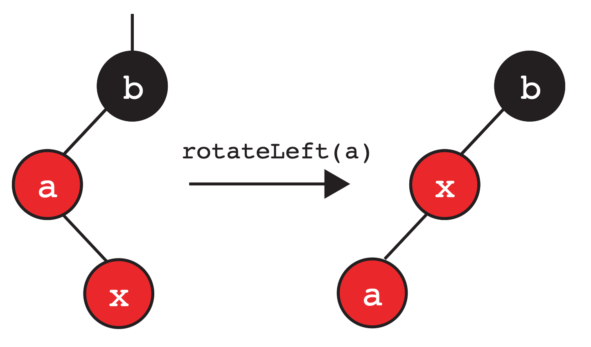
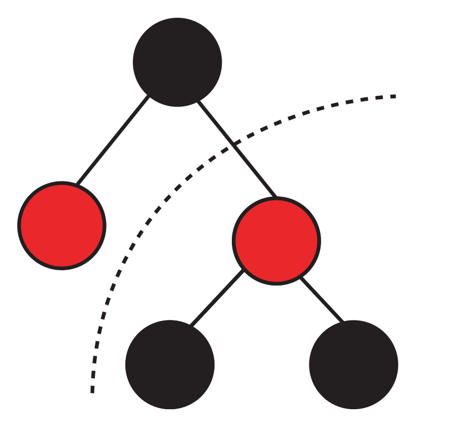
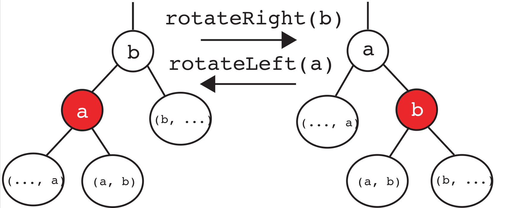

## FAQ

The FAQ for this lab can be found [here](faq.md).

## Before You Begin

As usual, pull the Lab 08 files from the skeleton and open them in IntelliJ.

## Learning Goals

In this lab, we will be implementing left-leaning red-black trees. 

## Introduction

In the previous labs, we've analyzed the performance of algorithms for 
access and insertion into the binary search tree. However, in some cases, 
we've always assumed that the trees were *balanced* - as we've seen, 
it's possible to produce a *spindly* tree that affects the performance 
of our data structure. 

Informally, a tree being "balanced" means that the paths from the root to 
each leaf are all roughly the same length. Any algorithm that looks once at 
each level of the tree -- such as searching for a value in the binary search 
tree -- only looks at the number of layers. In regard to the binary search 
tree, the smallest number of layers we can have is logarithmic with respect 
to number of nodes (i.e. $$\log N$$). 

To maintain this property of "balanced", we want to prevent the worst case scenario 
of obtaining a "spindly" tree, which leads to worse performance times. This is where 
balanced search trees/b-trees come in - they are effectively self-balancing and will 
maintain the "balanced" property that we want. If you would like a refresher on them, 
refer to the [lecture slides](https://docs.google.com/presentation/d/1MZBpWtRAkJdwY4jOYiebFrktz4v3gpLCSxopN2XSsaU/edit?usp=sharing).

However, in this lab, we won't be focusing on implementing balanced search trees - why? While
they do guarantee that a path from the root to any leaf is $$O(\log N)$$, they're 
also notoriously difficult and cumbersome to code, with numerous corner cases for 
common operations. They are still commonly used and provide plenty of benefits, but 
they do have drawbacks. **Keep in mind that we'll still reference balanced search trees 
throughout this lab (any reference to a balanced search tree from here on out is a reference 
to a 2-3 tree).**

We then turn our attention to a related data structure: **left-leaning red-black trees**.
The lecture slides are linked [here](https://docs.google.com/presentation/d/1GP_5y1hpfF7SfUz4rfwcP7uXIYZ4cNRREFyz6IDfWhg/edit?pli=1#slide=id.g213d1cb6cd3_0_522)
if you would like to review them before starting on this lab. 

### Links vs Nodes



In lecture, we've introduced the concept of LLRBs with **links**. However, for this lab,
we will not be representing our LLRBs with links. Instead, we'll be using **nodes**. The main
reason for this is that the implementation with links **is much harder** than with nodes.
To cover our ground here, consider the example below of how we've introduced the visualization
of it in lecture.

For this lab, since we'll be handling colored nodes - the relationship between the red link
and its connected node can be defined like below.

Originally, `A` was connected by a red link. But if we use colored nodes in our representation
instead of links, `A` itself would be colored red. The visualization above is meant to show 
how a red link would map to a colored node, so please keep this mind for the rest of the lab!



## Left-Leaning Red-Black Trees

At its core, LLRBs are just a binary search tree, but there are a few additional 
invariants related to "coloring" each node red or black. This "coloring" creates 
a one-to-one mapping between 2-3 trees and LLRBs! **In particular, every 2-3 tree
corresponds to exactly one LLRB, and vice-versa.**

The consequence is quite astounding: LLRBs maintain the balance of
2-3 trees while inheriting all normal binary search tree operations 
with additional housekeeping.

### LLRB Tree Properties

We now specify some properties of LLRB trees. In particular, we 
use the one-to-one mapping between valid LLRB trees and 2-3 
trees to derive some of these properties.

Using colored nodes as our representation, the root node must be colored black.
: Our interpretation of red nodes is that they are in the same 2-3 node as
  their parent. The root node has no parent, so it cannot be red.

If a node has one red child, it must be on the left.
: This makes the tree left-leaning.

No node can have two red children.
: If a node has two red children, then both children are in the same 2-3 node
  as the parent. This means that the corresponding 2-3 node contains 3 keys,
  which is not allowed.

No red node can have a red parent (every red node's parent is black).
: If a red node has a red parent, then both the red child and red parent are in
  the same 2-3 node as the red parent's parent. This means that the
  corresponding 2-3 node contains 3 keys, which is not allowed.

In a balanced LLRB tree, every path to a null reference goes through the same number of black nodes.
: In a balanced 2-3 tree, every null node is the same distance from the root.
  We also know that every black node in an LLRB tree corresponds to exactly one
  node in the equivalent 2-3 tree. Therefore, every null node in an LLRB tree
  is the same number of black nodes from the root.

## Inserting Into LLRB Trees

**Insertion into LLRB trees starts off with the regular binary search tree
insertion algorithm**, where we search to find the appropriate leaf location.
However, once we've placed the node, this can can break the LLRB
invariants, so we need additional operations that can "restore" LLRB properties. 
We know that there is a one-to-one correspondence of valid
LLRB to 2-3 trees. Let's use this correspondence to try to derive
these operations.

We'll cover different cases when our invariants are broken and the appropriate 
operations to fix them. 

### Invariant: If a node has one red child, it must be on the left  

As mentioned, our inserted node will be red. Let's say we insert our node into our 
LLRB and it ends up as a **right child** of node `a` (this implies that the value in our 
node is greater than `a`). **Let's assume that the left child of node `a` is black or 
doesn't exist.** This breaks our invariant, where "If a node has one red 
child, it must be on the left". Since we can't have any red-leaning nodes, we 
would want to **rotate left** on the parent node. An example is shown below:

{: style="max-height: 250px;" }

### Invariant: No node can have two red children

Let's consider another case. Similar to above, we insert our node into the LLRB 
as a red node, and it ends up as the **right child** of node `b` (in this example).
What happens when node `b`'s left child is a red node? This then breaks the invariant 
of "No node can have two red children". We then perform the operation 
"color flip" on the parent. Here, we apply the color flip operation on `b`, 
flipping its color and its childrens' colors.

{: style="max-height: 250px;" }

We will return to this configuration later.

### Invariant: No red node can have a red parent (every red node’s parent is black)

This can be broken down into two cases defined below.  

#### Two consecutive left-leaning red nodes. 

What happens if we insert our node and it ends up as a left child of a red node?
In this case, we then want to adjust our operation and "rotate right" (**in other 
words, it is not possible to have two left-leaning red nodes**).

Rotating right is the opposite of rotating left! It will give us back the
original subtree if applied to the new root.

In this case, we rotate right on `b`:

{: style="max-height: 250px;" }

At this point, we notice that it's the same pattern as the previous case, so
we apply a color flip to `a`.

#### Red node with a right-leaning red child/node. 

In the other case, we might end up with our node becoming the right child of an 
already red node. In this case, we then apply our rotate left operation. 

As shown below, we rotate left on `a` in this example and we get:

{: style="max-height: 250px;" }

**Note that this ties into the invariant mentioned above, where we can't have a 
red-leaning right node.** Here, we have the previous case again, so we know that we can rotate right on
`b` and apply a color flip to the root, `x`.

#### Upward Propagation

Hold on -- notice that some of these cases we just covered have ended up in a color flip.
What if the subtree we modified was a *right subtree*, and the rest of the tree looked
like this:

{: style="max-height: 250px;" }

Just like how pushing up a key in a 2-3 tree may result in overstuffing
the parent node, **performing these transformations may *also* violate an LLRB
invariant**, giving us one of these three cases again. We resolve
these cases until we either:

- Do not have any broken invariants
- Flip the root's color



In some cases, we must remember to flip the root back to black in 
our representation.

### LLRB Insertion Summary



We discussed three operations that we can use to "fix" the LLRB invariants
after inserting a node. Because it's possible to have upward propagation as mentioned above, 
let's try to generalize our operations a little more visually (specifically for our rotations). 

We have two rotations, that can be used to move a right child or left child
up into their parent's position:

{: style="max-height: 250px;" }

Here's a brief description of what happens when we `rotateRight(b)`:
- The root of the subtree has changed from `b` to `a`.
- `a` and `b` have moved to the "right".
- The two nodes swap colors so that the new root is the same color as the old root.
- The reorganized subtree still satisfies the binary search property.

Here's a brief description of what happens when we `rotateLeft(a)`: 

- The root of the subtree has changed from `a` to `b`.
- `a` and `b` have moved to the "left".
- The two nodes swap colors so that the new root is the same color as the old root.
- The reorganized subtree still satisfies the binary search property.

We also have the color flip operation:

{: style="max-height: 250px;" }

## LLRB Tree Implementation



Before starting, make sure to read through the entire class, `RedBlackTree.java`, especially 
the provided node class. Make sure to also read the comments for each method! 

### Exercise: Color Flip

Let's first consider the color flip operation that is essential to LLRB tree
implementation. Given a node, this operation simply flips its color and
the children's colors.

Implement the `flipColors` method in `RedBlackTree.java`.

### Exercise: Rotations

We have seen that we can rotate the tree to balance it without violating the 
binary search tree invariants. Now, will implement it ourselves!

In `RedBlackTree.java`, implement `rotateRight` and `rotateLeft`.



*Hint*: The two operations are symmetric. Should the code significantly differ?
If you find yourself stuck, take a look at the examples that are shown above!

### Exercise: `insert`

We will now implement `insert` in `RedBlackTree.java`. We have provided you
with most of the logic structure - we have provided the logic to help out with 
normal binary search tree insertion, so all you need to do is handle the different 
cases that causes one of the operations (`rotateLeft`, `rotateRight`, `colorFlip`)
to occur. **Make sure you follow the steps from all the cases very carefully!** 
The root of the `RedBlackTree` should always be black.

Make sure to use the methods you've already implemented (`rotateRight`, `rotateLeft`, 
`flipColors`) to simplify the code writing. 



## Testing 
 
All tests have been provided to you locally. If you pass all tests in `TestRedBlackTree.java`, 
you receive full credit on Gradescope. Comments have been provided for you throughout the tests 
to help you further debug. 

## Deliverables

Complete the following methods in `RedBlackTree.java`:
- `flipColors`
- `rotateRight` and `rotateLeft`
- `insert`

This lab is worth 5 points.