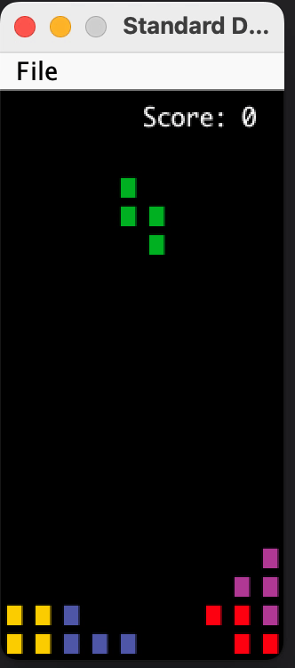

## [FAQ](faq.md)

Each assignment will have an FAQ linked at the top. You can also access it by
adding "/faq" to the end of the URL. The FAQ for Lab 12 is located
[here](faq.md).

## Introduction

This lab will help you get started with the second phase of the project: Interactivity. You are 
not expected to be done with phase 1 at the time you're working on this lab. If you have not 
started already though, we highly recommend that you do! 

For this lab, you should consider how some ideas (or implementation!) may translate over 
to Project 3. It will also help you gain more familiarity with useful tools necessary for 
the project.

## Tetris

In preparation for making your game, we will be constructing the game Tetris! If you're not too 
familiar with Tetris, it is a puzzle video game where players "complete" lines with differently 
shaped pieces (tetrominoes) spawn and descend on the board. With these pieces, the player 
can move them around and rotate as needed to complete lines - once those lines are completed, 
it disappears and the player gains points. The game ends when the uncleared lines reach the 
top of the board.

All of your implementation will be in `Tetris.java`. We have also provided two other files,
`Tetrimino.java`, which contains the board pieces that you'll be using, and `Movement.java`, 
which contains logic for rotating and moving the pieces. You won't be writing 
anything in either files directly, but these classes are used in `Tetris.java`.
We'll also be working with a library, `StdDraw`, to help implement some features,
such as user input. You may find this library very useful for Project 3.

While we want to have a working game of `Tetris.java`, we should break it down into 
smaller steps instead of tackling it all at once. The game can be loosely broken down 
into the following steps: 

1. Create the game window.
2. Randomly spawn a piece for the player to control and keep a display of the current score. 
3. Update the movements of the piece based on the player's input. 
4. Once the piece can no longer move, check if any lines need to be cleared, update the score and respawn a new piece. 
5. Repeat these steps until the game is over (when the uncleared lines reach the top).

In general, good coding practice is to first build small procedures with explicit 
purposes and then compose more complex methods using the basic ones. If you take a look 
at `Tetris.java`, you'll note that it contains many helper methods to help build 
a more complex game mechanism - breaking the game logic into individual methods is highly 
recommended for Project 3. It will give you a clear path forward in development and 
also provide clear breaks for unit tests.

By the end of the lab, you'll have something that functions like the below: 



## StdDraw

As mentioned, we'll be working with the library `StdDraw`. `StdDraw` is a provided 
library that gives basic capabilities to create drawings in your program as well as 
grab user input. Please take a look at the [API](https://introcs.cs.princeton.edu/java/stdlib/javadoc/StdDraw.html)
before getting started as you will find some of the methods useful not only for this lab,
but for Project 3.

## Running the Game 

To run the game, run the main method in `Tetris.java`.
You can use this method to verify the correctness of your game logic.

## Methods Overview 

Since all of your implementation will be in `Tetris.java`, there a couple of methods you'll
have to fill out to get your game working. 



### `updateBoard`

This method updates the board based on user input. The first step is to check if the user 
has typed in anything and grab the input if the user has. There will be some methods from the
`StdDraw` [API](https://introcs.cs.princeton.edu/java/stdlib/javadoc/StdDraw.html) 
that will be useful for implementing this part of the lab. 

The next step is to implement the actions that are taken from specific keys. 
The user is able to input 5 keys: 
- `a`: move the current piece towards the left by one tile
- `s`: move the current piece downwards by one tile
- `d`: move the current piece towards the right by one tile 
- `q`: rotate the current piece to the left
- `w`: rotate the current piece to the right

We recommend that you look at some of the provided helper methods in `Movement.java`
to see which ones you can call on to move a piece or rotate a piece (**you should not have to implement 
the logic yourself, but instead, rely on understanding what the helper methods do**). 

A `Movement` instance has also been provided for you, so you may use this to help you implement this 
method. 



### `incrementScore`

This is a helper method to help update your score. The player's score increases based on the number of 
lines cleared, that is, it increases by the lines clear multiplied by 100 points. The minimum 
number of lines that can be cleared is 1 and the maximum is 4. 



### `clearLines`

Whenever a line is completed in Tetris, we want to update our score. To help check if a row or multiple rows 
have been horizontally filled after a piece is placed, we want to implement this method. Let's break this down:
- To check if a row is full, we need to iterate through the entire height of our board. 
  - We track if a row is full through a boolean variable. The default is set to true. 
    - Note that we use a while loop with this boolean variable. If it is set to false, we no longer need to continue to check our rows.
  - We then go through the entire row at the current height. If a tile is equal to `Tileset.NOTHING`, then we set our boolean variable to false.
  - If we find that the current row is full, then we need to move all the rows above it down. 
  - Once the rows are moved down, then we update the amount of lines that are cleared and continue to check if there are any more complete rows.
- At the very end, we want to update our score based on the number of lines cleared.



### `runGame`

This is where the main game logic takes place. Comments have been left in the skeleton code
to help you get started. A couple of things to note:
- You'll need to ensure that the game does not exit or stop until the game is over (hint: how do you make sure this happens continuously?).
- Once you've completed the step above, you will need to check if you should render a new frame.
  - Specifically, you'll want to call on the helper method `shouldRenderFrame()`.
  - You don't need to know what this does, but it's to prevent flickering on the game (it should work without the condition too, but it won't be as seamless)
  - The next steps should be done within this check, so you'll have something like the below code snippet in your implementation. 

  ```sh
  // Your code here
  if (shouldRenderFrame()) {
    // Your code here 
  
  }
  ```

- If the current tetrimino is unable to move down or can no longer move from its current position, it is set to `null`. 
  - Once a piece has been placed and can no longer move, make sure to check if any lines need to be cleared and spawn another piece. 
- Make sure to update the board based on the user input and then render those changes.

**For this part, please use the helper methods that are provided or the ones you've already implemented to complete
this portion of the lab.** 



### `renderScore`

At this point, if you run the game, you'll notice that something is missing. The score! That's because we haven't 
yet rendered it. Fill out the method `renderScore` so that the score displays and you can use this to verify 
if your score is updated correctly when lines are completed in the game. 

Some notes: 
- Make sure to set the color of the text to white (rgb value of (255, 255, 255)) so the score is visible against a black background. 
- The score should appear at position x = 7, y = 19 
- Make sure to render the score once it's drawn!

Here are some useful methods to look at from the `StdDraw` library: 
- [`StdDraw.setFont`](https://introcs.cs.princeton.edu/java/stdlib/javadoc/StdDraw.html#setFont(java.awt.Font))
- [`StdDraw.clear`](https://introcs.cs.princeton.edu/java/stdlib/javadoc/StdDraw.html#clear())
- [`StdDraw.text`](https://introcs.cs.princeton.edu/java/stdlib/javadoc/StdDraw.html#text(double,%20double,%20java.lang.String))
- [`StdDraw.setPenColor`](https://introcs.cs.princeton.edu/java/stdlib/javadoc/StdDraw.html#setPenColor(java.awt.Color))
- [`StdDraw.show`](https://introcs.cs.princeton.edu/java/stdlib/javadoc/StdDraw.html#show())
- [`StdDraw.pause`](https://introcs.cs.princeton.edu/java/stdlib/javadoc/StdDraw.html#pause-int-)



## Submission and Grading

This lab is worth 5 points. Similar to Lab 11, completion of this lab is based off a checkoff. You may 
come to labs or office hours to get checked off in-person, or you may get checked off asynchronously
(through Ed). 

For the checkoff, we'll be looking for the following: 
- Pieces can be moved left, down, and right with the `a`, `s` and `d` keys respectively and rotated left and right with `q` and `w` respectively. 
- When a row is completed, the score is updated accordingly. 
- The score renders throughout the game and doesn't disappear at any point. 
- The game stops once the game over condition is met.

If you're getting checked off asynchronously through Ed, you will need to provide a screen recording of all of the above, 
so please plan ahead of time as it will take time to make the recording and to get checked off.


