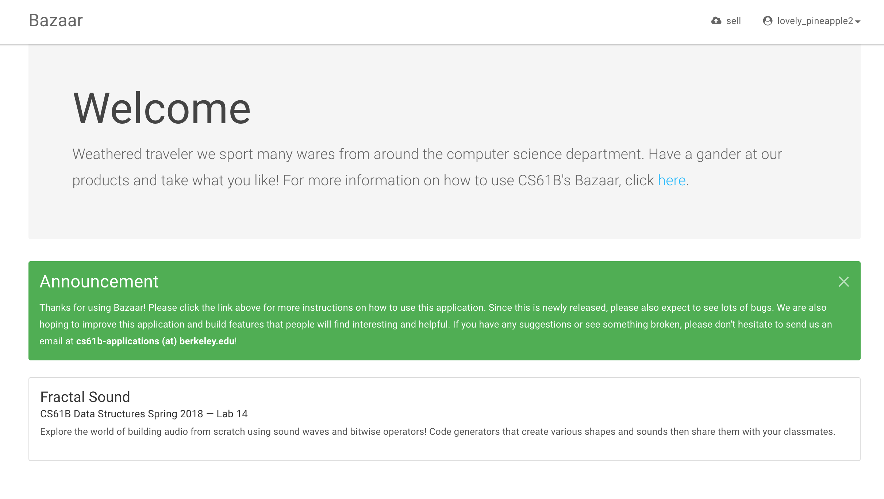
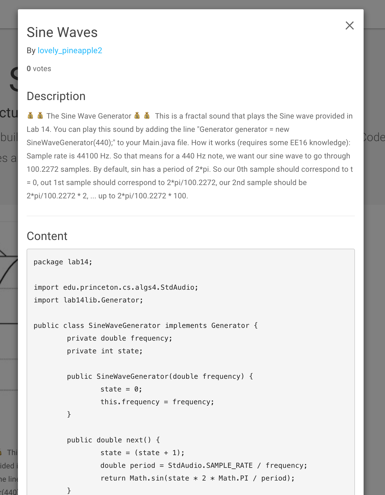
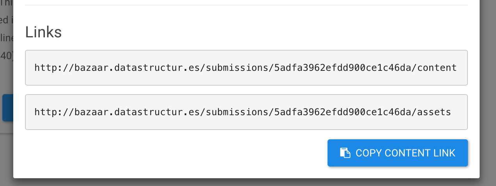
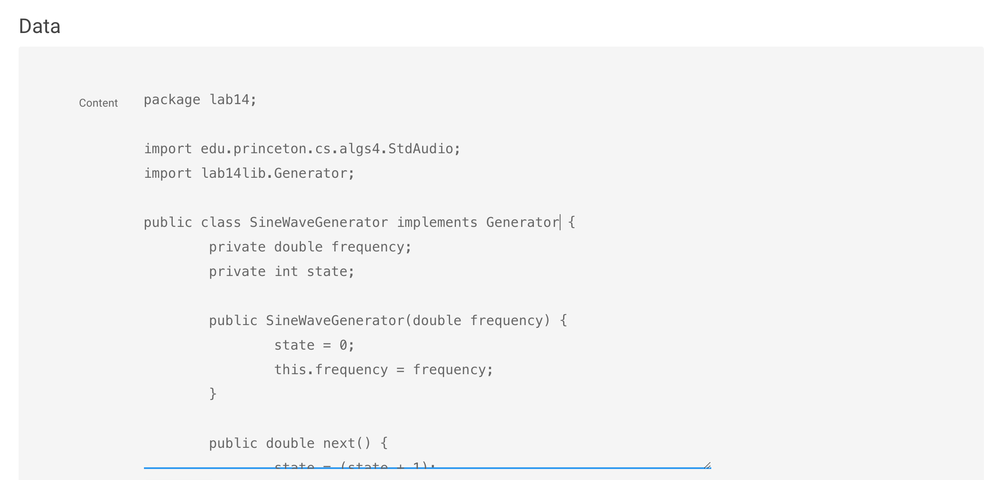
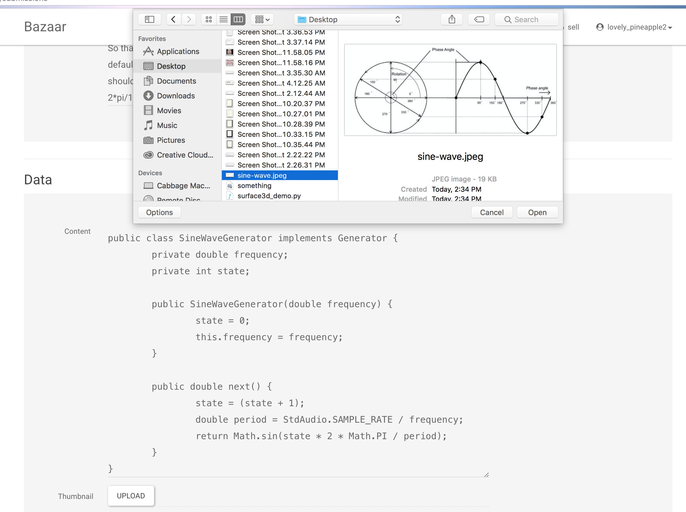
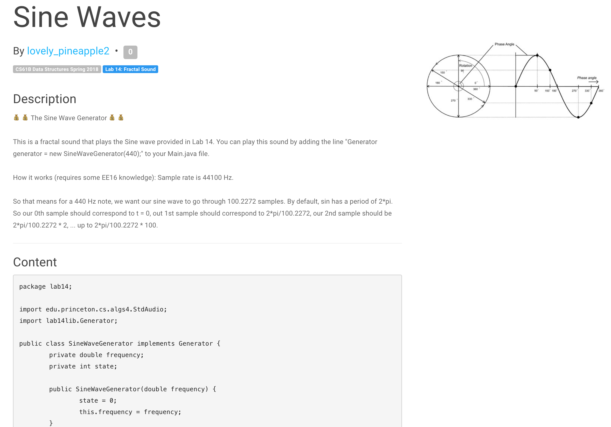

Introduction
-----

In this week's lab, you'll explore the world of building audio from scratch.

Skeleton Files
-----

After you pull from the skeleton repo, you'll have a few key files:
 - lab14lib/Generator.java
 - lab14lib/GeneratorPlayer.java
 - lab14lib/GeneratorDrawer.java
 - lab14lib/GeneratorAudioVisualizer.java
 - lab14lib/MultiGenerator.java
 - lab14/SineWaveGenerator.java
 - lab14/SineWaveAnimation.java
 - lab14/PlayMajorChord.java
 - lab14/Main.java

 You'll also need to pull updates from the library repo.  To do so, go to your cs61b-??? folder and navigate to the library-sp18 and run `git pull origin master`.  

Generator is an interface that defines the expected behavior of any Generator class. Each Generator needs a method `next` that returns the next `double`. `GeneratePlayer` plays the samples returned by the generator as sound. `GeneratorDrawer` draws the samples returned by the generator as a graph. `GeneratorAudioVisualizer` both plays and draws the samples. `MultiGenerator` provides a convenient way to play multiple waveforms at once. The other files are described below.

Playing with the Sine Wave Generator
-----

#### Creating and Using a Simple Generator

Open up `Main.java`, and add the follow lines to main:

        Generator generator = new SineWaveGenerator(440);
        GeneratorPlayer gp = new GeneratorPlayer(generator);
        gp.play(1000000);

What this does is:

 - Creates a SineWaveGenerator that outputs samples corresponding to a 440 Hz sine wave.
 - Creates a GeneratorPlayer that will play the SineWaveGenerator.
 - Tells the GeneratorPlayer to play the first one million samples from the generator as sound.

Try compiling and running GeneratorPlayer, and you should hear a high pitched beep sound.

Try changing the 440 to a 200 Hz, and you should hear a lower sound. Note that if you try even lower frequencies, your laptop speakers are likely too small to generate anything lower than ~60 Hz. However, if you use headphones or real speakers, you'll be able to hear such low frequencies.

#### Using the Generator Visualizer

We can also visualize the output of a generator. Replace the main method of `Main.java` with the following:

        Generator generator = new SineWaveGenerator(200);
        GeneratorDrawer gd = new GeneratorDrawer(generator);
        gd.draw(4096);

What this does is:

 - Creates a SineWaveGenerator that outputs samples corresponding to a 200 Hz sine wave.
 - Creates a GeneratorDrawer that will draw the GeneratorDrawer.
 - Tells the GeneratorDrawer to draw the first 4096 samples from the generator as a graph.

Run this and you should see something like:

#### Using the GeneratorAudioVisualizer

In fact, we can do both playing and drawing using `GeneratorAudioVisualizer.java`. Replace the main method of `Main.java` with the following:

        Generator generator = new SineWaveGenerator(200);
        GeneratorAudioVisualizer gav = new GeneratorAudioVisualizer(generator);
        gav.drawAndPlay(4096, 1000000);

Try this out, and you should see the first 4096 samples being drawn and the first 1,000,000 samples being played. The reason that we make these parameters different is that if we draw 1,000,000 samples, we won't be able to see anything useful.

#### Using the GeneratorAudioAnimator

We have provided a version of the visualizer that produces real-time animations of your generator's output: `GeneratorAudioAnimator.java`. Try out `SineWaveAnimation` to see it in action!

#### Using the MultiGenerator

As a last exercise in using the existing Generators, try the following out in `Main.java`:

        Generator g1 = new SineWaveGenerator(200);
        Generator g2 = new SineWaveGenerator(201);

        ArrayList<Generator> generators = new ArrayList<Generator>();
        generators.add(g1);
        generators.add(g2);
        MultiGenerator mg = new MultiGenerator(generators);

        GeneratorAudioVisualizer gav = new GeneratorAudioVisualizer(mg);
        gav.drawAndPlay(500000, 1000000);

You should hear a neat sound -- if you have better speakers, I recommend trying out 60 and 61 hz tones instead. This phenomenon of pulsing volume is known as a [beat](https://en.wikipedia.org/wiki/Beat_(acoustics).

For another example of using the `MultiGenerator`, try out `PlayMajorChord`, which will play a C [major chord](https://en.wikipedia.org/wiki/Major_chord) in sine waves.

Task 1: Generating a SawTooth
---

Your first major goal is to generate a `SawToothGenerator` class. Given the method below:

        Generator generator = new SawToothGenerator(512);
        GeneratorAudioVisualizer gav = new GeneratorAudioVisualizer(generator);
        gav.drawAndPlay(4096, 1000000);

It should draw the waveform below:

Specifically, this waveform should start at -1.0 and linearly increase towards 1.0, before resetting back to -1.0. The argument to SawToothGenerator describes the period of the waveform, i.e. the number of samples before it resets back down to -1.0.

For this task, you should create the `SawToothGenerator` class so that it behaves as above.

Hints:
 - This should be relatively straightforward. Don't overthink it.
 - You should use the % operator, with the period as the argument to the right of the %.
 - Your `SawToothGenerator` should have two instance variables of type int: period and state.
 - The argument for the `SawToothGenerator` should be an integer, not a double.
 - The argument for the `SawToothGenerator` constructor is the period, not the frequency.
 - There should not be any usage of `Math.PI` or `Math.sin` in your code.
 - The state of your generator should be an integer that increments by 1 each time.
 - Try creating a state variable that varies between 0 and period - 1, and write a helper function called `normalize` that converts values between 0 and period - 1 to values between -1.0 and 1.0.

For extra fun, use the MultiGenerator to play multiple sawtooth or sine waves in combination with each other.

Task 2: Generating an AcceleratingSawTooth
---

Next, we'll generate an `AcceleratingSawToothGenerator`. Given the method below:

        Generator generator = new AcceleratingSawToothGenerator(200, 1.1);
        GeneratorAudioVisualizer gav = new GeneratorAudioVisualizer(generator);
        gav.drawAndPlay(4096, 1000000);

This code should draw the waveform below:

Specifically, this waveform should start at -1.0 and linearly increase towards 1.0, before resetting back to -1.0. After resetting, the period should change by a factor of the second argument, rounded down. The first argument to SawToothGenerator still describes the period of the waveform, i.e. the number of samples before it resets back down to -1.0. So, in the example above, the period of the second sawtooth should be 220 samples, the 3rd should be 242 samples, the 4th should 266 (which is 266.2 with the 0.2 truncated off).

Experiment with different period factors to see how the sound changes. Anything outside the range 0.9 to 1.1 isn't going to sound particularly interesting since the period will change too quickly.

Task 3: Generating a Fractal Sound
---
One feature of Java that we haven't discussed in 61B this semester are bitwise operations. These include `&`, `|`, `>>`, `>>>`, and `<<`. These operations take two integers and perform operations on those integers in a bitwise manner.

#### The & Operation

As an example of a bitwise operation, consider the following expression:

        int x = 231 & 62;

After this expression executes, the integer x will be 38. The reason is that the `&` operation generates a new integer where the ith bit is 1 if the ith bit of 231 is 1 AND the ith bit of 62 is 1, and 0 otherwise. Or written out:

        231: 11100111
        62:  00111110

        x:   00100110

Note that x has a 1 only in positions where 231 and 62 have a 1. If we convert `00100110` from binary into decimal, we get 38, since 32 + 4 + 2 = 38.

#### The >> Operation

As another example, consider the expression:

        int x = 231 >>> 3;

After this expression executes, the integer x will be 28. The reason is that the `>>>` operation moves all bits in the number 3 bits to the right, filling in any top digits with zeros. Or written out:

        231:       11100111
        231 >>> 1: 01110011
        231 >>> 2: 00111001
        231 >>> 3: 00011100

If we convert `00011100` from binary into decimal, we get 16 + 8 + 4 = 28.

#### Generating a Fractal Sound Using Bitwise Operations

Make a copy of your `SawToothGenerator.java` called `StrangeBitwiseGenerator.java`. This time, create a temporary variable that is the modulus of the state `&` a copy of the the state right shifted by 3 places.

For example (your instance variables may be differently named, and the order of your lines may be different):

        state = state + 1;
        int weirdState = state & (state >>> 3) % period;

Important: Make sure you aren't reassigning state to the result of your bitwise operations! Try playing/drawing weirdState (but **normalized** so that it fits **in the range -1.0 to 1.0**, as you did in `SawToothGenerator`), and you should see something like the following:

Now try bitwise-ANDing the current time with a copy of the time right shifted by 3 places AND a copy of the time right shifted by 8 places.

        weirdState = state & (state >> 3) & (state >> 8) % period;

Try playing a normalized version of `weirdState`. You should hear something pretty amazing. Try experimenting by adding more shifted versions of the time, other bitwise operations, or even multigenerators. If you want to share your strange sounds with other people in the class then continue reading the section on Bazaar.

Note that the period of this new audio signal is no longer given by the period variable. Instead, the period is somehow much longer. We will not explore the features of these strange fractal sounds, but you're welcome to explore on your own if you'd like.

Bazaar
---

This semester a few staff members have put together a web-tool called Bazaar that will let you share your assignment related work with other students in the course. You can visit the site by navigating [here](http://bazaar.datastructur.es/). If you decide to share your wares, then this section will tell you how to use this tool to share your sound generators with others.

#### Logging into Bazaar

Everyone in the course will already have their emails associated with an account on Bazaar. You can go to [http://bazaar.datastructur.es/](http://bazaar.datastructur.es/) and login with your **berkeley.edu** account. Upon your first time logging in, you will be prompted to create your username.

After picking your username, you will see your user profile and are now ready to use Bazaar to download fractal sounds from other students as well as share your own.

#### Playing Fractal Sounds

Bazaar hosts sharable content related to CS61B assignments. For this lab, you can browse different sound generators that your classmates have created. Begin by heading to the home page where you can find a list of all assignments that are currently offered on Bazaar.

Clicking the assignment for Fractal Sound will bring you to a page which lists all the submissions that have already been posted.

You can browse a specific submission by clicking on the `Get Code` button. This will bring up a modal that contains the submission's description, content, and links to the content and assets. If you like the submission then consider giving a thumbs-up so that others will take a look at it too. For the Fractal Sound lab, you will only need to worry about contents which contain Java code for fractal sound generators.

You can play this sound by copying the contents pane to a `CLASSNAME.java` file in your lab 14 folder where `CLASSNAME` is the name of the sound generator class. You will need to change the line  

    Generator generator = new <GENERATOR CLASS>(<GENERATOR ARGUMENTS>);

in `Main.java` according to the instructions provided in the submission. Afterwards, compile and run `Main.java` to play the downloaded sound.

###### Using the DownloadSound script

To make this process easier, we have also provided a `DownloadSound.java` script which will take the contents of the submission and download it to your lab 14 directory as a properly named `.java` file. To use the script, first compile `DownloadSound.java`. Navigate to the submission page and copy the content link by pressing the clip board button.

Execute the script through command line by typing

    java DownloadSound <content url>

Or through intellij by specifying the content url as a program argument before running. This can be done by navigating to the Run > Edit configurations menu item.

#### Selling your Wares

To share your work with other students, you can click the `sell` button at the top right corner of the page at any time. This will bring you to a page where you begin filling in the details of your new submission to Bazaar. Let's step through an example of how to do this with the Fractal Sound lab.

###### 1. Picking a submission title and assignment

The first two entries in the form will be the title of your submission and the assignment that it is classified under. Pick a title that you think reasonably reflects your sound (refer to the "Please Be Nice" section below on what constitutes as "reasonable"). For the assignment name, click the drop down menu and select the one for lab 14 Fractal Sound.

###### 2. Submission Description

Next provide a description of you submission. Please include instructions on how to instantiate your Fractal Sound generator as well as an explanation on how the generator works. For example,

###### 3. Submission Content

For this lab, you will be sharing the Java file containing the `Generator` class that you defined as a part of this lab. Copy all the contents from the Java file you wish to share and paste it into the box titled `content` like so:

###### 4. Picking a Thumbnail and Submitting

Finally, upload an image as a thumbnail that describes your submission and submit the form.

Once done, you will be brought to a page with your submission!

If you wish to change these details at any time, hover next to the submission name until a pencil icon pops up. Click the pencil icon to change the fields of your submission.

#### Help! The Market Broke

Bazaar is a work in progress so it is highly likely you will find some bugs. If something is broken, find a small bug, or need help with your account then please email `cs61b-applications (at) berkeley.edu` with a description of the situation, and details on how to reproduce it. If you have general questions on how to use the application then please feel free to post a blurb at this pinned Piazza post [here](https://piazza.com/class/j9j0udrxjjp758?cid=4386).

#### Please Be Nice

We designed Bazaar hoping to create a 61B community where students can share their work with other students. While taking a part in this community, please be reasonable in the actions that you take! This may include but are not limited to:
-   Picking a username that your grandparents would approve of.
-   Posting responsibly e.g. providing PG-13 submission title, descriptions and thumbnails.
-   Being nice towards those who post content on Bazaar.

Staff will be moderating the page and failing to abide by any of this may result in punitive actions followed by a long winded email from grumpy sysadmins.

#### Thank you!

Thank you using Bazaar. We appreciate your usage of our system of trading ideas and information. If you have any questions, comments, or concerns, feel free to email cs61b-applications (at) berkeley.edu or post on the piazza post mentioned above. We would appreciate your input on our current features as well as any functionality you would like to see in the future so we can make this app better for future students. Happy trading!

Submission
---

Submit `SawToothGenerator.java`, `AcceleratingSawToothGenerator.java`, and `StrangeBitwiseGenerator.java` to Gradescope. The specifics of your `StrangeBitwiseGenerator` are not important (its output will not be tested), since its behavior is ill-defined.

P.S.
---

P.S. For an Illuminati time, try running:

        Generator generator = new StrangeBitwiseGenerator(1024);
        GeneratorAudioVisualizer gav = new GeneratorAudioVisualizer(generator);
        gav.drawAndPlay(128000, 1000000);

with

        weirdState = state & (state >> 7) % period;
