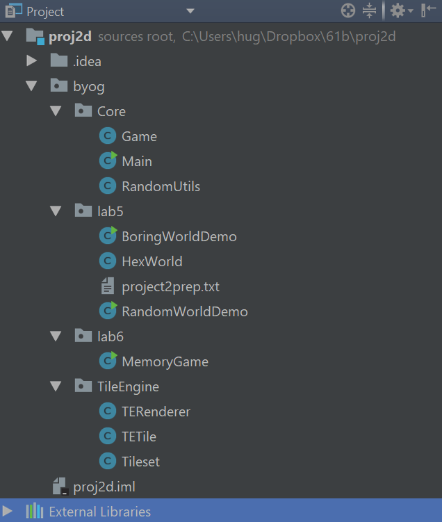
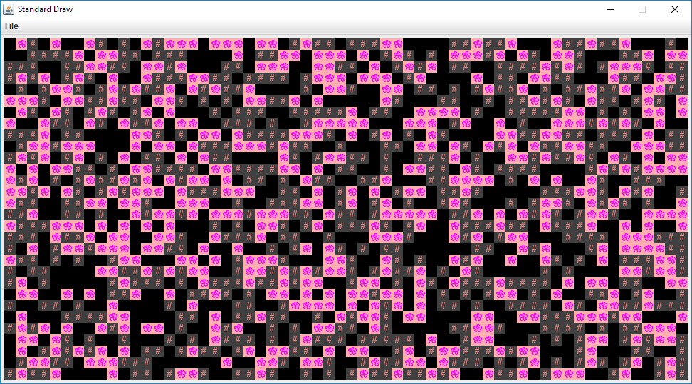
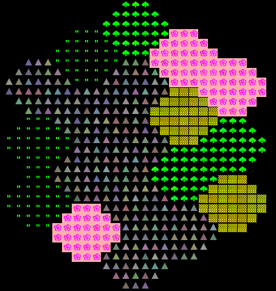
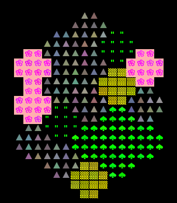
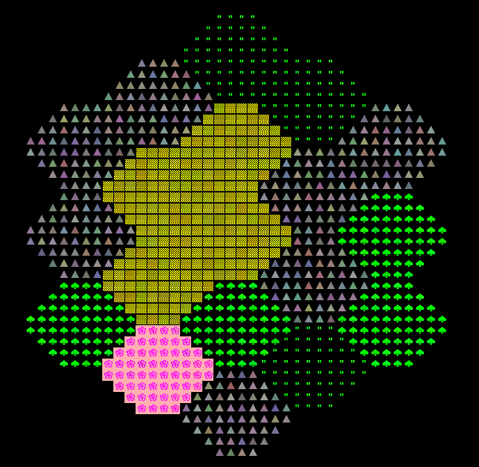

Please report any errors directly to Josh: hug@cs.berkeley.edu

When you import, make sure to import at the proj2 directory level, otherwise there will be dumb package issues. If you import properly it should look like [this](https://imgur.com/a/eD8uP).

Pre-lab
-------------------------------

Some steps to complete before getting started on this lab:

- As usual, use `git pull skeleton master`. This should download
  the proj2 skeleton files, which include the files you need for
  labs 5 and 6.

- Watch the project 2 getting started video [at this link](https://youtu.be/zgdNWICEb_M).

- Read the
  [project 2](http://datastructur.es/sp18/materials/guides/partnerships2.html)
  partnerships guide. 

- Optionally, read over the [project 2 spec](../../proj/proj2/proj2.html).

- Understand that project 2 will be a marathon and not a sprint.
- Form your project 2 team
    - [Partner Form](https://goo.gl/forms/leK3zBvORk4n9rrC3)
    - [Solo Form](https://goo.gl/forms/F0bGlCBmdhkwNZBs2) for if you really want to work alone, but this is not recommended

Introduction
--------------------------------

In this lab, you will learn some basic techniques and tools that will be helpful for
project 2. You should ideally work on this lab 
with your project 2 partner (if applicable), though it's OK to work alone, particularly
if you don't have a partner yet. 

We recommend that you form a partnership with someone of similar programming skill. 
You'll get more out of working with someone at your speed. Project 2 will be open ended
so you'll be able to adapt the difficulty of your project to your personal skill. 

If you have not found a partner by the end of the lab, let your lab TA know and
they will have you fill out a [partner matching form](https://docs.google.com/forms/d/e/1FAIpQLSeAfI6NsY-DF3Cbp0OSvPoTt0YKphNX-RoiWPbWGPu0AX3uRg/viewform?usp=sf_link).

Part I: Meet the Tile Rendering Engine
--------------------------------

#### Boring World

Import the proj2 skeleton files into IntelliJ using File->New->Project From Existing Sources. **Make sure you
Select the folder called proj2! Not the folder called lab5.** After importing, your IntelliJ should look something like
the following (you may need to click the right pointing arrows to expand and see the contents of the `byog.Core`,
`byog.lab5`, etc. packages).



Open up the `BoringWorldDemo` file. Try running it and you should see a window appear that looks like the following:


This world consists of empty space, except for the rectangular block near the bottom middle. The code
to generate this world consists of three main parts:
 - Initializing the tile rendering engine.
 - Generating a two dimensional `TETile[][]` array.
 - Using the tile rendering engine to display the `TETile[][]` array.

The API for the tile rendering engine is simple. After creating a `TERenderer` object, you simply need to
call the `initialize` method, specifying the width and height of your world, where the width and height
is given in terms of the number of tiles. Each tile is 16 pixels by 16 pixels, so for example, if we called
`ter.initialize(10, 20)`, we'd end up with a world that is 10 tiles and 20 tiles tall, or equivalently 160
pixels wide and 320 pixels tall. For this lab, you don't need to think about pixels, though you'll eventually
need to when you start building the user interface for your game (discussed in the next lab).

`TETile` objects are also quite simple. You can either build them from scratch using the `TETile` constructor
(see `TETile.java`), or you can choose from a palette of pregenerated tiles in the file `Tileset.java`. For example,
the code from BoringWorldDemo.java below generates a 2D array of tiles and fills them with the pregenerated
tile given by `Tileset.NOTHING`.

```java
TETile[][] world = new TETile[WIDTH][HEIGHT];
for (int x = 0; x < WIDTH; x += 1) {
    for (int y = 0; y < HEIGHT; y += 1) {
        world[x][y] = Tileset.NOTHING;
    }
}
```

Of course, we can overwrite existing tiles. For example, the code below from BoringWorld.java
creates a 14 x 4 tile region made up of the pregenerated tile `Tileset.WALL` and writes it over
some of the `NOTHING` tiles created by the loop code shown immediately above.

```java
for (int x = 20; x < 35; x += 1) {
    for (int y = 5; y < 10; y += 1) {
        world[x][y] = Tileset.WALL;
    }
}
```

The last step in rendering is to simply call `ter.renderFrame(world)`. Changes made to the tiles array will
not appear on the screen until you call the `renderFrame` method.

Try changing the tile specified to something else in the `Tileset` class other than `WALL` and see what happens. Also
experiment with changing the constants in the loop and see how the world changes.

*Note: Tiles themselves are immutable! You cannot do something like `world[x][y].character = 'X'`.*

#### Random World

Now open up `RandomWorldDemo.java`. Try running it and you should see something like this:



This world is sheer chaos -- walls and flowers everywhere! If you look at the `RandomWorldDemo.java` file, you'll 
see that we're doing a few new things:
 - We create and use an object of type `Random` that is a "[pseudorandom number generator](https://en.wikipedia.org/wiki/Pseudorandom_number_generator)".
 - We use a new type of conditional called a switch statement.
 - We have delegated work to functions instead of doing everything in main.

A random number generator does exactly what its name suggests, it produces an infinite stream of numbers that appear to be randomly ordered. The `Random` class provides the ability to produce *pseudorandom* numbers for us in Java.  For example, the following code generates and prints 3 random integers:

```java
Random r = new Random(1000);
System.out.println(r.nextInt());
System.out.println(r.nextInt());
System.out.println(r.nextInt());
```

We call `Random` a *pseudorandom* number generator because it isn't truly random. Underneath the hood, it uses cool math to take the previously generated number and calculate the next number. We won't go into the details of this math, but see wikipedia if you're curious. Importantly, the sequence generated is deterministic, and the way we get different sequences is by choosing what is called a "seed". If you start up a pseudorandom generator with a particular seed, you are guaranteed to get the exact sequence of random values.

In the above code snippet, the seed is the input to the `Random` constructor, so 1000 in this case. Having control over the seed is pretty useful since it allows us to indirectly control the output of the random number generator. If we provide the same seed to the constructor, we will get the same sequence values. For example, the code below prints 4 random numbers, then prints the SAME 4 random numbers again. Since the seed is different than the previous code snippet, the 4 numbers will be different than the 3 numbers printed above.

```java
Random r = new Random(82731);
System.out.println(r.nextInt());
System.out.println(r.nextInt());
System.out.println(r.nextInt());
System.out.println(r.nextInt());
r = new Random(82731);
System.out.println(r.nextInt());
System.out.println(r.nextInt());
System.out.println(r.nextInt());
System.out.println(r.nextInt());
```

In the case a seed is not provided by the user/programmer, i.e. `Random r = new Random()`, random number generators select a seed using some value that changes frequently and produces a lot of unique values, such as the current time and date. Seeds can be generated in all sorts of other stranger ways, such as [using a wall full of lava lamps](https://www.popularmechanics.com/technology/security/news/a28921/lava-lamp-security-cloudflare/).

For now, `RandomWorldDemo` uses a hard coded seed, namely 2873123, so it will always generate the exact same
random world. You can change the seed if you want to see other random worlds, though given how
chaotic the world is, it probably won't be very interesting.

The second new thing is the `switch` statement. We won't discuss exactly how this works in lab, but
it's a very handy way to avoid really long sequences of if-else statements. See [the official Java tutorial](https://docs.oracle.com/javase/tutorial/java/nutsandbolts/switch.html) for more.

The final and most important thing is that rather than doing everything in `main`, **our code delegates work
to functions with clearly defined behavior**. This is critically important for your project 2 experience! You're
going to want to constantly identify small subtasks that can be solved with clearly defined methods. Furthermore,
your methods should form a hierarchy of abstractions! We'll see how this can be useful in the final part of this lab.

Part II: Use the Tile Rendering Engine
--------------------------------

#### Hex World Intro

Above, we've seen how we can draw a world and generate randomness. In the remainder of this lab, we'll 
work our way towards strategically leveraging randomness and hierarchical abstraction to generate an interesting
world: The ultimate goal is to create a random terrain generator that will
build hexagon based worlds (similar to the board game [Settlers of Catan](https://www.google.com/search?q=settlers+of+catan&source=lnms&tbm=isch&sa=X&ved=0ahUKEwiquNjwy5rZAhUFYawKHRnjBM8Q_AUICygC&biw=1700&bih=640), if you've heard of it).
As an example, the world below contains fields of grass, fields of flowers, deserts, forests,
and mountains. 


In the actual project 2, you'll be generating random worlds as well, although in
the project, they will be indoor spaces instead of open landscapes. While this
lab task does not directly apply to the project, it will familiarize you with important
libraries including our Tile Rendering engine, and also help you think about how you can take
complex drawing tasks and break them into simpler pieces.

Your world should be able to support differently sized hexagons. The picture above is of size-3 hexagons,
and below we see a world consisting of size-2 and size-4 hexagons, respectively.





#### Drawing A Single Hexagon

Start by trying to create a method `addHexagon` that adds a hexagon of side length s to a given position in the world 
This is surprisingly tricky! There are many many ways of doing this, but however you do it, **the most important thing is to break the task down into smaller pieces.** This will probably involve creating helper methods. Example hexagons of size 2, 3, 4, and 5
are shown below. Note that your hexagon should always have a "middle" that is two rows thick, no matter how large the size (ie. the widest part consists of two rows of equal length).  This is important so that the hexagons tesselate nicely.

```  
     aa        aaa         aaaa             aaaaa
    aaaa      aaaaa       aaaaaa           aaaaaaa
    aaaa     aaaaaaa     aaaaaaaa         aaaaaaaaa
     aa      aaaaaaa    aaaaaaaaaa       aaaaaaaaaaa
              aaaaa     aaaaaaaaaa      aaaaaaaaaaaaa
               aaa       aaaaaaaa       aaaaaaaaaaaaa
                          aaaaaa         aaaaaaaaaaa
                           aaaa           aaaaaaaaa
                                           aaaaaaa
                                            aaaaa
 ```


These helper methods might involve drawing tasks, or they might involve calculating useful quantities.

In my case, I created two simple private helper methods to compute certain key quantities, and wrote JUnit tests 
to verify that they worked properly. I did not write any helper methods that performed drawing subtasks, but in
retrospect, I probably should have.

To verify that my `addHexagon` method worked, I simply wrote a short main method and verified that things looked OK.  Unfortunately,
writing a `JUnit` test to verify that you've properly drawn a hexagon is just as hard as drawing the hexagon itself,
so you won't be able to built confidence in your `addHexagon` method in a nice way like you can with simpler methods.

Even deciding the `addHexagon` method signature is a non-trivial task! Highlight after this colon to see mine: <span class="whitetext">public static void addHexagon(TETile[][] world, Position p, int s, TETile t), where Position is a very simple class with two variables p.x and p.y and no methods. p specifies the lower left corner of the hexagon.</span>

*Tip: If you want randomized colors for your hexagon tiles, e.g. so that not every flower is exactly the same, see the `TETile.colorVariant` method*

This task might EASILY take the entire lab and then some! It's OK if you don't finish. The point is to get you thinking. If you'd rather just have my version of the method, see [link](drawhexagon.txt). This file also lays out my thought process. It is very important that you try to approach your project 2 from a similar perspective of breaking tasks down into smaller tasks.

#### Drawing A Tesselation of Hexagons

Once you have code that can draw a single hexagon, you can try to tesselate them to form a world. Specifically, you should try to arrange them in the pattern shown below, consisting of 19 total hexagons.


As with drawing a single hexagon, there are a huge number of ways to do this. The most important part is to identify helper 
methods that will be useful for the task!

You should absolutely not try to do something like do everything in a nested for loop with no helper methods. 
While it is technically possible to do this, **you will melt your brain.** In this project, it is **absolutely vital**
that you avoid the temptation to always work at a "low level". Without hierarchical abstraction, your **mind will
transform into a pile of goo** under the weight of all the complexity.

By writing very well defined, nicely commented helper methods, you also make it physically possible to get help
from course staff. During office hours for this project, TAs will be limited to ten minutes per pair, and will not be 
allowed to spend a long time getting to know the intricacies of your code. They are there for high level guidance,
as well as help debugging when you've really exhausted all your options.

Highlight after this line for spoilers about my abstractions and approach. Solution code is not provided on this website.

<span class="whitetext">First: I wrote a couple of methods that compute the bottom-left Position of a current hexagon's neighbors. For example, I wrote topRightNeighbor, which computed the right thing to pass to addHexagon so that I could get my topRight neighbor. I did not write JUnit tests for this because I knew it'd be easy to visually test, though JUnit tests would have been fine. I then wrote bottomRight, and ended up with 3 whole hexagons out of the 19 I wanted.</span>

<span class="whitetext">Second: I tried to figure out how I could use bottomRight and topRight in some clever way to get the whole grid, but was a bit stymied. I considered trying to use recursion in some way, but it didn't feel like the right solution for symmetry reasons (too much weird backtracking). I then thought about whether I'd be stuck having to write six different neighbor methods, and decided that seemed excessive. All of this was done without any coding. If I'd have started coding all this, it would have been a huge waste of time."</span>

<span class="whitetext">Third: Stepping back, I decided to try to find the "nicest" way to try to lay out my hexagons and was ready to throw away my bottomRight and topRight methods entirely. Then the key AHA moment occurred when I noticed that the world consists of 5 columns of 3, 4, 5, 4, and 3 hexagons, respectively.</span>

<span class="whitetext">Fourth: I wrote a method called drawRandomVerticalHexes that draws a column of N hexes, each one with a random biome.</span>

<span class="whitetext">Fifth: I wrote a main method that is a little ugly, but basically calls drawRandomVerticalHexes five times, one for each of the five columns of the world, consisting of 3, 4, 5, 4, and 3 hexagons. To figure out the starting position for the "top" hex of each column, I used the topRightNeighbor or bottomRightNeighbor on the old top, as appropriate.</span>

<span class="whitetext">Sixth: I added some code to allow for interactivity so you can press a single key to get a new random world and enjoyed playing around with it. But interactivity will have to wait until next week's lab for you guys.</span>

## Submission

EDIT: There will be nothing to submit for this lab. While this does mean the lab is optional, we highly recommend you complete it to the best of your ability before working on the project.

## Moving on to Project 2

In theory, this lab has taught you everything you need to know for project 2! The process of generating your world will be similar in many ways to drawing a hexagon world, though project 2 world generation will be considerably more complex. If you're not sure how to get started, look at the questions in project2prep.txt. Feel free to discuss answers with TAs.
