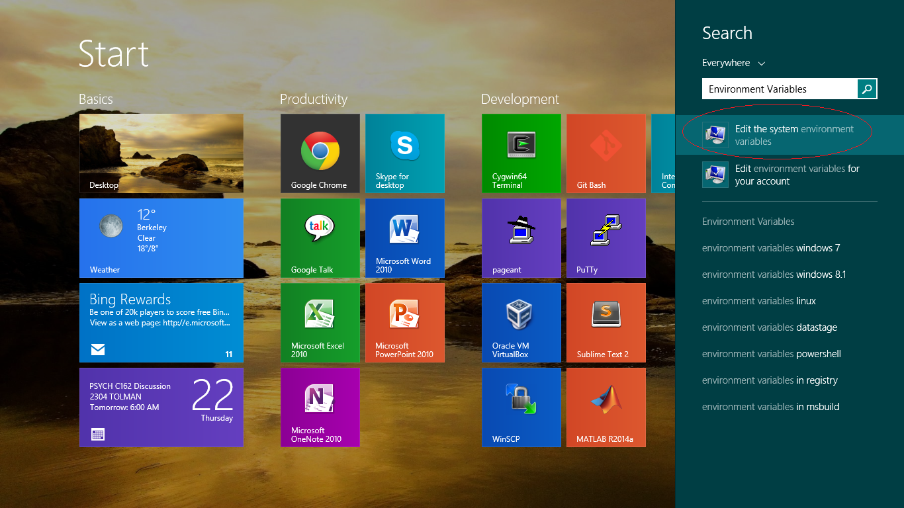
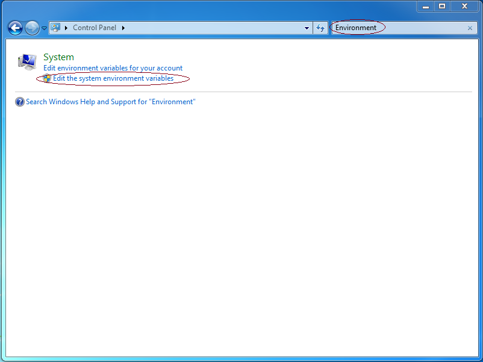
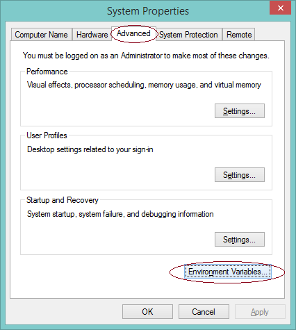
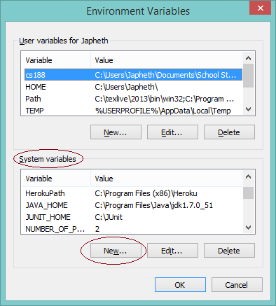
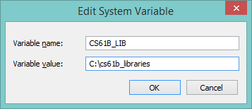
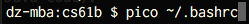

Introduction
----

For those of you who don't want to use IntelliJ, this is an unofficial
supplemental guide on how to run JUnit tests from the command line. Because
we've switched over to IntelliJ, the staff has not been trained in these
instructions, and will not provide official support for this approach, though
some staff members will be able to help.

In order to run JUnit tests from the terminal, you'll need to have your computer
setup to use the Spring 2017 Java libraries.

To download the files, all you need to do is pull from the skeleton repository
using `git pull skeleton master`. Your javalib directory should contain the
following files:

 - algs4.jar
 - hamcrest-core-1.3.jar
 - jh61b.jar
 - junit-4.12.jar
 - stdlib.jar
 - stdlib-package.jar

A. Windows Setup
----

1. Pull from the skeleton repo and verify that you've received a javalib folder
   containing the files listed above.

2.  Create a CLASSPATH environment variable pointing to the javalib folder. As
    we did in Lab 1b, we will do this by updating our environment variables:
    1. **Windows 10/8/8.1:** Launch the Start Screen by pressing Windows, and
       type 'Environment Variables'.  Select "Edit the system environment
       variables".
        
        **Windows 7 and earlier:** Open the Start Menu and launch the "Control
        Panel".  Search for "Environment Variables", and select "Edit the system
        environment variables".
        

    2. Navigate to the "Advanced" tab, and click "Environment Variables...".
        

    3. Under "System variables", click "New..."
        

    4. Define the following variables -- if the variable already exists, select
       the variable and click "Edit...", then add the value specified below to
       the front of the value, followed by a semicolon; otherwise, click
       "New..." and use the values specified below as the value of the variable:
        - **CS61B_LIB:** Set this to the location which contains your library
          JAR files (e.g. stdlib package.jar).  This is the location you
          specified in step 1.  In my case, I have specified the location
          `C:\cs61b_libraries`. Since you downloaded the libraries using git,
          your directory will probably be something more like
          `C:\Users\potato\cs61b\abc\javalib`.
            **Warning:** If the path to the above directory contains space(s),
            this will most likely go miserably for you. You should do anything
            in your power to avoid having spaces in your folder names for path
            purposes.
            
        - **CLASSPATH:** Set this to `%CLASSPATH%;%CS61B_LIB%\*;.;`

2. Press OK to save these settings, and OK again to close the dialog for System
   Properties.  Restart any open Git Bash/Command Prompt/Cygwin windows that you
   have open and you should be good to go. To verify that your setup works, try
   compiling the `ArithmeticTest.java` file from lab3. If this file compiles,
   everything is working as expected.

B. OS X and Unix Setup
----

[Video Instructions](https://youtu.be/17-okNrio1U) (Spring 2016)

1. Navigate to your repository in the command line, pull from the skeleton repo
   with `git pull skeleton master`, and verify that you have a `javalib/` folder
   containing the jar files listed above.

2. Navigate to the javalib folder in your repository and enter in the command
   `pwd`. You should get something that looks like
   `/Users/Dennis/school/cs61b/sp2016/aaa/javalib`. Copy this to somewhere (for
   pasting purposes)!

3. Set up a CLASSPATH environment variable that points to the javalib folder. To
   do this:
    1. Open the file .bashrc in your home directory. Since the filename starts
       with a period, it counts as a "hidden file", and will not appear in your
       Finder window. Annoyingly, there is no "show hidden files" option in Mac
       OS X, so I recommend opening this file by creating a terminal window and
       entering the command `pico ~/.bashrc`. This will open the pico editor,
       which is fairly easy to use (compared to vim or emacs). Or you can use
       sublime or whatever else you'd like to use.
       

    2. Copy the result you got from step 2 above to the clipboard.

    3. Scroll to the bottom of your .bashrc file. **If it is empty, this is
       fine. It just means that you didn't have one yet.** At the bottom of your
       .bashrc file, add: `export CS61B_LIB_DIR="[paste result from step 2
       above]/*"` (note the asterisk at the end), but with the directory name
       adjusted to match the location of your javalib folder. So, if I use the
       result that I got above, I would add: `export
       CS61B_LIB_DIR="/Users/Dennis/school/cs61b/sp2016/repo/javalib/*"` to my
       .bashrc file. This creates an environment variable called
       `CS61B_LIB_DIR`.

    4. Now add a line to the bottom of your .bashrc file that says `export
       CLASSPATH="$CLASSPATH:$CS61B_LIB_DIR:./"`. This creates an environment
       variable called CLASSPATH. Everytime you use javac, it will look in the
       directories given by the CLASSPATH for library files (you do not need to
       manually import libraries in Java code).

    5. Check to make sure your .bashrc is correct. Starting from an empty
       .bashrc, I would end up with this at the bottom of my file:
       ```sh
        export CS61B_LIB_DIR="/Users/Dennis/school/cs61b/sp2016/aaa/javalib/*"
        export CLASSPATH="$CLASSPATH:$CS61B_LIB_DIR:./"
        ```

    6. Press Ctrl-O to save. Then press Ctrl-X to exit pico.

    7. Now, open the file .bash\_profile in your home directory with `pico
       ~/.bash_profile`.

    8. Again, scroll to the bottom of the file and add on a new line: `source
       $HOME/.bashrc`.

    9. Press Ctrl-O to save. Then press Ctrl-X to exit pico.

4. Restart any terminal windows you have open.

5. Open a new terminal window and verify that your code is working by compiling
   ArithmeticTest.java from lab3 with `javac ArithmeticTest.java`. If this works
   without errors, then your computer is properly configured.

Note: For Unix users, you might need to tweak these steps slightly if you're
using a different shell than Bash. If you don't know what that means, then these
directions should almost certainly work (but have not been tested).

C. Running JUnit Tests from a Terminal
----

Rather than write your own main method that manually invokes every test (e.g.
`testSum` and `testProduct`), we'll use the trick from Lecture 7 where our main
method simply calls a `runTests` method that is able to automatically identify
and execute all test methods annotated with the `"@Test` symbol.

In 61B, all JUnit tests files should have a main method that calls
`jh61b.junit.TestRunner.runTests`, with an argument equal to the name of the
class. For example, if your JUnit test file is called ArithmeticTest.java, your
main should simply be:

```java
jh61b.junit.TestRunner.runTests(ArithmeticTest.class);
```

This line is invoking the `runTests(Class c)` method of a class called
`TestRunner` in a library called `jh61b.junit`.

You don't need to know how this mysterious TestRunner class works (but see the
[Spring 2016 lecture 7
lectureCode](https://github.com/Berkeley-CS61B/lectureCode-sp16/tree/master/lec7/extra).
Just know that this function will run all of the methods which are preceded by
`@Test` in the specified file, and will output everything in a nice format.

Let's try it out. Go to the lab3/Arithmetic folder, and try running the small
test provided:

```sh
javac *.java
java ArithmeticTest
```

This will run all of the tests in ArithmeticTest.java and give you back a JUnit
report. Notice it includes a failure! This tells you which test failed
(`testSum` in `ArithmeticTest`), what the expected and actual values were, and
on what line the failure occured. The output on your console should be something
like this:

    Running JUnit tests using jh61b.junit.TestRunner in "all" mode.

    Running testSum:
    ====================================
    expected:<11> but was:<30>
        at ArithmeticTest.testSum:25 (ArithmeticTest.java)
    =====> FAILED!

    Running testProduct:
    ====================================
    =====> Passed

    Passed: 1/2 tests.

As you can see above the `testProduct` test passed with flying colors. However,
the `testSum` class failed miserably, apparently calculating 30 when it should
have computed 11.

Open up `ArithmeticTest.java` and take a look around. Comparing against the
output above, you'll see that even though `testSum` included many `assert`
statements, you only saw the first failure (even though all of the later asserts
would have failed as well!)

This is because JUnit tests are short-circuiting – as soon as one of the asserts
in a method fails, it will output the failure and move on to the next test.

Try modifying `ArithmeticTest` so that it shows only failed test results (by
changing the mode argument from "all" to "failed"). Re-run and you'll see only
failed tests. We recommend that you run your test files in "failed" mode, as
this will allow you to focus on what needs doing, rather than celebrating what
has already been done. Debugging is a hard life.

Now it's time to look to see why `testSum` failed. Look at `testSum` to understand what its testing for, and then make the appropriate change in `Arithmetic.java`.

After fixing the bug, execute the compilation and execution commands again:

```sh
$ javac *.java
$ java ArithmeticTest
```

If you've fixed the bug, it should look like this:
```sh
$ java ArithmeticTest

Running JUnit tests using jh61b.junit.TestRunner in "failure" mode.

Passed: 2/2 tests.
```

Since you're running your code from the command line, you're going to need to
use print statement debugging (as opposed to the cool debugger you hopefully saw
in lab 2). Any code that is printed during a test will be output as part of the
results message for a given test. Try adding print statements and see how the
output changes.

Extra for Experts: If you're interested in learning to use a command line
debugger for Java, you can try out Paul Hilfinger's gjdb tool. See this [video
from Spring 2015](https://www.youtube.com/watch?v=ihMUS-MhNwA) for a demo of
this tool. Due to very low adoption rates in previous semesters, we will not
provide official support for this tool, but lab1d and lab3 from Spring 2015
explain how to use it. The directions from Spring 2015 should still work (but
let Josh know if they don't). 

D. Running the Style Checker from the Terminal
----

We will not be supporting the command line style checker in the Spring of 2017.
If you want to use it, see the [Spring 2016
directions](http://datastructur.es/sp16/materials/lab/lab3/lab3.html#running-the-61b-style-checker).
The needed files can be found in the [Spring 2016 skeleton
repository](https://github.com/Berkeley-CS61B/skeleton-sp16/tree/master/javalib).
