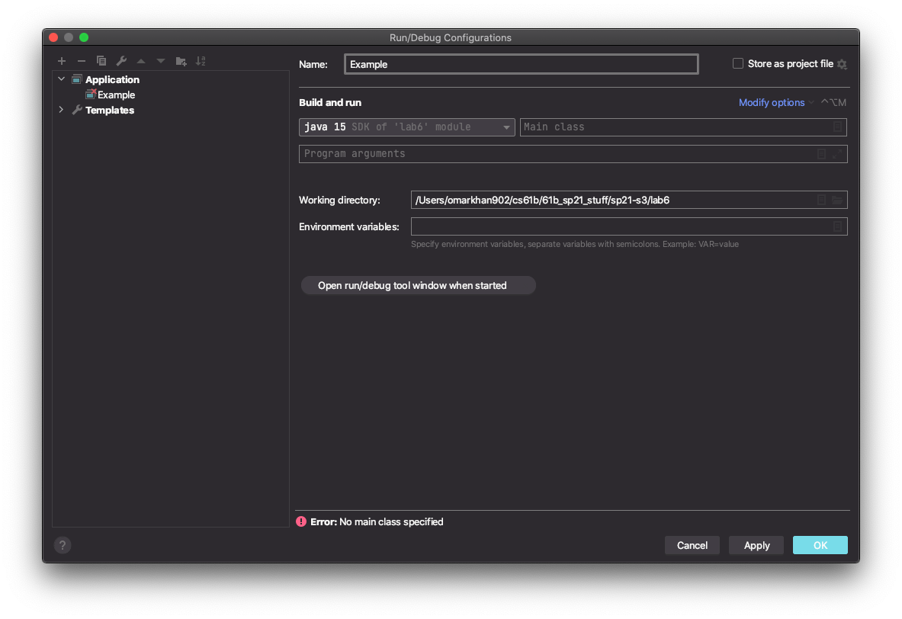
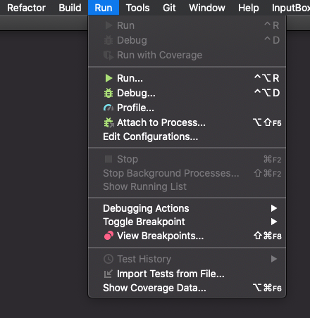
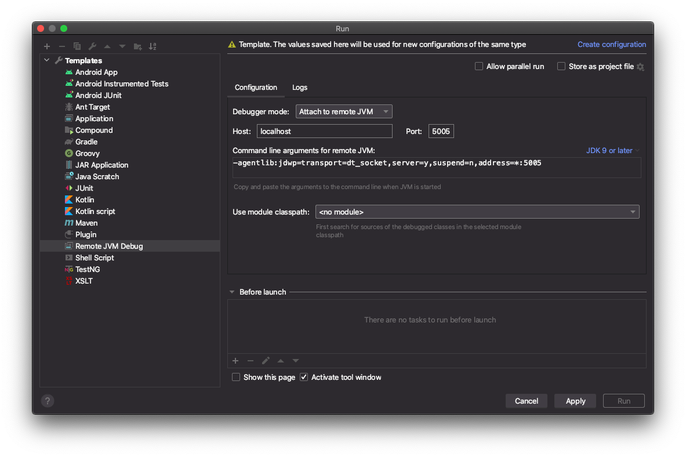

Intro
-----

The goal of this lab is to prepare you for success on Project 2: Gitlet. In
this lab, you will learn:

1. How to run Java from the command line and run the tests for Capers (the
   tests for Gitlet are very very similar).
2. How to work with files and directories in Java.
3. How to serialize Java objects to a file and read them back later (also
   called Persistence).

So far in this class, you have exclusively made programs whose state only persists while the program is running, and all traces of the program disappear once the program exits. For example, in Project 0, you created a game that you could play while the program was running, but there was no way to save the game state, quit the program, go do some other stuff, and then run the program again, load up your previous progress, and continue playing the game. In this lab, we will go over two methods to make the state of your program <a href="https://en.wikipedia.org/wiki/Persistence_(computer_science)">persist</a> past the execution of your program: one through writing plain text to a file, and the other through serializing objects to a file. This will be directly applicable to Project 2 Gitlet as well as any future projects you want to do where you want to be able to save state between programs (like Project 3).

As always, you can get the skeleton files with the following command:
```sh
$ git pull skeleton master
```

There's a lot of background info to get started with this lab. The actual task starts in the section labeled "Exercise: Canine Capers". However, it's important to carefully read and do all the sections of the lab that precede this exercise, otherwise it won't make any sense.

Persistence (Conceptually)
--------------------

As noted above, all of the programs you've written in this class have had no capability to remember anything about their prior executions. For example, when you ran 2048, there was no ability to save your progress to be resumed at a later date.

By contrast, many real world programs out there have the ability to maintain a state that persists across multiple executions. For example, consider the git version control tool. For example, when you call `git add`, git makes a note of which files you'd like to add.

```sh
$ git add Hello.java Friends.java
```

If you then enter `git status`, the correct files will be listed: 

```sh
$ git status
Changes to be committed:
  (use "git restore --staged <file>..." to unstage)
        modified:   Hello.java
        modified:   Friends.java
```        

Git is able to do this even though the program completely terminates in between these two commands. In other words, if you run `git add`, then turn your computer off entirely for a year, then come back later, `git status` will still somehow do the right thing. Git is somehow exhibiting **persistence**.

The key idea that makes this possible is to use your computer's file system. By storing information to your hard drive, programs are able to leave information for later executions to utilize.

**Important note:** Static variables do NOT persist in Java between executions. When a program completes execution, all instance and static variables are completely lost. The only way we can maintain persistence between executions is to store data on the file system.

For the next several sections, we'll go over a lot of command line and file system knowledge that you'll need to complete lab 6 and project 2. Some of it may be review for some of you, but we still encourage you to read the entire thing.

Java and Compilation
--------------------

A walkthrough of "Java Compilation" and "Make" can be found
[here](https://youtu.be/jW0GQqUzs2Y). The video simply goes over the steps listed in the spec, so if you find yourself confused on the directions then check it out.

Up until now, we have been running our Java code on IntelliJ by clicking
the magic green button. Perhaps surprisingly, there are other more primitive
ways of running Java code that aren't graphical. What we're
referring to here is compiling and running Java code through the _command line_
(your terminal). You may be used to this idea from CS 61A, where we often ran code directly from terminal using `python3 myprogram.py`.

The Java implementations we use compile Java _source code_, written by
the programmer in a `.java` file, into Java `.class` files containing _Java byte code_, which may then be executed by a separate program. Often, this separate program, called `java`, does a mix of interpreting the class file and compiling it into machine code and then having the bare hardware execute it.

We're going to walk through how to compile and run a `.java` file from just
your terminal. In order for this all to work, ensure that the following are both
version 15 or above:

```sh
$ javac -version
$ java -version
```

NOTE: If you're in Windows, make sure that you're using a Bash prompt. That is, if your terminal starts with "C:\", you're in the wrong kind of terminal window. Open up git bash intead.

If they aren't, please redo the relevant part from [lab1setup](https://sp21.datastructur.es/materials/lab/lab1setup/lab1setup).

First ensure your current working directory is `sp21-s***/lab6/capers`.
These commands will take you there:

```sh
$ cd $REPO_DIR
$ cd lab6/capers
```

While you're here, go ahead and run the `ls` command. You'll see all the
capers files, but the one we want to focus on is a file called `Main.java`.

To compile the source file and all of its dependencies, run this command within your terminal:

```sh
$ javac *.java
```

The `*.java` wildcard simply returns all the `.java` files in the current directory. Run `ls` again, and you'll see a bunch of new `.class` files, including `Main.class`. These files constitute the _compiled code_. Let's see what it looks like.

```sh
$ cat Main.class
```

That command will print out the contents of the file. You'll see mostly garbage
with many special characters. This is called _bytecode_, and even though it looks foreign to us, the `java` program can take this compiled code and actually interpret it to run the program. Let's see it happen:

```sh
$ java Main
```

Oops! We got an error.

```sh
Error: Could not find or load main class Main
Caused by: java.lang.NoClassDefFoundError: capers/Main (wrong name: Main)
```

If we were to translate this error to English, it's saying "I don't know what
`Main` you're talking about." That's because `Main.java` is inside a package,
so we must use it's fully canonical name which is `capers.Main`. To do this:

```sh
$ cd ..                 # takes us up a directory to sp21-s***/lab6
$ java capers.Main
```

And now the program finally runs and prints out

```sh
Must have at least one argument
```

The lesson: to run a Java file that is within a package, we must enter the
parent directory (in our case, `lab6`) and use the fully canonical name.

One last thing about command line execution: how do we pass arguments to the
`main` method? Recall that when we run a class (i.e. `java Main`), what really
happens is the `main(String[] args)` method of the class is called. To pass
arguments, simply add them in the call to `java`:

```sh
$ java capers.Main story "this is a single argument"
```

As demonstrated, you can have a space in one of your elements of `String[] args`
by wrapping that argument in quotation marks.

In the above execution, the `String[] args` variable had these contents:

```java
{"story", "this is a single argument"}
```

You'll be using the `String[] args` variable in this lab and in Gitlet. Some
skeleton is already provided to show you how it's done in the `main` method
of the `Main` class.

Although we will be using command-line compilation to run and debug our code, we will still be using IntelliJ to make edits to the code. Please open up Lab 6 in IntelliJ by opening the `sp21-s***/lab6/pom.xml` file.

Open Main.java, and find the line (around line number 40) that looks like:

```java
if (args.length == 0) {
    Utils.exitWithError("Must have at least one argument");
}
```

Immediately below this code add `System.out.println("args: " + Arrays.toString(args));`, so that the code now reads:

```java
if (args.length == 0) {
    Utils.exitWithError("Must have at least one argument");
}
System.out.println("args: " + Arrays.toString(args));
```

The word `Arrays` will be in red, so you'll want to put your cursor on the red word and press alt+enter (or option+enter on a Mac) to import the `java.util.Arrays` class. Once you've done this, try compiling and running the code <strong>from the command line</strong> (not IntelliJ!) using the commands below:

```sh
$ javac capers/Main.java
$ java capers.Main story "this is a single argument"
```

This time, your program should print out: 

```sh
args: [story, this is a single argument]
```

Note: You may notice a bunch of .class files in IntelliJ in the same folder as your code. As you may recall, we did not have such .class files in project 0, project 1, or in previous labs. This is because IntelliJ stores the .class files that it generates in another folder (usually called either `out` or `target`).

Make
----

Unfortunately, using JUnit testing for this lab and project 2 is awkward, so we're going to use a more sophisticated command line based testing infrastructure to run automated tests for this lab and project 2.

The key reason is that Capers (this lab) and Gitlet (project 2) are both programs that have persistent state, i.e. each time you run them, they "remember" what they did during previous runs of the program. For example, when you call `git add`, then `git status`, the `git` program somehow keeps track of which files were added, even though it completely terminates execution in between the `add` and `status` commands.

For example, a test for the `status` command for Gitlet would need to:

1. Run Gitlet's `Main` class with the `add` argument.
2. Let your program finish and exit.
3. Run Gitlet's `Main` class a second time with the `status` argument.
4. Test that the printed output of the program shows that it correctly "remembers" what happened in the earlier execution of the program.

Another issue that makes testing hard is that the output of Gitlet is complicated. Gitlet tests must be able to parse the printed output of the program, while also testing that various files contain the right contents. 

The end result of all of this is that we'll be using a custom command line testing suite built by Paul Hilfinger and 61B TAs that uses python as the basic engine for verifying program correctness for this lab and in project 2.

The testing suite is executed using a standard unix tool called `make`. We won't talk about how to use `make` in detail. Just know that there are two things that you can use `make` for:

1. Compiling your code by using the `make` command.
2. Running the test suite by using `make check` command.

In order to use `make`, you'll need to follow the brief instructions [here](https://sp21.datastructur.es/materials/guides/make-install.html) to install `make`. Additionally, you'll need Python so follow [these](https://www.python.org/downloads/) instructions if you do not already have Python installed.

<!-- You may have noticed it's a little annoying to manually compile then run your code. Running tests from the command line using indivdual commands will be even worse. Thus, to save time and keep things simpler, we'll be using a build system called `make`.  -->

Once you have `make` and `python` installed, let's see how to use `make` to compile your code.

<!-- There are just 2 _make targets_ we need to use: the first is the default, and
the second is `check`. -->

You can run `make` within any directory as long as it's within `lab6` (
i.e. `lab6/capers`, `lab6`, `lab6/testing`), though for simplicity let's just
stay in the `lab6` directory on our terminals). Try typing the following command in your terminal.

```sh
$ make
```

When you run this command, it will compile all of the `.java` files in your project directory and
place the `.class` files in the project folder (in our case, the `capers`
folder). The output will look something like:

```
"/Library/Developer/CommandLineTools/usr/bin/make" -C capers default
javac -g -Xlint:unchecked -Xlint:deprecation -cp "..::;..;" CapersRepository.java Dog.java Main.java Utils.java
touch sentinel
```

You don't need to understand what any of this means, but basically it's just compiling your files.

To run the test suite, enter:
```sh
$ make check
```

NOTE: If you get an error that looks like "/bin/bash: python3: command not found" or "python3: Permission denied", see the FAQ at the end of this spec.

`make check` launches our tests and prints out which ones you passed and
which ones you did not. Initially, you'll fail all of the tests since you
haven't completed this lab assignment yet.

There is also a thread way to use `make`. Specifically `make clean` will remove all the
`.class` files and other clutter if it bothers you having so many files in your
project folder. We suggest running this after you're done testing for the
moment and want to go back to editing your `.java` files in IntelliJ.

Terminology note: `check` and `clean` are known as _make targets_. You can actually define more targets for `make` by creating a custom `Makefile`. Doing so is well beyond the scope of 61B.

If the above command successfully ran (i.e., you are able to see test output), then you're ready to start the lab! If you did encounter issues regarding not being able to run `make`, then get assistance from your TA by putting yourself on the lab queue.

We'll now move onto how to manipulate files and directories in Java.

Files and Directories in Java
-----------------------------
Before we jump into manipulating files and directories in Java, let's go through some file system basics.

### Current Working Directory
The [current working directory](https://en.wikipedia.org/wiki/Working_directory) (CWD) of a Java program is the directory from where you execute that Java program. You can access the CWD from within a Java program by using `System.getProperty("user.dir")`. Examples follow for Windows & Mac/Linux users - they are very similar, just different stylistically. 

**Windows**
For example, for Windows users, let's say we have this small Java program located in the folder `C:/Users/Michelle/example` (or `~/example`) named `Example.java` :

```java
// file C:/Users/Michelle/example/Example.java
class Example {
  public static void main(String[] args) {
     System.out.println(System.getProperty("user.dir"));
  }
}

```

This is a program that prints out the CWD of that Java program.

If I ran:
```sh
$ cd C:/Users/Michelle/example/
$ javac Example.java
$ java Example
```

the output should read:

```sh
C:\Users\Michelle\example
```

Note: This Example.java file was just a hypothetical. You will not find it in the lab 6 skeleton.

**Mac & Linux**
For example, for Mac & Linux users, let's say we have this small Java program located in the folder `/home/Michelle/example` (or `~/example`) named `Example.java`:

```java
// file /home/Michelle/example/Example.java
class Example {
  public static void main(String[] args) {
     System.out.println(System.getProperty("user.dir"));
  }
}
```

This is a program that prints out the CWD of that Java program.

If I ran:

```sh
$ cd /home/Michelle/Example
$ javac Example.java
$ java Example
```

the output should read:

```sh
/home/Michelle/example
```

Note: This Example.java file was just a hypothetical. You will not find it in the lab 6 skeleton.

**IntelliJ**

Above, we saw how the "current working directory" is the directory that we're in when we launch a program. You might wonder what the working directory is when using IntelliJ, since we're not running it from a directory at all, but rather using the IntelliJ GUI.

In IntelliJ, the CWD is given by the specified directory under Run > Edit Configurations > Working Directory:


You can see that my CWD is `/Users/omarkhan902/cs61b/61b_sp21_stuff/sp21-s3/lab6`. Note that you may have to run `Main.java` once for this option to appear.

**Terminal**
In terminal / Git Bash, the command `pwd` will give you the CWD.

### Absolute and Relative Paths
A <a href="https://en.wikipedia.org/wiki/Path_(computing)">path</a> is the location of a file or directory. There are two kinds of paths: absolute paths and relative paths.

- An **absolute path** is the location of a file or directory relative to the **root** of the file system.
	- In the example above, the absolute path of `Example.java` was `C:/Users/Michelle/example/Example.java` (Windows) or `/home/Michelle/example/Example.java` (Mac/Linux). Notice that these paths start with the root which is `C:/` for Windows and `/` for Mac/Linux.
- A **relative path** is the location of a file or directory relative to the CWD of your program.
	- In the example above, if I was in the `C:/Users/Michelle/example/` (Windows) or `/home/Michelle/example/` (Mac/Linux) folders, then the relative path to `Example.java` would just be `Example.java`.
	- If I were in `C:/Users/Michelle/` or `/home/Michelle/`, then the relative path to `Example.java` would be `example/Example.java`.

_Note: the root of your file system is different from your home directory. Your home directory is usually located at `C:/Users/<your username>` (Windows) or `/home/<your username>` (Mac/Linux). We use `~` as a shorthand to refer to your home directory, so when you are at `~/sp21-s***`, you are actually at `C:/Users/<your username>/sp21-s***` (Windows) or `/home/<your username>/sp21-s***` (Mac/Linux)._

When using paths, `.` refers to the CWD. Therefore, the relative path `./example/Example.java` is the same as `example/Example.java`.

Similarly, `..` refers to the parent (or enclosing) directory. So the command

```sh
cd ..
```
is a quick and simply way to navigate to your parent directory. If you want
to go to your parent's parent directory, you can string these together like so:

```sh
cd ../..
```

And similar for your parent's parent's parent directory. You shouldn't need to
do this in this lab/project, though it's a useful thing to quickly navigate
around your terminal.

### File & Directory Manipulation in Java
The Java [File](https://docs.oracle.com/javase/7/docs/api/java/io/File.html) class represents a file or directory in your operating system and allows you to do operations on those files and directories. In this class, you usually will want to be doing operations on files and directories by referring to them to their relative paths. You'll want any new files or directories you create to be in the same directory as where you run your program (in this lab, the `sp21-s***/lab6` folder) and not some random place on your computer.

#### Files
You can make a File object in Java with the File constructor and passing in the path to the file:

```java
File f = new File("dummy.txt");
```

The above path is a relative path where we are referring to the file `dummy.txt` in our Java program's CWD. You can think of this File object as a reference to the actual file `dummy.txt` - **when we create the new File object, we aren't actually creating the `dummy.txt` file itself**, we are just saying, "in the future, when I do operations with `f`, I want to do these operations on `dummy.txt`". To actually create this `dummy.txt` file, we could call

```java
f.createNewFile();
```

and then the file `dummy.txt` will actually now exist (and you could see it in File Explorer / Finder).

You can check if the file "dummy.txt" already exists or not with the `exists` method of the File class:

```java
f.exists()
```

Actually writing to a file is pretty ugly in Java. To keep things simple, we've
provided you with a `Utils.java`. This class will be very handy for this lab and
in Gitlet. You should look at the list of available methods in `Utils.java` to
get a sense of what it can do for you. See the FAQ at the bottom of this lab for
hints on what to focus on.

As an example, if you want to write a String to a file, you can do the following:

```java
Utils.writeContents(f, "Hello World");
```

Now `dummy.txt` would now have the text "Hello World" in it.

#### Directories
Directories in Java are also represented with File objects. For example, you can make a File object that represents a directory:

```java
File d = new File("dummy");
```

Similar to files, this directory might not actually exist in your file system. To actually create the folder in your file system, you can run:

```java
d.mkdir();
```

and now there should be a folder called `dummy` in your CWD. You should also checkout the `mkdirs()` method, whose documentation can be found [here](https://docs.oracle.com/javase/7/docs/api/java/io/File.html).

#### Summary
There are many more ways to manipulate files in Java, and you can explore more by looking at the [File javadocs](https://docs.oracle.com/javase/7/docs/api/java/io/File.html) and Googling. There are a ton of resources online and, if you Google it, doing more extensive file operations in Java can get a bit complicated. We recommend understanding the basics by doing this lab, and in the future if you come across a use case you don't know how to handle, then start searching or asking on Ed. For this lab and Gitlet, you should use our `Utils.java` class that has many useful helper functions for file operations.

Serializable
--------
Writing text to files is great and all, but what if we want to save some more complex state in our program? For example, what if we want to be able to save the `Model` object in 2048 so we can come back to it later? We could write a toString method to convert a `Model` to a `String` and then write that `String` to a file. However, we'd then have to also write code that is able to read the `String` and then parse it back into a `Model`. While it is certainly possible to do so, it's tedious to write such code.

Luckily, we have an alternative called [serialization](https://en.wikipedia.org/wiki/Serialization) which Java has already implemented for us. Serialization is the process of translating an object to a series of bytes that can then be stored in the file. We can then _deserialize_ those bytes and get the original object back in a future invocation of the program.

To enable this feature for a given class in Java, this simply involves implementing the `java.io.Serializable` interface:

```java
import java.io.Serializable;

public class Model implements Serializable {
    ...
}
```

This interface has no methods; it simply marks its subtypes for the benefit of some special Java classes for performing I/O on objects. For example,

```java
Model m = ....;
File outFile = new File(saveFileName);
try {
    ObjectOutputStream out =
        new ObjectOutputStream(new FileOutputStream(outFile));
    out.writeObject(m);
    out.close();
} catch (IOException excp) {
    ...
}
```

will convert `m` to a stream of bytes and store it in the file whose name is stored in `saveFileName`. The object may then be reconstructed with a code sequence such as

```java
Model m;
File inFile = new File(saveFileName);
try {
    ObjectInputStream inp =
        new ObjectInputStream(new FileInputStream(inFile));
    m = (Model) inp.readObject();
    inp.close();
} catch (IOException | ClassNotFoundException excp) {
    ...
    m = null;
}
```

The Java runtime does all the work of figuring out what fields need to be converted to bytes and how to do so. You'll be serializing objects left and right, so to lower the amount of code you have to write we have provided helper function in `Utils.java` that handles reading and writing objects. 

Note that the code above is pretty annoying, with lots of mystery classes and try/catch statements. If you use our helper functions from the `Utils` class, serializing is as easy as:

```java
Model m;
File outFile = new File(saveFileName);

// Serializing the Model object
writeObject(outFile, m);
```
And similarly, deserializing is simply:
```java
Model m;
File inFile = new File(saveFileName);

// Deserializing the Model object
m = readObject(inFile, Model.class);
```

_Note: There are some limitations to Serializable that are noted in the Project 2 spec. You will not encounter them in this lab._

Exercise: Canine Capers
--------

Whew! We're finally read to get started on the actual work for this lab. For this lab, you will be writing a program that will be taking advantage of file operations and serialization. We have provided you with three files:

* `Main.java`: The main method of your program. Run it with `java capers.Main [args]` to do the operations specified below. This class doesn't have too much logic itself: rather, it serves as an "entry point" and simply knows when to call the right method in `CapersRepository.java` 
* `CapersRepository.java`: Handles all coordination among the other classes. The majority of the FIXMEs in this program are in here.
* `Dog.java`: Represents a dog that has a name, breed, and age. Contains a few FIXMEs.
* `Utils.java`: Utility functions for file operations and serialization. These are a subset of those provided with Gitlet.

You do not need to worry about error cases or invalid input, we aren't testing you on that in this lab (though beware, you will need to do this for Gitlet). You are able to complete this lab with just the methods provided in `Utils.java` and other `File` class methods mentioned in this spec, but feel free to experiment with other methods if you're feeling adventurous.

### Main
Your code will support the following three commands:

* `story [text]`: Appends "text" + a newline (i.e. `"\n"`) to a story file in the .capers directory. Additionally, prints out the current story (the current story should include the recently added "text").
* `dog [name] [breed] [age]`: Persistently creates a dog with the specified parameters; should also print the dog's `toString()`. Assume dog names are unique.
* `birthday [name]`: Advances a dog's age persistently and prints out a celebratory message.

As an example, below we see a series of executions of capers.Main, followed by the output of each command.


```sh
$ java capers.Main story "Once upon a time, there was a beautiful dog."
Once upon a time, there was a beautiful dog.

$ java capers.Main story "That dog was named Fjerf."
Once upon a time, there was a beautiful dog.
That dog was named Fjerf.

$ java capers.Main story "Fjerf loved to run and jump."
Once upon a time, there was a beautiful dog.
That dog was named Fjerf.
Fjerf loved to run and jump.

$ java capers.Main dog Mammoth "German Spitz" 10
Woof! My name is Mammoth and I am a German Spitz! I am 10 years old! Woof!
$ java capers.Main dog Qitmir Saluki 3 
Woof! My name is Qitmir and I am a Saluki! I am 3 years old! Woof!
$ java capers.Main birthday Qitmir
Woof! My name is Qitmir and I am a Saluki! I am 4 years old! Woof!
Happy birthday! Woof! Woof!
$ java capers.Main birthday Qitmir
Woof! My name is Qitmir and I am a Saluki! I am 5 years old! Woof!
Happy birthday! Woof! Woof!
```

Note that the `dog` and `birthday` commands have related functionality. Note that the `story` command has functionality that is entirely independent of `dog` or `birthday`.

Also note that your code should NOT print out the command line arguments at each step. In other words, you should delete the call to `System.out.println("args: " + Arrays.toString(args));` that you added earlier in this lab.

All persistent data should be stored in a `.capers` directory in the current working directory. We prepend a `.` because files and directories preceded by a `.` are hidden in the file viewer by default. After all, we wouldn't want the users of our Java program to care about how/where/if we store persistent data. They should only care that the program works. Both IntelliJ and Git take advantage of this idea: whenever you create an IntelliJ project, it creates a hidden `.idea` folder in the CWD to store all of its metadata. Similarly, whenever you initialize a Git repository, it stores all of its persistent data in a `.git` folder. You can view hidden files in terminal by typing `ls -a` instead of just `ls`.

Recommended file structure (you do not have to follow this):

```
.capers/ -- top level folder for all persistent data
    - dogs/ -- folder containing all of the persistent data for dogs
    - story -- file containing the current story
```

You should not create these manually, your program should create these folders and files (hint: scroll up to see how do we create a directory/file in Java). If you want to remove all saved data from your program, just remove the `.capers` directory (NOT the `capers` directory) with `rm -rf .capers`.

### Useful Util Functions
Useful Util functions (as a start, may need more and you may not need all of them):

* `static void writeContents(File file, Object... contents)` - writes out strings/byte arrays to a file. The `...` allows us to use _variable arguments_, meaning we can call `writeContents` with any number of arguments. For example, we can call `writeContents(outFile, "dog", "cat", "mouse")`, and the function `writeContents` will have access to all three objects we pass in via an array.
* `static String readContentsAsString(File file)` - reads in a file as a string
* `static byte[] readContents(File file)` - reads in a file as a byte array
* `static void writeObject(File file, Serializable obj)` - writes a serializable object to a file
* `static <T extends Serializable> T readObject(File file, Class<T> expectedClass)` - reads in a serializable object from a file. You can get a `Class` object by using `<Class name>.class`, (e.g. `Dog d = readObject(inFile, Dog.class)`).
* `static File join(String first, String... others)` - joins together strings or files into a path. E.g. `Utils.join(".capers", "dogs")` would give you a `File`object with the path of ".capers/dogs", and `Utils.join(".capers", "dogs", "shitzus")` would give you a `File` object with the path of `".capers/dogs/shitzus"`. You should **not** create files by String concatenation! This can create weird bugs depending on the system you are running.

### Suggested Order of Completion

Please be sure to read the comments above each method in the skeleton for a description of what they do. 

1. Fill out `CAPERS_FOLDER` in `CapersRepository.java`, then `DOG_FOLDER` in `Dog.java`, and then `setUpPersistence` in `CapersRepository.java`.
2. Fill out the `main` method in `Main.java`. This should consist mostly of calling other methods from `CapersRepository`.
3. Fill out `writeStory` in `CapersRepository`.java. The story command should now work.
4. Try using the story command manually and verify that it is behaving properly.
5. Fill out `saveDog` and then `fromFile` in `Dog.java`. You will also need to address the `TODO` at the top of `Dog.java`. Remember dog names are unique!
6. Fill out `makeDog` and `celebrateBirthday` in `CapersRepository.java` using methods in `Dog.java`. You will find the `haveBirthday` method in the Dog class useful. The dog and birthday commands should now work.
7. Try using the dog and birthday commands manually and verify that they are working properly.
8. Run make check and verify that you code passes all the tests. If you are failing tests and don't know why, see the debugging section later in this lab.

Each `TODO` should take at most around 8 lines, but many are fewer.

### Usage
The easiest way to run and test your program is to compile it in terminal with `make` and then run it from there. E.g.

```sh
$ cd $REPO_DIR
$ cd lab6                      # Make sure you are in your lab6 folder (NOT the lab6/capers folder)

$ make                         # or javac capers/*.java, make sure to recompile your program each time you make changes
$ java capers.Main [args]      # Run the commands you want! e.g., java story hello
```

For the `story` command, if you want to pass in a long string that includes spaces as the argument, you will want to put it in quotes, e.g.

```sh
$ java capers.Main story "hello world"
```

<!-- If running in IntelliJ, you will need to use Run > Edit Configurations > Program Arguments to add the arguments. -->

Testing
-------

As discussed earlier, tests are run using the `check` make target, i.e.:

```sh
$ make check
```

These are the exact tests on Gradescope, so if you pass them locally you should
get a full score on Gradescope.

However, you should also do some ad-hoc testing. That looks something like this:

```sh
$ make              # to compile all your .java files
$ java capers.Main story Hello
Hello               # this should be printed
$ java capers.Main story World
Hello               # this should be printed
World
$ ls .capers        # investigate the .capers folder to make sure it looks how
                    # you expect
...                 # More commands + investivgation
```

Recall we said we aren't using JUnit tests for Capers nor Gitlet. A single test
is represented as a file with the file extension `.in`: all of our tests are in
the `lab6/testing/our` directory. Here is what the `test02-two-part-story.in`
looks like:

```
# Two uses of the `story` command
> story "Hello"
Hello
<<<
> story "World"
Hello
World
<<<
```

The first line is a comment telling us what the test does. If you're failing a
test, you should read the top line to get a sense of what the test is doing.

The next 3 lines make up a section corresponding to a single execution to the
program:

```
> [args given to capersMain.main()]
[first line of expected output]
[second line of expected output]
[...]
<<<
```

So we see that all of the text on the same line as the `>` corresponds to the
command given to `capers.Main.main()`, and the next lines up until the `<<<` are
the expected output. 

So that first section is saying "If I run the program with args `story
"Hello"`, then the program should output `Hello`." If your program doesn't have
the exact same output, then our tests will fail and tell you your output
differs.

With this in mind, let's make sense of the next section:

```
> story "World"
Hello
World
<<<
```

When we run the command `capers.Main story "World"` after the first capers
command, the output should now be the concatenated story "Hello" followed by a
new-line character then "World". The word `"Hello"` is there because of
persistence: even though these are separate executions of the program, your code
should have somehow recorded the fact that `"Hello"` is part of the story
(likely putting this string in some file).

We call these _integration tests_. As opposed to _unit tests_, integration tests
test many things in cohesion. A (good) unit test will only test one specific
portion of your program: in our integration tests, we test multiple things. You
can see from the names of these integration tests that we've tried to provide
some tests to isolate a particular functionality of capers, so those should help
you get started and give you a basic sanity check of your work so far.

Submission
----------
Once you have passed all of the integration tests that are run when you call `make check`, youa ready to submit. You should have made changes in `capers/Main.java`, `capers/Dog.java`, and 
`capers/CapersRepository.java`. Submit the lab as always:

```sh
$ git commit -m "<commit message>"
$ git push origin master
```

And then submit on Gradescope. There is no style check for this lab.

Mandatory Epilogue: Debugging
---------

Before completing this section you should have passed all of the make check tests. You should also have submitted to gradescope. Even though you have your points for the lab, there is one more thing to do.

In this section, we'll talk about how to use the IntelliJ debugger to debug lab 6. This might seem impossible at first glance, since we're running everything from the command line. However, IntelliJ provides a feature called "remote JVM debugging" that will allow you to add breakpoints that trigger during our integration tests.

Start by using git to checkout the original version of the skeleton code. That is, after checking out, you should be back right where you started at the very beginning of this lab. If you don't know how to do that, read [this](../lab4/lab4#step-6) section from Lab 4.


A walkthrough of the remainder of this section of the lab can be found
[here](https://youtu.be/jO4lLWHHygs). The video simply goes over the steps
listed in the spec, so if you find yourself confused on the directions then
check it out.

Without JUnit tests, you may be wondering how to debug your code. We'll walk
you through how you will do that in Capers and in Gitlet.

First, let's discuss how you would know you have a bug. If you run the
the `make check` tests, you'll see that you're failing the test
`test02-two-part-story.in`. Now we need
to figure out which _execution_ of your program was buggy. Remember that our
tests will run your program multiple times; in this case, the `.in` file has
2 lines that call `capers.Main`, so this test runs it
twice (though in Gitlet it'll typically be more than that). 

To debug this integration test, we first need to let IntelliJ know that we want to debug remotely.
Navigate to your IntelliJ and open your `lab6` project if you don't have
it open already. At the top, go to "Run" -> "Run":



You'll get a box asking you to Edit Configurations that will look like the
below:


Yours might have more or less of those boxes with other names if you tried
running a class within IntelliJ already. If that's the case, just click the one
that says "Edit Configurations"

In this box, you'll want to hit the "+" button in the top left corner and
select "Remote JVM Debug." It should now look like this:



We just need the default settings. You should add a descriptive name in the top
box, perhaps "Capers Remote Debug". After you add a name, go ahead and hit
"Apply" and then exit from this screen. **Before we leave IntelliJ**, place a
breakpoint in the `main` method of the `Main` class so we can actually debug.
Make sure this breakpoint will actually be reached, so just put it on the first
line of the `main` method.

Now you'll navigate to the `testing` directory within your terminal.
The script that will connect to the IntelliJ JVM is `runner.py`: use the
following command to launch the testing script:

```sh
python3 runner.py --debug our/test02-two-part-story.in
```

If you wanted to run a different test, then simply put a different `.in` file.
If you'd like the `.capers` folder to stay after the test is completed to
investigate its contents, then use the `--keep` flag:

```sh
python3 runner.py --keep --debug our/test02-two-part-story.in
```

For our example it doesn't matter what you do; we've just included it in case
you'd like to take a look around. By default, the `.capers` that is generated
is deleted.

If you see an error message, then it means you are either not in the `testing`
directory, or your `REPO_DIR` environment variable isn't set correctly. Check
those two things, and if you're still confused then ask a TA.

Otherwise, you should be ready to debug! You'll see something like this:

```
   ============================================================================
  |                   ~~~~~  You are in debug mode  ~~~~~                      |
  |   In this mode, you will be shown each command from the test case.         |
  |                                                                            |
  |   There are three commands:                                                |
  |                                                                            |
  |   1. 'n' - type in 'n' to go to the next command without debugging the     |
  |            current one (analogous to "Step Over" in IntelliJ).             |
  |                                                                            |
  |   2. 's' - type in 's' to debug the current command (analogous to          |
  |            "Step Into" in IntelliJ). Make sure to set breakpoints!         |
  |                                                                            |
  |   3. 'q' - type in 'q' to quit and stop debugging. If you had the `--keep` |
  |            flag, then your directory state will be saved and you can       |
  |            investigate it.                                                 |
   ============================================================================

test02-two-part-story: 
>>> capers story "Hello"
>

```

The top box contains helpful tips. What we see next is the name of the `.in`
file we're debugging, then a series of lines that begin with `>>>` and `>`.

Lines that begin with `>>>` are the capers commands that will be run on your
`Main` class, i.e. a specific execution of your program. These correspond to the
commands we saw in the `.in` file on the right side of the `>`.

Lines that begin with `>` are for you to enter debug commands on. The 3
commands are listed in the helpful box.

Remember that each input file will list multiple commands and therefore
multiple executions of our program. We need to first figure out what command
is the culprit.

Type in the single character "n" (short for "next") to execute this command
without debugging it. You can think of it as bringing you to the next command.

One of these will error: either your code will produce a runtime error, or
your output wasn't the same. For example:

```
   ============================================================================
  |                   ~~~~~  You are in debug mode  ~~~~~                      |
  |   In this mode, you will be shown each command from the test case.         |
  |                                                                            |
  |   There are three commands:                                                |
  |                                                                            |
  |   1. 'n' - type in 'n' to go to the next command without debugging the     |
  |            current one (analogous to "Step Over" in IntelliJ).             |
  |                                                                            |
  |   2. 's' - type in 's' to debug the current command (analogous to          |
  |            "Step Into" in IntelliJ). Make sure to set breakpoints!         |
  |                                                                            |
  |   3. 'q' - type in 'q' to quit and stop debugging. If you had the `--keep` |
  |            flag, then your directory state will be saved and you can       |
  |            investigate it.                                                 |
   ============================================================================

test02-two-part-story: 
>>> capers story "Hello"
> n
ERROR (incorrect output)

Directory state saved in test02-two-part-story_0

Ran 1 tests. 0 passed.

```

For us, it was our first command. Notice also it tells us `Directory state saved
in test02-two-part-story_0` because we had the `--keep` flag enabled. We could
now investigate that directory to see what happened. If we debugged again with
the `--keep` flag on the same test, we'll get a new directory `Directory state
saved in test02-two-part-story_1` and so on.

Once you've found the command that errors, do it all again except now you can
hit "s" (short for "step") to "step into" that command, so to speak. Really
what happens is the IntelliJ JVM waits for our script to start and then
attaches itself to that execution. So after you press "s", you should hit the
"Debug" button in IntelliJ. Make sure in the top right the configuration is set
to the name of the remote JVM config you added earlier (this is why it is
helpful to give it a good name).

This will stop your program at wherever your breakpoint was as it's trying
to run that command you hit "s" on. Now you can use your normal debugging
techniques to step around and see if you're improperly reading/writing some
data or some other mistake.

You might get scenarios where the command you're debugging did
everything it was supposed to: in these cases, it
means you had a bug on a previous command with persistence. For example:
let's say your second invocation looks like it is doing everything correctly,
except when it tries to read the previous story (that should have been
persistently stored in a file) it receives a blank file (or maybe the file
isn't even there). Then, even though the second execution of the program has
output that doesn't match the expected, it was really the previous (first)
execution that
has the bug since it didn't properly persist the data.

These are very common since persistence is a new and initially tricky concept,
so when debugging, your first priority is to find the execution that produced the
bug. If you didn't, then you would be debugging the second (non-buggy) execution
for hours to no avail, since the bug already happened.

**Debugging will look exactly the same for Gitlet** as described in this section. Even though your work for this debugging epilogue is not graded, you should still complete it!

Don't forget to checkout your lab6 back to your solution and not the skeleton!

Tips, FAQs, Misconceptions
--------

#### Tips
These are tips if you're stuck!

* `setUpPersistence`: In `setUpPersistence`, you should make sure that if the files and folders you need for the program to work don't exist yet that they are made.
* `writeStory`: You should be using `readContentsAsString` and `writeContents`. It is not sufficient to just use `writeContents`, since that method _overwrites_ the file instead of appending to it. Since the story is just plain text (i.e. it's just a string), you do not need to serialize anything.
* `saveDog`: You should be using `writeObject`, since Dogs aren't Strings so we want to be able to serialize them. Make sure you're writing your dog to a File object that represents a file and not a folder!
* `fromFile`: You should be using `readObject`. This should be similar to `saveDog` except you're loading a Dog from your filesystem instead of writing it!

#### FAQs & Misconceptions
* If make check isn't working, you may need to add an additional argument when you call `make check`. Most computers take the command `python3` in order to run Python. However, on
some computers you may need to type `python` or `py` to run Python. If this is the case for you, you should use the flag:

```sh
$ make check PYTHON=<whatever you use to run Python files>
```

So if you use `py` to run Python, then use the command:

```sh
$ make check PYTHON=py
```

If you don't want to keep adding this extra text to `make check` every time, you can edit line 25 of the file called `Makefile`.

* `writeObject`: `writeObject` takes in (1) the `File` object that represents the *file* you want to write the object to and (2) the object you want to serialize and write into the file. The first argument should be a `File` object that represents a *file* on your filesystem, not a directory.
* File objects can represent both *files* and *directories* in your filesystem. The only way to differentiate between them is the methods you use with the File object. You can check if a File object represents a directory with `.isDir()`, which you shouldn't need for the lab since you should already know which File objects represent files and which represent directories.
* Creating a new File object in Java *does not create the corresponding file or directory on your computer.* The file is only created when you call `.createNewFile()` or `mkdir()` on that File object. You can think of `File` objects as pointers to files or directories - you can have multiple of them, and whenever you want to actually change the corresponding file or directory, you will need to call specific methods (usually the ones in `Utils` with "read" and "write" in the name).
* `Utils.join(File d, String s)` is shorthand for `new File(File d, String s)` (and `Utils.join(String d, String s)` is shorthand for `new File(new File(d), String s)`), both of which will create a new File object that represents the file or folder called `s` in the `d` directory. Again, this doesn't make the actual file/folder in your filesystem until you call appropriate methods.
* When we say "make changes persistently", that means you should make the changes in Java and then also make sure that those changes are reflected on your filesystem by writing those changes back into the appropriate files.

Credits
--------
Capers was originally written by Sean Dooher in Fall 2019. Spec and lab adaptation were written by Michelle Hwang in Spring 2020 and then Omar Khan in Spring 2021.
