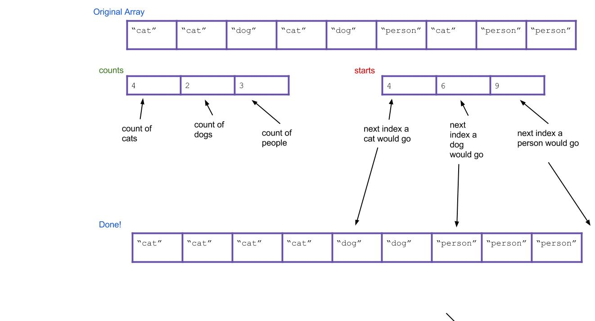

Prelude
----

This week in lab you are going to be implementing counting sort and a form of radix sort. This lab includes material drawn from the summer CS 61BL labs to reinforce the lecture material and background of radix-based sorts. If you're not interested in reading the background, or if you already feel comfortable with the material, feel free to scroll to the [Submission](#submission) section at the bottom of the lab to know what you need to turn in.

Counting Sort
----

Suppose you have an array of one million strings, but you happen to know that there are only three unique string values in it: "cat", "dog", and "person". How would you sort the array into lexicographical order? If you used merge sort or quicksort, your runtime would be proportional to N log N, where N is ~one million. Can you do better?

We think you can. What's the simplest thing you could do? Take a step back and don't think too hard about it. All we need is an array of "cat" strings followed by "dog" strings followed by "person" strings.

We propose an algorithm called _counting sort_. For the above example, it works like this:

1. First create an int array of size three. Call it the `counts` array. It will count the total number of each type of String.

2. Iterate through your array. Every time you find a cat, increment `counts[0]` by 1. Every time you find a dog, increment `counts[1]` by 1. Every time you find a person, increment `counts[2]` by 1. As an example, the result could be this:

    

3. Next, create a new array that will be your sorted array. Call it `sorted`.

    

4. Think about it: based on your `counts` array, can you tell where the first "dog" would go in the new array? The first "person"? Create a new array, called `starts`, that holds this information. For our example, the result is:

    

5. Now iterate through all of your Strings, and put them into the right spot. When I find the first "cat", it goes in `sorted[starts[0]]`. When I find the first "dog", it goes in `sorted[starts[1]]`. What about when I find the second "dog"? It goes in `sorted[starts[1]+1]`, of course. Or, an alternative: I can just increment `starts[1]` every time I place a "dog". Then the next "dog" will always go in `sorted[starts[1]]`.

Here's what everything would look like after completing the algorithm. Notice that the values of `starts` have been incremented along the way.

Does the written explanation of counting sort seem complicated? [Here](https://www.cs.usfca.edu/~galles/visualization/CountingSort.html) is a pretty cool animated version of it that might make it more intuitive.

In this example we arbitrarily decided which index represented "cat" and "dog" and "person", but is there a systematic way to do this? If you are guaranteed to only be sorting non-negative integers, the answer is yes: count the occurences of `i` in `counts[i]`.

Note that if you're only dealing with primitives, you can simply skip step 4 and 5, and iterate over `counts` placing, in sorted order, how many of each element you'd expect in the sorted array based. This works because all primitives with the same value are equal to each other and so we can just place new copies of each element. However this does not apply to objects, where we'd actually have to iterate over the original array instead in order to copy over the actual instances from the original array!

In `CountingSort.java`, we've given you an implementation of this type of non-negative integer counting sort. Look at and try running `CountingSortTester` and you'll see that the provided `naiveCountingSort` cannot handle an array with negative numbers.

Fill in the `betterCountingSort` method so that it still does a counting based sort, but also handles negative numbers gracefully.

We've given you some tests in `CountingSortTester`, but optionally, you can try writing a test that causes your `betterCountingSort` to fail if you are interested.

We'll now try to extend this type of example to more general cases where we might not know the contents of the list, but we do know the nature of its contents.

Radix Sort
----

The _radix_ of a numeral system is the number of values a single digit can take on. Binary numbers form a radix-2 system since each bit in a number can either be 0 or 1; decimal numbers are radix-10 since each digit in a number can take on values between 0 and 9. Words formed from the lowercase English alphabet are part of a radix-26 number system (yes, words can be enumerated).

Given a collection of elements all from the same radix numeral system, you can sort it using a radix sort. A radix sort examines elements in passes, one pass for each place in the elements. In other words, a radix sort would make a pass for the rightmost digit, one for the next-to-rightmost digit, and so on. In contrast, comparison based sorts (of which all the sorts you've learned already belong to), compare elements in pairs in order to sort.

A key realization is the following: given two three-digit numbers (say, 536 and 139), it is possible to sort these numbers using a subroutine that sorts one digits-place at a time. There are two ways to do this:

- First use the subroutine to sort everything on the least important (right-most) digit. Then sort everything on the next digit to the left. Continue, until you reach the left-most digit. This strategy requires the subroutine sorts to be stable.

- First sort everything on the most-important (left-most) place and group all the items into buckets according to the value they take on in that digit. Recursively sort each bucket on the next highest digit. After your buckets have been sorted, concatenate your buckets back together.

Here's an example of using the first strategy. Imagine we have the following numbers we wish to sort:

356, 112, 904, 294, 209, 820, 394, 810

First we sort them by the first digit:

82**0**, 81**0**, 11**2**, 90**4**, 29**4**, 39**4**, 35**6**, 20**9**

Then we sort them by the second digit, keeping numbers with the same second digit in the same relative order from the previous step:

9**0**4, 2**0**9, 8**1**0, 1**1**2, 8**2**0, 3**5**6, 2**9**4, 3**9**4

Finally, we sort by the third digit, keeping numbers with the same third digit in their order from the previous step:

**1**12, **2**09, **2**94, **3**56, **3**94, **8**10, **8**20, **9**04

All done!

Hopefully it's not hard to see how these can be extended to more than three digits. The first strategy is known as _LSD radix sort_, and the second strategy is called _MSD radix sort_. LSD and MSD stand for _least significant digit_ and _most significant digit_ respectively, reflecting the order in which the digits are considered. Here's some pseudocode for the first strategy:

    public static void LSDRadixSort(int[] arr) {
        for (int d = 0; d < numDigitsInAnInteger; d++) {
            stableSortOnDigit(arr, d);
        }
    }

The 0th digit is the smallest digit, or the one furthest to the right in the number, and our subroutine is `stableSortOnDigit`.

The pseudocode for the second strategy isn't so clean to write, but its easy to see how it works in practice. Let's sort that same list above by MSD RadixSort. Note how our sort-on-digit doesn't have to be stable this time.

356, 112, 904, 294, 209, 820, 394, 810

First we sort them by the first digit, splitting the list into "buckets" representing numbers with the same value in the digit we sorted on:

[**1**12], [**2**94, **2**09], [**3**56, **3**94], [**8**20, **8**10], [**9**04]

For each bucket, recursively do the same thing on the next less significant digit. For purposes of clarity, let's just look at the 200s bucket. Which is:

294, 209

This now gets sorted and bucketed by the second-most significant digit:

[2**0**9], [2**9**4]

Finally, we concatenate together and return the concatenated list. MSD is a little easier to conceptualize, but turns out to be a little tougher to implement, especially if you care about efficiency.

Note that both LSD and MSD radix sorts employ some sort of subroutine to sort based on a digit. If you look closely enough, you'll realize the subroutine can be a form of counting sort.

It is important to note that the time Radix Sort takes depends on the width of the longest element it has to sort. Radix sort is considered to run in linear time for a list of integers in Java since integers in Java have a fixed/maximum number of digits.
For Strings, the sort runs in `O(N*M)` time where `N` is the number of Strings and `M` is the length of the longest String. We omit the `R` radix value in the runtime seen in lecture because it is constant for sorting within the the same radix system.

[Here](https://www.cs.usfca.edu/~galles/visualization/RadixSort.html) is a great tool for seeing how Radix sort works visually.

Deliverables
----

In this part of lab you'll write an implementation of radix sort for ASCII Strings. Normally, if we just had decimal numbers, we would say that we would have a radix of 10 (R = 10) since there are 10 possible digits at each index, [0, 1, 2, 3, 4, 5, 6, 7, 8, 9]. ASCII Strings have 256 possible characters (numbered 0-255 with the radix R = 256) and are of variable length. In Java, you can get the ASCII value for a character by casting the `char` to an `int` (`int i = (int)'a'`), and get the character from the ASCII value by casting the other way (`char a = (char)97`).

Write the method `sort` in `RadixSort.java` that returns a sorted copy of the input list of ASCII Strings. Make sure the method is NON-destructive (the original list cannot be modified).

Implement your radix sort as an LSD (least significant digit) sort rather than an MSD (most significant digit). MSD Radix is conceptually simpler, but a bit uglier and more difficult to code (and slower in practice). LSD Radix is relatively harder to understand intuitively, but easier to implement (and faster in practice). If you would like, you can implement MSD radix sort as extra practice.

Note: A difference between sorting numbers and strings using a radix sort is that we naturally sort Strings lexicographically (a.k.a. dictionary order; "2" is after "100" so "2" is considered equivalently as "2\_\_", where "\_" is a placeholder that comes before any other character), but sort numbers in numerically ascending order (2 is before 100 and is considered equivalently as 002). In other words, to sort Strings, we would pad them on the right with empty values, but to sort numbers, we would pad them on the left with empty values.

Tip: Remember ASCII codes start from 0, not 1.

Extra for experts (optional): Implement an MSD radix sort; Compare the runtime of your Radix sort compared to `Arrays.sort`. Which is faster for short arrays? Long arrays? Do the values in the array matter?

Submission
----

Implement `betterCountingSort` in `CountingSort.java` and `sort` in `RadixSort.java`. If you're feeling like that was easy, definitely try implementing alternative forms of radix sort (like MSD)!

Note that both sorting algorithms are non destructive!!!
