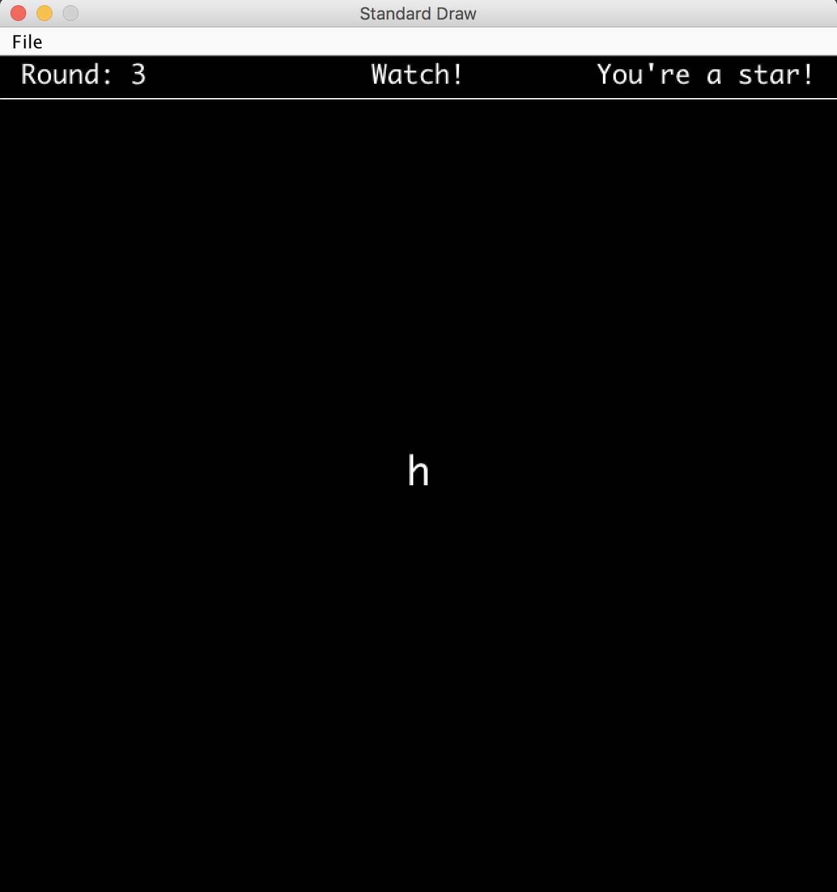

## Introduction

This lab will help you get started with the second phase of the project: Interactivity. Hopefully you've made significant progress on world generation by the time you're doing this lab. You are not expected to be done with phase 1 at the time you're working on this lab.

As with lab 5, this lab will not contribute any actual code directly to your project, it will help you get more familiar with useful tools necessary for the project and teach you some programming paradigms you might end up using.

## Memory Game

In preparation for making your game, we will use `StdDraw` and `java.util.Random` to construct a simple memory game. This game is much like the electronic toy [Simon](https://en.wikipedia.org/wiki/Simon_(game)), but on a computer and with a keyboard instead of with 4 colored buttons. The goal of the game will be to type in a randomly generated target string of characters after it is briefly displayed on the screen one letter at a time. The target string starts off as a single letter, but for each successful string entered, the game gets harder by making the target string longer.

Eventually we want `MemoryGame.java` to have a main method which will launch a playable memory game, but instead of jumping straight into the implementation of the game, it is good to try and break down what tasks you will need to perform in order to run a game. For this memory game it would looks something like:
- Create the game window
- Randomly generate a target string
- Display target string on screen one character at a time
- Wait for player input until they type in as many characters are there are in the target
- Repeat from step 2 if player input matches the target string except with a longer random target string

In general, good coding practice is to first build small procedures with explicit purposes and then compose more complex methods using the basic ones. Eventually, you’ll be able to build up something as complicated as a game or text editor using just a few lines in your main method. If you take a look at `MemoryGame.java` you will see that we have written in a few method headers which will each handle one of the above tasks. This process of identifying the steps of your game and breaking it apart into individual methods is highly recommended for project 2. It will give you a clear path forward in development and also provide clear breaks for unit tests.

## generateRandomString

First task: we need to be able to randomly generate a string of a specified length. Briefly mentioned above, this random generation should be done using `java.util.Random`.

Modify the `main` method and the `MemoryGame` constructor to create a `Random` object which uses the first program argument as the seed. After that, complete `generateRandomString` so that it produces a random string using your `Random` object that is the length specified by the input `n`. Since we only want to produce strings of lowercase characters, the private `CHARACTERS` field has been provided for your convenience. 

## drawFrame

Now that we have a random string, we need to be able to display this string on the screen one letter at a time. To do this, we will use the `StdDraw` library which you used in project 0. Unliked lab 5, you will be using `StdDraw` directly, rather than relying on a tile engine. We use the StdDraw library because it is rather light and easy to get started with, but there are a few quirks of the library you should be aware of while working with it. Notably, when we want to change what is displayed on the screen, we have to clear the entire screen and redraw everything we want to show up. Because of this, it is incredibly useful to have a method which first clears the canvas, draws everything necessary for the next frame, and then shows the canvas.

Eventually, `drawFrame` will be this method for us, but for now let’s keep it simple. We know we need to display strings on the screen and it should be noticable. Fill out `drawFrame` so that it clears the canvas, sets the font to be large and bold (size 30 is appropriate), draws the input string so that it is centered on the canvas, and then shows the canvas on the screen. This would be a good time to look at the [StdDraw](https://introcs.cs.princeton.edu/java/stdlib/javadoc/StdDraw.html) API and figure out exactly how it works. Some useful methods to look at include:

- [`StdDraw.setFont`](https://introcs.cs.princeton.edu/java/stdlib/javadoc/StdDraw.html#setFont(java.awt.Font))
- [`StdDraw.clear`](https://introcs.cs.princeton.edu/java/stdlib/javadoc/StdDraw.html#clear())
- [`StdDraw.text`](https://introcs.cs.princeton.edu/java/stdlib/javadoc/StdDraw.html#text(double,%20double,%20java.lang.String))
- [`StdDraw.setPenColor`](https://introcs.cs.princeton.edu/java/stdlib/javadoc/StdDraw.html#setPenColor(java.awt.Color))
- [`StdDraw.show`](https://introcs.cs.princeton.edu/java/stdlib/javadoc/StdDraw.html#show())

## flashSequence

Using what we’ve built so far, we need to define a procedure which presents the target string one character at a time. Write `flashSequence` so that it takes the input string and displays one character at a time centered on the screen. Each character should be visible on the screen for 1 second and there should be a brief 0.5 second break between characters where the screen is blank. 

## solicitNCharsInput

After displaying the target string one character at at time, we need to wait for the player to type in their string. For this task, we will have to use StdDraw’s key listening API to read in what the player typed. The methods of interest for this lab are `hasNextKeyTyped` and `nextKeyTyped`. These methods interact with a queue StdDraw uses to store all the keys the user has pressed and released. `hasNextKeyTyped` looks to see if there is any keystroke left in the queue while `nextKeyTyped` removes the key at the front of the queue and returns it. Note that `nextKeyTyped` returns the key as a char - this is another quirk of StdDraw and prevents us from using any keys on the keyboard which do not correspond to a char variable. 

Once you’ve familiarized yourself with how StdDraw handles inputs from the keyboard, write `solicitNCharsInput` which reads `n` keystrokes using StdDraw and returns the string corresponding to those keystrokes. Also, the string built up so far should appear centered on the screen as keys are being typed by the user so that they can see what they’ve hit so far. 

A nice feature to add would be the ability to delete characters in case of a mistake, but since StdDraw can’t handle the backspace key we’ll just ignore this feature and say its for the sake of making the game harder.

## startGame

We’re almost there! Now that we have defined all of our subprocesses, it is time to put them together and run our game. The `startGame` method should launch our game and begin the loop of gameplay until the player fails to type in the target string. The code for `startGame` should look like a translation of the following process into code:

1. Start the game at round 1
2. Display the message “Round: “ followed by the round number in the center of the screen
3. Generate a random string of length equal to the current round number
4. Display the random string one letter at a time
5. Wait for the player to type in a string the same length as the target string
6. Check to see if the player got it correct
  - If they got it correct, repeat from step 2 after increasing the round by 1
  - If they got it wrong, end the game and display the message “Game Over! You made it to round:” followed by the round number they failed in the center of the screen

After you’ve done this you should be able to run `MemoryGame.java` and play your game! It’s pretty bare bones and definitely not pretty, but we’ll fix that a little bit in the next section.

## Helpful UI

At this point, you have a functional game which someone could play, but it is definitely not presented in the most pleasant way. Most importantly, if someone picked up the game with no context whatsoever it would be a bit hard to figure out what was going on. Since the game is pretty simple, we could fix this with a single message at the top which told the player what to do, either “Watch!” or “Type!”.  While we’re at it, a good thing to display as well would be the current round number so they know how long the target string is, and since we’re nice people an encouraging phrase for the player would be great too. Eventually, we want something that looks like:

Since this is a change to the user interface (UI), it means we need to modify `drawFrame` to have this feature. Add to the method `drawFrame` so that as long as the game is not over, a bar is drawn at the top of the screen with: the round number displayed on the left as “Round: “ + round number, the current task displayed in the center (“Watch!” or “Type!”), and an encouraging phrase on the right. For the encouraging phrase, you should randomly choose one to be displayed from some collection of nice phrases. For your convenience we have provided the private `ENCOURAGEMENT` field with some phrases, but feel free to add your own.

## Submission

EDIT: There will be nothing to submit for this lab. While this does mean the lab is optional, we highly recommend you complete it to the best of your ability before working on the project.
